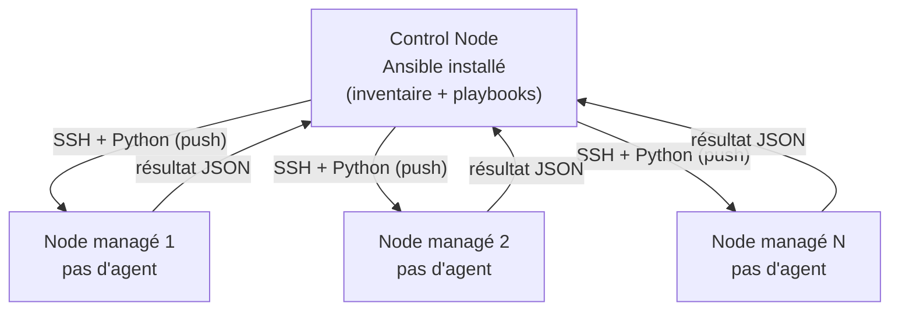
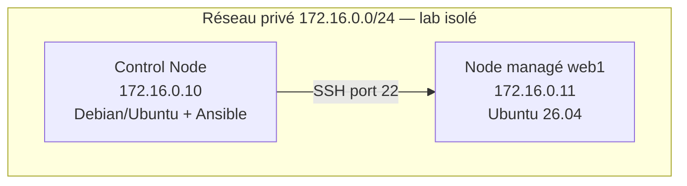
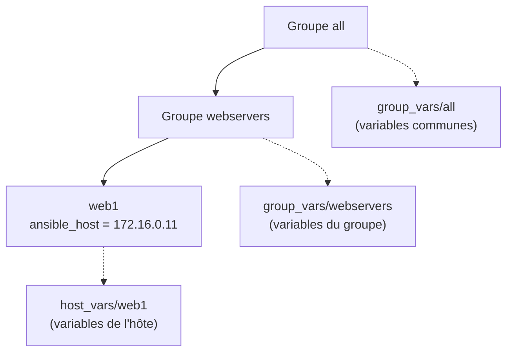
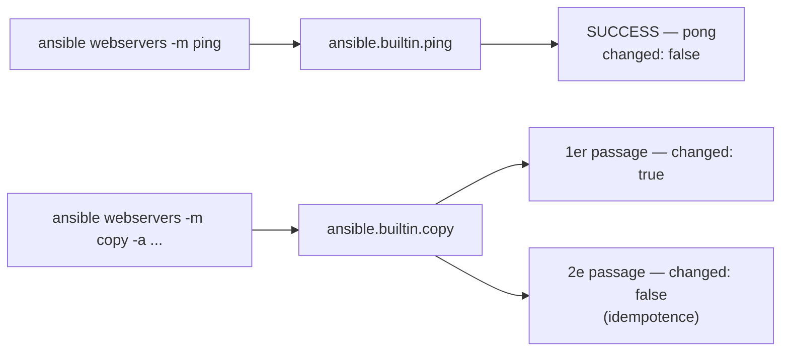

# Ansible — JOUR 1

## Architecture, Installation et Commandes ad hoc (06/10/2026)

**Auteur : Youghourta Merabtène**

> **Fil conducteur** — Le control node `cn-ansible` est livré déjà équipé (Ubuntu Server, Ansible, compte `stagiaire`, clé SSH, réseau) : la journée commence par le vérifier et par préparer le node `web1` (Lab 0 — contrôle du control node, nom d'hôte, adresse IP statique, compte de travail, clé SSH). Vient ensuite la compréhension de l'architecture d'Ansible et de son fonctionnement sans agent (S1), la vérification et la mise en place de l'environnement (S2), puis l'exécution des premières tâches d'automatisation avec les modules et commandes ad hoc (S3).

---

## Objectifs du Jour

- Contrôler le control node fourni, puis préparer le node `web1` pour en faire le lab (nom d'hôte, adresse IP statique, compte de travail, clé SSH)
- Comprendre l'architecture d'Ansible et son fonctionnement sans agent
- Comparer Ansible aux autres outils d'automatisation (Chef, Puppet)
- Vérifier, puis au besoin réinstaller ou mettre à jour Ansible sur la machine de contrôle, puis y déclarer un inventaire statique pour le réseau local
- Explorer un projet Ansible existant et y identifier ses composants
- Exécuter des commandes ad hoc avec les modules de base (ping, command, shell, copy) et vérifier leur idempotence

> **Ordre réel de la journée** — Le control node est livré avec Ansible, mais le node `web1` est livré vierge : le cours commence donc par contrôler l'un et préparer l'autre (Lab 0), avant toute notion d'Ansible. L'installation du moteur est ensuite vérifiée et rejouée sur la machine de contrôle (Lab 2), afin que chacun sache la refaire ; le projet existant n'est exploré (Lab 1) qu'une fois le moteur disponible, sinon les commandes d'exploration échoueraient. Les modules sont enfin mis en œuvre en commande ad hoc (Lab 3).

---

## Prérequis — Outils de la journée

> **Bon à savoir** — Le seul prérequis réel est le savoir-faire : à l'aise avec le Shell et l'édition de fichiers en ligne de commande [1]. Tout le reste est **fourni avec le lab ou installé par le cours lui-même** : le control node arrive équipé, le node `web1` et le reste de l'environnement sont préparés pendant la journée. Ce tableau distingue les outils acquis avant la formation et ceux installés pendant la formation ; il donne la commande de vérification, la séquence qui installe l'outil et la commande d'installation.

| Outil | Rôle dans la journée | Vérification | Installé par | Installation |
|-------|----------------------|--------------|--------------|--------------|
| python3 | Exécution des modules sur les nodes | `python3 --version` | Lab 0, étape 7 (node web1) ; Lab 2, Exo 3 (venv) | `sudo apt install -y python3` ; `sudo apt install -y python3-venv` pour l'environnement virtuel |
| ssh | Connexion du contrôleur aux nodes | `ssh -V` | présent sur une image Ubuntu Server ; sinon `sudo apt install -y openssh-client` | Le cours n'utilise aucun mot de passe SSH : seules les clés sont employées (Lab 0, étape 6) |
| ansible | Moteur d'automatisation — **fourni installé sur le control node ; sa vérification et sa remise en état restent un exercice du cours** | `ansible --version` | **fourni** sur `cn-ansible` ; contrôlé et remis en état au **Lab 2, Exo 2** (voie du lab) | `sudo apt install -y ansible` — Ubuntu 26.04 fournit ansible-core 2.20.1 ; variante plus récente : Lab 2, Exo 3 |
| ansible-playbook | Exécution des playbooks (Jour 2) | `ansible-playbook --version` | fourni par le paquet `ansible` déjà présent sur `cn-ansible` (contrôlé au Lab 2, Exo 2) | aucune commande supplémentaire |
| yamllint | Validation de la syntaxe YAML (Jour 2) | `yamllint --version` | Lab 4 du Jour 2 | `sudo apt install -y yamllint` |
| ansible-lint | Contrôle des bonnes pratiques des playbooks et rôles (Jour 2) | `ansible-lint --version` | Lab 4 du Jour 2 | `sudo apt install -y ansible-lint` (ou `~/ansible-venv/bin/pip install ansible-lint` dans le venv du Lab 2) |
| git | Versionnement du projet (facultatif, non requis par les labs) | `git --version` | — | `sudo apt install -y git` |

> **Pourquoi cette distinction ?** — Un prérequis est acquis avant le cours ; un outil installé en cours fait partie de l'apprentissage. Les confondre masque l'essentiel de la séquence S2 : installer le moteur d'automatisation est un exercice, pas une formalité administrative. Le control node est livré avec le moteur déjà présent, mais le Lab 2 rejoue l'installation en commandes idempotentes : il faut savoir vérifier l'état d'une machine, le corriger si besoin et le remettre à jour sans rien casser.

---

## Lab 0 — Vérifier le control node fourni et préparer le node web1 (20 min, 9h00-9h20)

> **Où cela s'inscrit** — Ce lab ouvre la séquence S1 (9h00-10h00) et en occupe les 20 premières minutes ; les 40 minutes suivantes sont consacrées au contenu théorique. Le control node `cn-ansible` est livré **déjà équipé** : Ubuntu Server, Ansible (ansible-core ≥ 2.20), compte `stagiaire` avec élévation `sudo`, clé ed25519, adresse statique et entrées `/etc/hosts` sont en place — l'étape 1 le vérifie. Le node `web1`, lui, est livré **vierge** : ni nom d'hôte, ni adresse statique, ni compte de travail, ni clé SSH. Ce lab le prépare, commande par commande.

#### Ce que produit ce lab

| Élément | Valeur |
|---------|--------|
| Machine de contrôle | `cn-ansible`, 172.16.0.10 — fournie déjà équipée : Ubuntu Server, Ansible (ansible-core ≥ 2.20), compte `stagiaire` (élévation `sudo` sans mot de passe), clé ed25519 `~/.ssh/id_ed25519`, adresse statique et entrées `/etc/hosts` ; tout est contrôlé à l'étape 1 |
| Node « web » | `web1`, 172.16.0.11 — **seul node managé** du lab, préparé par les étapes 2 à 7 |
| Réseau | 172.16.0.0/24, privé et isolé ; aucune de ces adresses n'est routable depuis Internet |
| Compte de travail | `stagiaire` — déjà présent sur `cn-ansible`, créé sur `web1` à l'étape 5, avec élévation `sudo` sans mot de passe (lab uniquement) |
| Authentification SSH | clé ed25519 `~/.ssh/id_ed25519` déjà créée dans la session `stagiaire` de `cn-ansible` (vérifiée à l'étape 1), puis copiée sur `web1` seul à l'étape 6 |
| Session de travail | session administrateur de `web1` (`root`, ou le compte initial de l'image avec `sudo`) pour les étapes 2 à 5 et pour le verrouillage du mot de passe en fin d'étape 6 ; session `stagiaire` sur `cn-ansible` dès l'étape 1 et pour **tous les labs du Jour 1 et du Jour 2** |
| Accès physique | console de l'hyperviseur (VirtualBox : *machine > Console*) ou terminal local de `web1`, plus la session `stagiaire` de `cn-ansible` |

> **Pourquoi commencer par là ?** — Ansible fonctionne sans agent : le contrôleur se connecte aux nodes par SSH et y exécute des modules Python [1]. Il faut donc, avant toute notion d'Ansible, que les machines se nommissent, se voient sur le réseau privé, acceptent un compte non privilégié et répondent en SSH. C'est exactement ce que reproduit l'administration d'un parc : le réseau et les accès d'abord, l'automatisation ensuite.

> **Avertissement de sécurité** — Les étapes 3 (configuration réseau par netplan), 4 (résolution de noms dans `/etc/hosts`), 5 (droits `sudo`) et 6 (clés SSH) modifient la configuration système du node et les droits d'un compte. Elles s'exécutent **uniquement sur le node `web1` de démonstration**, réseau 172.16.0.0/24 isolé — le control node n'est fait que l'objet de contrôles en lecture à l'étape 1. Sur un système réel : ne désactivez pas cloud-init, n'écrivez pas d'entrées statiques en dur dans `/etc/hosts`, n'accordez jamais `NOPASSWD: ALL`, ne désactivez pas la vérification des clés SSH, et utilisez un compte de service dédié au rôle d'automatisation.

#### Étape 1 — Vérifier le control node fourni et relever l'état de départ de web1 (2 min)

> **Comment travailler** — Cette première étape est la seule qui touche aux deux machines. Le control node est contrôlé **en lecture seule** depuis sa propre session : nom d'hôte, version d'Ansible, compte de travail, clé SSH, adresse et résolution de noms. On relève ensuite sur `web1`, depuis la console de l'hyperviseur ou un terminal local, l'état de départ qui sert de référence aux étapes 3 et suivantes. Les étapes 2 à 7 se déroulent **sur le seul node `web1`**.

```bash
# Où : control node cn-ansible (172.16.0.10), console ou terminal local, session du compte « stagiaire »
# Quoi : relever l'identité du control node fourni, la version d'Ansible déjà installée et le compte de travail
# Attendu : « Static hostname: cn-ansible », une ligne « ansible [core 2.20.x] » (ou 2.21.x),
#           puis « uid=…(stagiaire) » — le moteur et le compte sont déjà en place.
hostnamectl --static
ansible --version
id stagiaire
```

```bash
# Où : control node cn-ansible, session du compte « stagiaire », répertoire ~
# Quoi : vérifier que la paire de clés SSH dédiée au lab existe déjà dans la session de travail
# Attendu : ~/.ssh/id_ed25519 (privée, mode 0600) et ~/.ssh/id_ed25519.pub (publique) sont listés ;
#           aucun autre couple de clés n'apparaît.
ls -l ~/.ssh/id_ed25519*
```

```bash
# Où : control node cn-ansible, session du compte « stagiaire »
# Quoi : relever l'adresse IPv4 du contrôleur et vérifier qu'il résout déjà le nom du node web1
# Attendu : « 172.16.0.10/24 » sur l'interface du réseau privé, puis « 172.16.0.11 web1 » —
#           les entrées /etc/hosts du control node sont fournies avec la machine.
ip -4 addr show
getent hosts web1
```

```bash
# Où : sur le node web1 (console de l'hyperviseur ou terminal local), session administrateur
# Quoi : relever l'identité de la machine vierge, sa version d'OS et ses adresses IPv4 actuelles
# Attendu : un nom d'hôte provisoire (par exemple ubuntu-vm), une ligne PRETTY_NAME="Ubuntu 26.04.1 LTS",
#           et une seule adresse IPv4 obtenue par DHCP sur l'interface de l'hyperviseur (souvent 10.0.2.15).
hostnamectl
cat /etc/os-release
ip -4 addr show
```

```bash
# Où : sur le node web1, session administrateur
# Quoi : relever les noms des interfaces réseau et la route par défaut — ces valeurs sont
#        réutilisées telles quelles à l'étape 3
# Attendu : trois lignes : « lo », plus deux interfaces (par exemple enp0s3 vers le NAT de l'hyperviseur,
#           enp0s8 vers le réseau privé du lab) et une route « default via … » vers la passerelle du NAT.
ip -br link
ip route
```

#### Étape 2 — Fixer les noms d'hôtes (2 min)

```bash
# Où : sur le node web1, session administrateur (console de l'hyperviseur ou terminal local)
# Quoi : fixer le nom d'hôte définitif du node — celui de cn-ansible est déjà en place (étape 1)
# Attendu : aucun retour sur le terminal ; « hostnamectl » affiche ensuite le nom choisi
#           dans le champ « Static hostname ».
sudo hostnamectl set-hostname web1
```

```bash
# Où : sur le node web1, session administrateur
# Quoi : confirmer le nom d'hôte appliqué
# Attendu : « Static hostname: web1 ».
hostnamectl --static
```

#### Étape 3 — Attribuer les adresses IP statiques par netplan (6 min)

**netplan** est l'outil de configuration réseau d'Ubuntu Server [11] : des fichiers YAML déposés dans `/etc/netplan`, que la commande `netplan` traduit pour le gestionnaire réseau du système (`systemd-networkd`). Les fichiers sont lus **par ordre alphabétique** et fusionnés : lorsqu'un même paramètre apparaît dans deux fichiers, celui dont le nom est le plus élevé l'emporte — un paramètre défini dans `99-lab.yaml` remplace donc le même paramètre défini dans le fichier d'origine de l'installeur.

**cloud-init** est l'outil de configuration de premier démarrage des images Ubuntu [15]. Il peut, à chaque démarrage, régénérer son propre fichier réseau et remplacer une adresse statique par une adresse DHCP. Pour que l'adresse du lab survive aux redémarrages, on désactive sa partie réseau [13].

```bash
# Où : sur le node web1 (console de l'hyperviseur ou terminal local), session administrateur
# Quoi : lire la configuration réseau existante avant de la remplacer
# Attendu : la liste des fichiers de /etc/netplan (sur l'image du lab : 00-installer-config.yaml, écrit
#           par l'installeur, puis 99-lab.yaml que nous allons créer — au premier passage, seul
#           00-installer-config.yaml est listé ; 99-lab.yaml apparaît après l'étape suivante), puis le
#           contenu de chaque fichier affiché : la commande « cat » les concatène dans l'ordre alphabétique de leur nom.
ls -1 /etc/netplan/
sudo cat /etc/netplan/*.yaml
```

```bash
# Où : sur le node web1, session administrateur
# Quoi : empêcher cloud-init de réécrire la configuration réseau au prochain démarrage
# Attendu : aucune sortie ; le fichier créé contient « network: » puis « config: disabled ».
sudo tee /etc/cloud/cloud.cfg.d/99-disable-network-config.cfg >/dev/null <<'EOF'
network:
  config: disabled
EOF
```

```bash
# Où : sur le node web1, session administrateur
# Quoi : écrire la configuration réseau du lab — adresse statique 172.16.0.11/24 sur l'interface
#        du réseau privé, DHCP conservé sur l'interface de sortie vers l'hyperviseur
# Attendu : /etc/netplan/99-lab.yaml existe et contient l'adresse 172.16.0.11/24.
# Avertissement : remplacez les deux noms d'interface (enp0s8 et enp0s3) par ceux relevés
#        à l'étape 1 avec « ip -br link ». Le réseau 172.16.0.0/24 est privé et sans sortie
#        Internet : ni passerelle ni serveur DNS n'y sont déclarés, la route par défaut et la
#        résolution de noms viennent du DHCP sur l'interface de l'hyperviseur.
sudo tee /etc/netplan/99-lab.yaml >/dev/null <<'EOF'
network:
  version: 2
  renderer: networkd
  ethernets:
    enp0s8:
      dhcp4: false
      addresses:
        - 172.16.0.11/24
    enp0s3:
      dhcp4: true
EOF
```

```bash
# Où : sur le node web1, session administrateur
# Quoi : fixer les droits du fichier — netplan n'accepte un fichier lisible que par root
# Attendu : aucune sortie ; « -rw------- 1 root root » pour /etc/netplan/99-lab.yaml.
sudo chmod 600 /etc/netplan/99-lab.yaml
```

```bash
# Où : sur le node web1, console de l'hyperviseur, session administrateur
# Quoi : appliquer la nouvelle configuration réseau avec retour arrière automatique
# Attendu : la commande affiche « Do you want to keep these settings? » puis un compte à rebours.
#           Appuyez sur Entrée dans les 30 secondes pour valider : la commande répond
#           « Configuration accepted. » et la configuration est conservée.
#           Sans validation, elle affiche « Reverting. » et rétablit l'ancienne configuration :
#           c'est son fonctionnement normal de sécurité, pas une erreur.
# Note : sur l'image du lab, un avertissement « Cannot find unique matching interface for enp0s3 »
#        peut apparaître : il vient du fichier 00-installer-config.yaml écrit par l'installeur, qui
#        associe enp0s3 à l'adresse MAC d'origine de la carte, qui n'est plus celle de la machine
#        virtuelle. L'avertissement est sans effet : l'adresse statique de enp0s8 est bien appliquée
#        et le DHCP de enp0s3 est conservé. Vérifiez toujours le résultat à la commande ci-dessous.
sudo netplan try --timeout 30
```

```bash
# Où : sur le node web1, session administrateur
# Quoi : vérifier l'adresse statique obtenue et la route par défaut conservée par le DHCP
# Attendu : « 172.16.0.11/24 » sur l'interface du réseau privé ;
#           « default via … » sur l'interface de l'hyperviseur.
ip -4 addr show
ip route
```

#### Étape 4 — Résoudre les noms localement (2 min)

`/etc/hosts` associe des noms à des adresses **sans passer par le réseau** : c'est le moyen le plus simple de faire résoudre localement les noms du lab sur `web1`. Deux entrées suffisent : `web1` lui-même, et `cn-ansible` — le node doit pouvoir nommer son contrôleur, par exemple pour remonter un résultat.

```bash
# Où : sur le node web1, session administrateur (le même bloc n'est ajouté que sur web1)
# Quoi : déclarer les noms du lab et leur adresse dans /etc/hosts
# Attendu : aucune erreur ; le bloc est identifiable au marqueur « Lab Ansible ».
# Note : sur une machine déjà préparée, les entrées sont déjà présentes mais sans ce marqueur :
#        n'ajoutez alors rien au fichier, et vérifiez simplement avec « getent » (à l'étape suivante).
#        Un second ajout créerait des doublons sans conséquence (getent renvoie la première correspondance).
sudo tee -a /etc/hosts >/dev/null <<'EOF'

# Lab Ansible — réseau privé 172.16.0.0/24
172.16.0.10 cn-ansible
172.16.0.11 web1
EOF
```

```bash
# Où : sur le node web1, session administrateur
# Quoi : vérifier la résolution locale des noms
# Attendu : deux lignes, associant cn-ansible et web1 à leur adresse respective. Sur une machine
#           déjà préparée, ces deux lignes s'affichent déjà avant tout ajout : c'est le résultat attendu.
getent hosts cn-ansible web1
```

#### Étape 5 — Créer le compte de travail et ses droits (3 min)

Le cours utilise un compte unique, nommé `stagiaire`, déjà présent sur `cn-ansible` (fourni avec la machine) et créé ici sur `web1`, à l'image du compte de service qu'un parc réserve à l'automatisation. Il est **non privilégié** (aucun accès direct à `root`) et élève ses droits par `sudo`, conformément au principe du moindre privilège [1][5].

Un mot de passe est demandé à la création du compte. Il ne sert qu'à une chose : authentifier `ssh-copy-id` à l'étape 6, qui doit se connecter une fois au compte avant que la clé ne soit déposée. **Il n'est jamais réutilisé** et il est verrouillé dès l'étape 6 : après cela, l'accès SSH ne passe plus que par la clé privée. Aucun mot de passe n'est écrit dans ce support : l'apprenant le saisit lui-même à l'invite, qui n'affiche rien.

La règle d'élévation est écrite dans un fichier dédié de `/etc/sudoers.d`, au mode 0440 et contrôlé par `visudo` [14].

```bash
# Où : sur le node web1, session administrateur
# Quoi : créer le compte de travail « stagiaire » (répertoire personnel créé, squelette de fichiers
#        copié) avec un mot de passe saisi à l'invite
# Attendu : « Adding new user 'stagiaire' (UID …) with group 'stagiaire' … », puis deux invites
#           « New password: » et « Retype new password: » ; aucune valeur n'est affichée à l'écran.
#           (Rejeu sur un lab déjà préparé : « fatal: The user 'stagiaire' already exists. » — le compte
#           est déjà en place, on passe à l'étape suivante.)
sudo adduser --gecos "Compte de travail du lab Ansible" stagiaire
```

```bash
# Où : sur le node web1, session administrateur
# Quoi : accorder au compte l'élévation de privilèges sans mot de passe, dans un fichier
#        dédié de /etc/sudoers.d (jamais dans /etc/sudoers lui-même)
# Attendu : « /etc/sudoers.d/90-stagiaire: parsed OK ». La validation par visudo est
#           obligatoire : une erreur de syntaxe dans ce répertoire rendrait tout sudo inutilisable
#           sur la machine, y compris pour la corriger.
sudo tee /etc/sudoers.d/90-stagiaire >/dev/null <<'EOF'
# Compte de travail du lab Ansible : élévation sans mot de passe, limitée aux machines de démonstration.
stagiaire ALL=(ALL) NOPASSWD: ALL
EOF
sudo chmod 0440 /etc/sudoers.d/90-stagiaire
sudo visudo -cf /etc/sudoers.d/90-stagiaire
```

```bash
# Où : sur le node web1, dans une session du compte « stagiaire »
#       (depuis la session administrateur : « su - stagiaire »)
# Quoi : vérifier que l'élévation fonctionne sans mot de passe
# Attendu : « root » — la commande aboutit sans invite, le code de retour est 0.
sudo -n id -un; echo $?
```

#### Étape 6 — Déposer la clé SSH du compte sur le node web1 (3 min)

> **Session de travail** — Les commandes du contrôleur s'exécutent, depuis l'étape 1, dans la session du compte `stagiaire` de `cn-ansible` (elle est fournie avec la machine). Si vous êtes connecté en session administrateur, ouvrez-la avec `su - stagiaire`. La session administrateur de `cn-ansible` ne sert plus à rien à partir d'ici ; celle de `web1`, elle, reste nécessaire jusqu'au verrouillage du mot de passe, en fin d'étape.

```bash
# Où : control node cn-ansible (172.16.0.10), session du compte « stagiaire », répertoire ~
# Quoi : vérifier la paire de clés SSH du compte, puis ne la créer que si elle manque
#        (algorithme ed25519, sans phrase de passe, fichier dédié au lab)
# Attendu : sur cn-ansible fourni, ~/.ssh/id_ed25519 (privée, mode 0600) et ~/.ssh/id_ed25519.pub
#           (publique) existent déjà : la commande ne les régénère pas, elle ne fait que les
#           afficher. Sur une machine sans clé, l'empreinte s'affiche et les deux fichiers sont créés.
install -d -m 700 ~/.ssh
[ -f ~/.ssh/id_ed25519 ] || ssh-keygen -t ed25519 -N "" -C "cle-lab-ansible" -f ~/.ssh/id_ed25519
ls -l ~/.ssh/id_ed25519*
```

> **Où se trouve la clé ?** — Elle doit appartenir au compte `stagiaire` de `cn-ansible` : c'est ce couple clé/clé publique qui sera déposé sur le node `web1`. Vérifiez simplement que vous êtes bien dans cette session (`whoami` affiche `stagiaire`, `pwd` affiche `/home/stagiaire`) avant de lancer la commande. Une clé lue depuis la session administrateur appartiendrait à l'autre compte et ne serait pas déposée au bon endroit.

> **Pourquoi ed25519 ?** — ed25519 est l'algorithme recommandé par OpenSSH depuis plusieurs versions : il offre le même niveau de sécurité avec une clé beaucoup plus courte que RSA [12]. Les clés `id_rsa` (RSA) déposées sur d'anciennes installations fonctionnent toujours, mais ne doivent plus être créées.

```bash
# Où : control node cn-ansible, session du compte « stagiaire »
# Quoi : déposer la clé publique du compte sur le node web1 — la commande demande le mot de passe
#        du compte « stagiaire » sur web1, saisi à l'invite et créé à l'étape 5
# Attendu : « Number of key(s) added: 1 ».
ssh-copy-id -i ~/.ssh/id_ed25519.pub stagiaire@172.16.0.11
```

```bash
# Où : control node cn-ansible, session du compte « stagiaire »
# Quoi : se connecter au node par son nom, sans aucune invite de mot de passe
# Attendu : « web1 ». BatchMode échoue immédiatement si la clé n'est pas reconnue ;
#           accept-new mémorise la clé du node au premier contact au lieu de s'arrêter sur
#           « Host key verification failed ».
ssh -o BatchMode=yes -o StrictHostKeyChecking=accept-new stagiaire@web1 hostname
```

La clé est déposée : le mot de passe n'a plus aucune utilité. On le verrouille sur `web1`, sans toucher à la session `stagiaire` de `cn-ansible` : c'est le compte local du contrôleur, la clé suffit désormais pour tout.

```bash
# Où : sur le node web1, session administrateur (console de l'hyperviseur ou terminal local)
# Quoi : verrouiller le mot de passe du compte « stagiaire » ; l'accès SSH ne se fait plus que par clé
# Attendu : une seule ligne « passwd: password changed. » (ou « passwd : mot de passe changé. » sur une
#           session en français). Le verrouillage est immédiat : « passwd -S stagiaire » affiche ensuite
#           un état « L » (locked).
sudo passwd -l stagiaire
sudo passwd -S stagiaire | awk '{print $2}'   # affiche : L
```

> **Pourquoi verrouiller ?** — Un mot de passe sur un compte d'automatisation est une surface d'attaque inutile : il peut être deviné, il expire mal, il se transmet. Une fois la clé déposée et testée, le supprimer complètement est la bonne pratique. Le compte reste utilisable : `ssh-copy-id` a écrit la clé publique dans `~/.ssh/authorized_keys`, qui est l'unique moyen d'accès désormais.

> **Vérification** — Depuis `cn-ansible`, reprenez la commande de connexion par clé (`ssh -o BatchMode=yes -o StrictHostKeyChecking=accept-new stagiaire@web1 hostname`) : elle doit toujours fonctionner, sans invite de mot de passe. C'est la preuve que le verrouillage n'a rien cassé.
>
> > **Au secours — « Permission denied » après le verrouillage** — Si la connexion par clé échoue alors que le compte `stagiaire` est verrouillé, ce n'est pas le verrouillage qui est en cause : le compte distant n'a pas la bonne clé. Vérifiez que vous vous connectez au compte `stagiaire` et que la clé déposée est bien celle de la session `stagiaire` de `cn-ansible`. Repartir de l'étape 6 (rouvrir la session, `ssh-copy-id` si le compte possède encore un mot de passe) reste possible ; si le compte est déjà verrouillé, demandez à un administrateur de replacer la clé ou de déverrouiller le compte le temps de l'opération.

#### Étape 7 — Vérifier Python sur le node web1 (2 min)

SSH n'est pas la seule dépendance d'Ansible sur un node : le contrôleur y exécute des modules écrits en Python. En dehors de SSH et d'un interpréteur Python, rien n'est nécessaire sur les machines cibles [1][2].

```bash
# Où : sur le node web1, session administrateur (console de l'hyperviseur ou terminal local)
# Quoi : vérifier la présence de l'interpréteur Python, seule dépendance hors SSH requise
# Attendu : « Python 3.14 » sur l'image du lab (Ubuntu 26.04), ou une version plus récente.
python3 --version
```

> **Où exécuter ces commandes ?** — Les deux blocs suivants (`python3 --version`, puis `apt`) s'exécutent sur `web1`, en session administrateur : c'est la marche à suivre sur une machine neuve dont on vient de préparer le compte. Depuis `cn-ansible`, une fois la clé déposée, la même vérification se fait en une commande, dans le dernier bloc de cette étape.

```bash
# Où : sur le node web1, session administrateur
# Quoi : installer l'interpréteur s'il est absent — commande sans effet s'il est déjà présent
# Attendu : « python3 est déjà la version la plus récente » ou « Setting up python3… ».
sudo apt update
sudo apt install -y python3
```

```bash
# Où : control node cn-ansible, session du compte « stagiaire »
# Quoi : confirmer en une fois l'accès SSH et la présence de Python sur le node
# Attendu : « Python 3.14 ».
ssh -o BatchMode=yes stagiaire@web1 python3 --version
```

#### Vérification finale du Lab 0

```bash
# Où : control node cn-ansible (172.16.0.10), session du compte « stagiaire », répertoire ~
# Quoi : contrôler en une séquence identité du contrôleur, moteur disponible et accès au node
# Attendu : cn-ansible ; la ligne « ansible [core 2.20.x] » (ou 2.21.x) ; « web1 » renvoyé par SSH.
hostnamectl --static
ansible --version
ssh -o BatchMode=yes stagiaire@web1 hostname
```

> **État attendu du compte `stagiaire`** — Sur `cn-ansible` (fourni) et sur `web1` (étape 5), le compte est non privilégié, élève ses droits par `sudo` sans mot de passe et ne possède plus de mot de passe utilisable (verrouillé à l'étape 6 sur `web1`). Seule la clé privée `~/.ssh/id_ed25519` de la session `stagiaire` de `cn-ansible` permet d'entrer sur le node.

> **Au secours — blocages fréquents** — Si `netplan try` affiche « Could not find interface named … », le nom d'interface écrit dans `99-lab.yaml` ne correspond pas à celui relevé par `ip -br link` : corrigez le fichier et relancez `netplan try`. Si l'adresse revient en DHCP après un redémarrage, le fichier de désactivation de la partie réseau de cloud-init est absent : recréez-le (voir ci-dessous) puis redémarrez pour vérifier. Si `ssh-copy-id` réclame un mot de passe alors que le compte `stagiaire` en possède un, c'est normal : cette étape est précisément celle qui l'utilise ; s'il n'en possède pas, refaites l'étape 5 sans l'option `--disabled-password`. Si `ssh` répond ensuite « Permission denied (publickey) », la clé publique n'a pas été ajoutée au bon compte : le compte distant doit être `stagiaire`, comme la clé. Enfin, si `sudo` réclame un mot de passe, le fichier sudoers dédié n'est pas en mode 0440 ou la ligne `stagiaire ALL=(ALL) NOPASSWD: ALL` n'a pas été écrite.
>
> **Deux noms de fichiers varient selon l'image** — Le fichier qui désactive la partie réseau de cloud-init peut s'appeler `99-disable-network-config.cfg` (nom usuel) ou `00-subiquity-disable-cloudinit-networking.cfg` (nom écrit par l'installeur subiquity) : vérifiez avec `ls /etc/cloud/cloud.cfg.d/`. Le contenu est identique dans les deux cas ; sur une installation standard d'Ubuntu Server, le paquet `cloud-init` n'est simplement pas présent et ce fichier n'existe pas — c'est alors un gain de temps. De même, le fichier sudoers dédié peut porter un autre nom sur une machine déjà préparée (`90-lab-stagiaire`, par exemple) : seul son mode 0440 compte.

---


---

## Planning du Jour

| Séquence | Horaires | Thème | Durée | Module |
|----------|----------|-------|-------|--------|
| S1 | 9h00-10h00 | Présentation d'Ansible et de son architecture | 1h | M1 |
| S2 | 10h00-12h00 | Installation et configuration d'Ansible | 2h | M2 |
| — | 12h00-13h00 | Pause déjeuner | 1h | — |
| S3 | 13h00-16h00 | Introduction aux modules et commandes ad hoc | 3h | M3 |

**Découpage des séquences** — Les horaires du programme sont respectés ; à l'intérieur, les minutes se répartissent ainsi :

| Séquence | Contenu | Minutes |
|----------|---------|---------|
| S1 | Lab 0 — vérifier le control node et préparer web1 (20 min) puis contenu théorique (40 min) | 60 |
| S2 | Contenu théorique (45 min), Lab 2 — vérifier l'installation d'Ansible et configurer l'inventaire (55 min), puis Lab 1 — explorer un projet Ansible (20 min) | 120 |
| S3 | Contenu théorique (70 min) puis Lab 3 — exécuter des tâches avec les modules (110 min) | 180 |

---

## S1 — Présentation d'Ansible et de son architecture (9h00-10h00)

### Objectifs

- Savoir dire, pour le control node fourni et pour le node web1, ce qui a été vérifié ou configuré et pourquoi (Lab 0, en ouverture de la séquence)
- Définir Ansible et son positionnement parmi les outils d'automatisation
- Comprendre le fonctionnement sans agent (push, SSH + Python)
- Identifier les composants d'une architecture Ansible (control node, nodes, modules, inventaires, rôles)

### Contenu Théorique (40min, 9h20-10h00)

#### 1. Vue d'ensemble des outils d'automatisation (Ansible, Chef, Puppet)

L'automatisation des infrastructures regroupe plusieurs familles d'outils complémentaires :

| Famille | Objectif | Exemples |
|---------|----------|----------|
| Provisionnement | Créer l'infrastructure (machines, réseau, stockage) | Terraform, CloudFormation |
| Gestion de configuration | Appliquer et maintenir un état cible sur des machines existantes | Ansible, Chef, Puppet |
| Déploiement | Publier des applications sur une infrastructure existante | Ansible, GitLab CI/CD (Intégration Continue / Déploiement Continu), Argo CD |
| Orchestration | Coordonner des flux complexes entre plusieurs systèmes | Ansible Automation Platform (AWX) [9], Kubernetes, Jenkins |

Ansible (projet communautaire maintenu par Red Hat), Chef et Puppet sont les trois références historiques de la gestion de configuration. Ils diffèrent par trois choix structurants : **le modèle de déclenchement** (push ou pull), **la présence d'un agent sur les machines gérées** et **le langage de description** de l'état cible [1].

| Critère | Ansible | Chef | Puppet |
|---------|---------|------|--------|
| Modèle de déclenchement | Push (le contrôleur pousse) | Pull (l'agent vient chercher) | Pull (l'agent vient chercher) |
| Agent sur les machines gérées | Aucun (sans agent) | Oui (chef-client) | Oui (puppet-agent) |
| Serveur central requis | Non (fonctionne de poste à poste) | Oui (Chef Infra Server) | Oui (Puppet Server) |
| Langage de description | YAML déclaratif | Ruby (DSL) | Puppet DSL (déclaratif) |
| Transport par défaut | SSH, WinRM (Windows Remote Management) | HTTPS + clés signées | HTTPS + certificats |
| Éditeur de référence | Red Hat | Progress | Perforce |

> **Contexte d'administration publique** — Dans une administration où le parc est hétérogène et la sécurité est un enjeu premier, l'absence d'agent (donc de logiciel supplémentaire à déployer et à maintenir sur chaque serveur) et l'utilisation d'un langage déclaratif lisible sont des arguments décisifs en faveur d'Ansible.

**Déclaratif vs impératif** : une approche *impérative* décrit la succession d'actions à exécuter (« installe le paquet, puis copie le fichier, puis redémarre le service ») ; une approche *déclarative* décrit l'état final souhaité (« le paquet nginx est présent, le fichier de configuration correspond à ce contenu, le service est actif »). Ansible est déclaratif : le moteur calcule lui-même l'écart entre l'état courant et l'état cible, et n'exécute que les actions nécessaires.

#### 2. Fonctionnement sans agent : avantages et limites

Ansible repose sur une architecture **control node / nodes** :

- Le **control node** est la machine où Ansible est installé. C'est elle qui orchestre toutes les exécutions. En l'absence d'un serveur central dédié, n'importe quel poste Linux correctement configuré peut jouer ce rôle.
- Les **nodes managés** sont les machines cibles. Elles n'hébergent aucun logiciel Ansible : seule la présence d'un serveur SSH et de Python est requise. Le contrôleur se connecte en SSH, y copie le module à exécuter (écrit en Python), le lance, puis récupère le résultat au format JSON avant de supprimer le fichier temporaire.

Ce fonctionnement est appelé **push** : la décision d'exécution part du contrôleur vers les nodes, contrairement au modèle *pull* des outils à agents (Chef, Puppet) où chaque machine interroge périodiquement un serveur central.

**Avantages du mode sans agent**

- Déploiement immédiat : aucune installation préalable sur les nodes, l'existant (SSH) est réutilisé.
- Surface d'attaque réduite : pas de daemon supplémentaire à exposer, pas de certificats à gérer sur chaque machine.
- Simplicité de mise à jour : c'est uniquement le contrôleur qui évolue, pas le parc.
- Multi-plateforme : Linux (SSH), Windows (WinRM/PowerShell), équipements réseau (via des modules dédiés).
- Niveau de droit maîtrisé : l'utilisateur de connexion peut être un compte non privilégié élevant ses droits via sudo (`become`), selon le principe du moindre privilège.

**Limites du mode sans agent**

- Dépendance au transport SSH et à la présence de Python sur chaque node.
- Pas de planification native : l'exécution doit être déclenchée (manuellement, par cron, par un CI ou par Ansible Automation Platform).
- Modèle push contraint : les machines hors réseau (DMZ, zone démilitarisée, parcs isolés) nécessitent des relais ou des stratégies adaptées.
- Montée en charge : le contrôleur porte la charge des connexions ; le paramètre `forks` permet de paralléliser (voir S3 et S6).

**Fig 1.1** — Architecture Ansible : le control node pousse les modules vers les nodes managés via SSH, sans agent installé sur ceux-ci.



#### 3. Organisation d'Ansible : modules, tâches, inventaires, rôles

La brique de base est le **module** : une unité d'action réutilisable, identifiée par son nom complet (FQCN, *Fully Qualified Collection Name*, par exemple `ansible.builtin.ping`, `ansible.builtin.copy`). Un module reçoit des paramètres, agit sur la machine cible et renvoie un résultat structuré (JSON) [5].

Les éléments structurants d'un projet Ansible :

| Élément | Rôle |
|---------|------|
| Inventaire (inventory) | Liste des nodes managés, organisés en groupes, éventuellement avec des variables |
| ansible.cfg | Fichier de configuration du contrôleur (inventaire par défaut, utilisateur, forks…) ; l'élévation de privilèges (become) se règle dans `[privilege_escalation]` (S2) |
| Tâche (task) | Appel d'un module avec ses paramètres, dans un playbook |
| Playbook | Fichier YAML décrivant des séquences de tâches à appliquer à des groupes de nodes |
| Handler | Tâche spéciale exécutée uniquement lorsqu'elle est notifiée par une tâche ayant produit un changement |
| Rôle (role) | Paquet réutilisable organisant tâches, handlers, variables, templates et fichiers dans une structure normalisée |
| Collection | Format de distribution d'un ensemble de modules, rôles et plugins |

L'enchaînement d'une exécution est toujours le même : l'inventaire fournit les cibles, le playbook (ou la commande ad hoc) fournit les tâches, chaque tâche appelle un module, le module renvoie son résultat au contrôleur. Jour 2 (S4-S6) approfondit playbooks, rôles et supervision [7].

**Fig 1.2** — Topologie du lab : un control node et un seul node managé sur le réseau privé 172.16.0.0/24.



> **Concept clé** — Ansible est une solution d'automatisation de type **push sans agent** : le contrôleur pousse des modules vers les nodes via SSH, en s'appuyant sur Python présent sur les cibles, par opposition aux outils à agents (Chef, Puppet) fonctionnant en pull.

> **Bon à savoir** — L'**idempotence** est le fil conducteur de toute la formation : une opération est idempotente si, appliquée plusieurs fois au même état, elle ne produit aucun changement après le premier passage. Toutes les vérifications des labs (jour 1 et jour 2) s'appuient sur ce principe : rejouer une commande ou un playbook et observer `changed: false` (commande ad hoc) ou `changed=0` (bilan de playbook, jour 2).

---

## S2 — Installation et configuration d'Ansible (10h00-12h00)

> **Point de départ** — Les trois conditions décrites ci-dessous (distribution Linux supportée, Python, SSH) sont déjà réunies : le control node est fourni avec Ansible et le réseau privé fonctionne ; le node `web1` a été préparé par le Lab 0 — compte `stagiaire` avec ses clés, Python présent, noms résolus localement. Il reste à vérifier le moteur lui-même, à le remettre à jour si besoin, puis à décrire le parc dans un inventaire. Cette séquence enchaine le contenu théorique, puis le Lab 2 (vérification de l'installation et inventaire), puis le Lab 1 (exploration d'un projet existant).

### Objectifs

- Lister les prérequis d'installation (distribution supportée, Python, SSH)
- Vérifier l'installation d'Ansible fournie sur la machine de contrôle et la remettre à jour au besoin (voie paquets et voie Python)
- Créer un inventaire statique au format INI puis au format YAML
- Configurer ansible.cfg et vérifier l'ensemble avec ansible-inventory
- Explorer un projet Ansible existant et y repérer ses trois composants

### Contenu Théorique (45min)

#### 1. Prérequis : distribution Linux supportée, Python, SSH

Le control node peut être n'importe quelle machine Linux disposant de Python ; les distributions Debian et Ubuntu sont supportées et servent de référence pour ce cours. Windows n'est pas supporté nativement comme contrôleur (WSL2, Windows Subsystem for Linux version 2, permet toutefois de s'en approcher). Les nodes managés doivent disposer d'un serveur SSH et d'un interpréteur Python [1][2]. **Ces trois conditions sont réunies ici** : le control node est fourni avec Ansible sous Ubuntu, le node `web1` est également une machine Ubuntu préparée par le Lab 0 — leurs noms se résolvent localement, le compte `stagiaire` dispose de clés SSH et Python est présent sur le node.

| Composant | Exigence | Détail |
|-----------|----------|--------|
| Control node | Linux (Debian, Ubuntu, RHEL…) | Python 3.12 à 3.14 pour ansible-core 2.20/2.21 (minimum 3.12 ; Ubuntu 26.04 = 3.14) [10] |
| Node managé (Linux) | SSH + Python 3.9 à 3.14 | `openssh-server` actif, interpréteur Python 3.9 à 3.14 présent (exigence ansible-core 2.20) [10] |
| Node managé (Windows) | WinRM + PowerShell | hors périmètre du lab mais supporté |
| Compte de connexion | Utilisateur SSH + droits sudo | Élévation via `become` (sudo), jamais de connexion root directe par défaut ; le lab utilise `stagiaire` (Lab 0, étape 5) |
| Réseau | Port SSH (22) ouvert depuis le contrôleur | Clés publiques SSH recommandées ; avertissement : jamais de mot de passe en production |

Pour la gestion des comptes et des droits, Ansible s'appuie sur l'utilisateur SSH existant (`ansible_user`) et sur l'élévation de privilèges (`become`, méthode sudo par défaut). Le cours n'utilise jamais de mot de passe en clair : les clés SSH du lab sont copiées avec `ssh-copy-id` (Lab 0, étape 6), et les éventuels secrets passent par des variables (Ansible Vault présenté en J2 seulement).

#### 2. Installation et vérification d'Ansible sur la machine de contrôle

Deux voies d'installation coexistent [2] :

| Voie | Commande | Avantages | Limites |
|------|----------|-----------|---------|
| Paquets de la distribution | `sudo apt install ansible` | Simple, géré par le gestionnaire de paquets ; sur Ubuntu 26.04 : Ansible 13.1 (core 2.20.1) | Version parfois ancienne (ex. Debian 12 → Ansible 2.14) ; paquet `ansible` = ansible-core + collections |
| Python PyPI (voie recommandée : venv) | `python3 -m venv ~/ansible-venv && ~/ansible-venv/bin/pip install --upgrade ansible` | Dernière version stable (série ansible-core 2.20/2.21 en 2026), isolée du système | Nécessite `python3-venv` ; activer le venv à chaque session (`source ~/ansible-venv/bin/activate`) |
| Python PyPI (noyau seul) | `~/ansible-venv/bin/pip install --upgrade ansible-core` | Noyau minimal, isolé (venv du Lab 2) | Sans collections pré-installées (modules limités à `ansible.builtin.*`) ; `pip` direct bloqué par PEP 668 sur Ubuntu 24.04+ |

Le paquet PyPI `ansible` regroupe `ansible-core` (le moteur) et un ensemble de collections (dont `ansible.builtin`, `ansible.posix`). Le paquet `ansible-core` seul est plus léger mais restreint aux modules de base. **Choix retenu pour ce cours** : la voie des paquets de la distribution, déjà présente sur le control node fourni et rejouée au Lab 2 (Exo 2) en commandes idempotentes — elle fournit ansible-core 2.20.1 sur Ubuntu 26.04 ; la voie de l'environnement virtuel (Exo 3) reste la solution de repli lorsque la distribution propose une version trop ancienne, et le noyau seul `ansible-core` n'est jamais utilisé ici.

La vérification systématique se fait avec deux commandes [2][5], reprises au Lab 2 :

```bash
# Où : control node cn-ansible (172.16.0.10), répertoire ~/ansible-lab (cd ~/ansible-lab)
# Quoi : afficher la version d'ansible-core, les chemins de configuration et la version Python du contrôleur
# Attendu : la ligne « ansible [core 2.20.x] » (ou 2.21.x) et la ligne « python version ».
ansible --version
```

```bash
# Où : control node cn-ansible (172.16.0.10), répertoire ~/ansible-lab (cd ~/ansible-lab)
# Quoi : afficher la documentation locale d'un module et de ses paramètres
# Attendu : la fiche complète du module ansible.builtin.ping.
ansible-doc ansible.builtin.ping
```

#### 3. Configuration de l'inventaire statique et d'ansible.cfg

**Inventaire statique** : la liste des nodes managés. Deux syntaxes équivalentes, illustrées ici avec le seul groupe du lab ; rien n'empêche d'en déclarer d'autres (un second groupe de serveurs de base de données, par exemple), la structure reste la même.

- **INI** : syntaxe historique, compacte, groupes entre crochets, variables en `clé=valeur`.

```ini
[webservers]
web1 ansible_host=172.16.0.11

[all:vars]
ansible_user=stagiaire
ansible_python_interpreter=/usr/bin/python3
```

- **YAML** : structure `all → children → hosts`, préférée pour la lisibilité et le versionnement.

```yaml
all:
  children:
    webservers:
      hosts:
        web1:
          ansible_host: 172.16.0.11
  vars:
    ansible_user: stagiaire
    ansible_python_interpreter: /usr/bin/python3
```

La variable `ansible_host` indique l'adresse de connexion (nom DNS ou IP) ; `ansible_user` le compte SSH ; `ansible_python_interpreter` force l'interpréteur Python de la cible (bonne pratique pour éviter les surprises avec `auto`) [3].

**ansible.cfg** : le fichier de configuration du contrôleur. Ansible recherche ce fichier dans l'ordre suivant et utilise **le premier trouvé** [8] :

1. Variable d'environnement `ANSIBLE_CONFIG` (si définie)
2. `ansible.cfg` dans le répertoire courant
3. `~/.ansible.cfg` (répertoire personnel)
4. `/etc/ansible/ansible.cfg`

Les paramètres essentiels de la section `[defaults]` [4] :

| Paramètre | Valeur d'exemple | Rôle |
|-----------|------------------|------|
| `inventory` | `./inventory.yml` | Inventaire par défaut, évite de passer `-i` à chaque commande |
| `remote_user` | `stagiaire` | Compte SSH utilisé sur les nodes |
| `forks` | `5` | Nombre de nodes traités en parallèle |
| `host_key_checking` | `False` | Désactivation de la vérification des clés SSH (lab isolé uniquement) |
| `interpreter_python` | `auto` | Recherche automatique de l'interpréteur Python sur les cibles |
| `inject_facts_as_vars` | `False` | Ne pas injecter les faits dans l'espace de noms global : les faits restent accessibles par `ansible_facts['…']`. Cette position, recommandée par Red Hat, supprime les noms de variables en double et évite les collisions entre modules ; c'est un choix d'hygiène, pas une condition de fonctionnement (valeur par défaut dans ansible-core 2.20 : `True`, qui donne accès aux deux formes de lecture) |
| `timeout` | `10` | Délai (secondes) d'attente d'une réponse SSH |

> **Note** — L'élévation de privilèges (`become`, `become_method`, `become_user`) se configure dans la section `[privilege_escalation]` d'ansible.cfg, pas dans `[defaults]`. Le cours l'active à la demande avec l'option `-b` (S3) ; les playbooks la fixent par le mot-clé `become` (J2).

> **Sécurité** — `host_key_checking = False` et un compte `stagiaire` avec `sudo` sans mot de passe ne sont acceptables que sur le réseau de lab isolé. En environnement réel, la vérification des clés SSH reste activée et le compte SSH utilise une authentification par clé, sans mot de passe partagé.

```ini
[defaults]
inventory = ./inventory.yml
remote_user = stagiaire
forks = 5
host_key_checking = False
interpreter_python = auto
inject_facts_as_vars = False
timeout = 10
```

**Vérification de l'inventaire** : `ansible-inventory` affiche l'inventaire résolu (variables comprises, au format JSON ou YAML) et sa vue graphique [3]. Ces deux lectures sont exercées sur le projet réel au Lab 2 (Exo 5 en format INI, Exo 7 en format YAML) : la commande `ansible-inventory --list --yaml` affiche l'arbre `all / children / webservers` avec les variables résolues de l'hôte, et `ansible-inventory --graph` affiche l'arborescence `@all` contenant `webservers` (web1) et le groupe automatique `@ungrouped`, vide puisque l'hôte est rangé.

**Fig 1.3** — Inventaire statique : groupes, hôtes et fichiers de variables associés du lab.



> **Concept clé** — Le fichier `ansible.cfg` du répertoire de projet prime sur la configuration globale du poste : l'ordre de recherche est `ANSIBLE_CONFIG`, puis `ansible.cfg` du répertoire courant, puis `~/.ansible.cfg`, puis `/etc/ansible/ansible.cfg` [8]. Chaque projet est ainsi auto-porteur. À nuancer : ansible.cfg fixe les *paramètres par défaut* ; les variables définies dans l'inventaire, les playbooks ou en ligne de commande priment sur lui (précédence des variables, J2 S5).

> **Bon à savoir** — À l'exception du Lab 1, qui travaille dans le projet jetable `~/ansible-demo`, toutes les commandes de la journée s'utilisent depuis le répertoire du projet de référence (`~/ansible-lab`) où résident `ansible.cfg` et l'inventaire ; cela évite les options `-i` répétées et garantit la reproductibilité des résultats.

### Lab 2 — Vérifier l'installation d'Ansible et configurer un inventaire statique (55min)

#### Environnement

| Élément | Valeur |
|---------|--------|
| Control node | `cn-ansible` (172.16.0.10), Ubuntu Server, session du compte `stagiaire` — Ansible déjà présent, vérifié et remis en état par les Exo 2 et 3 |
| Node managé | `web1` (172.16.0.11) : accès SSH par clé et interpréteur Python, préparés par le Lab 0 |
| Réseau | 172.16.0.0/24, isolé |
| Compte de connexion | `stagiaire` (sudo sans mot de passe sur les machines du lab uniquement) |
| Projet | `~/ansible-lab` — créé et remis à l'état initial par l'Exo 0, rempli par les Exo 4 et 6 |

> **Sécurité** — Commandes d'installation et de configuration à exécuter exclusivement sur le lab isolé (172.16.0.0/24). L'activation du sudo sans mot de passe est limitée aux machines de démonstration.

#### Exercices

**Exo 0 — Créer le répertoire du projet de référence et le remettre à l'état initial (2min).**

**Contexte :** control node cn-ansible · répertoire `~` du compte `stagiaire` · création de `~/ansible-lab` puis suppression des fichiers de projet d'une session précédente, recréés par les Exo 4 et 6 · le répertoire ne contient plus aucun fichier de projet

Ce projet est la **référence de la formation** : tous les labs du Jour 1 et du Jour 2 s'y exécutent, à l'exception du Lab 1 qui travaille dans un répertoire jetable (`~/ansible-demo`) pour ne pas perturber le projet de référence. L'Exo 0 crée le répertoire et en retire les fichiers de projet : sans cette remise à zéro, les vérifications des Exo 5 et 7 porteraient sur des fichiers préexistants et l'autoportance du projet ne serait pas démontrée.

```bash
# ⚠ Suppression définitive — les quatre fichiers de projet sont effacés sans confirmation.
#   Ils ne sont recréés que par les Exo 4 et 6 : ne lancez pas cette commande en cours d'écriture.
# Où : control node cn-ansible (172.16.0.10), session du compte « stagiaire », répertoire ~
# Quoi : supprimer les fichiers de projet d'une session précédente puis créer le répertoire de référence
# Attendu : aucune sortie ; le répertoire ~/ansible-lab existe.
rm -f ~/ansible-lab/inventory.ini ~/ansible-lab/inventory.yml ~/ansible-lab/ansible.cfg ~/ansible-lab/local.txt
mkdir -p ~/ansible-lab
```

```bash
# Où : control node cn-ansible (172.16.0.10), session du compte « stagiaire », répertoire ~/ansible-lab
# Quoi : contrôler le contenu du répertoire de projet
# Attendu : aucune sortie ; « ls -la ~/ansible-lab » ne liste plus inventory.ini, inventory.yml,
#           ansible.cfg ni local.txt. Les répertoires créés par les labs du Jour 2 (group_vars/,
#           host_vars/, playbooks/, roles/) peuvent subsister si cette journée a déjà été réalisée.
ls -la ~/ansible-lab
```

**Exo 1 — Vérifier les prérequis (Python, SSH, clés) (6min).**

**Contexte :** control node cn-ansible · session du compte `stagiaire` · répertoire `~/ansible-lab` · contrôle de la version de Python, du client SSH et de l'accès au node web1 · les prérequis installés par le Lab 0 sont satisfaits avant toute installation

```bash
# Où : control node cn-ansible (172.16.0.10), répertoire ~/ansible-lab (cd ~/ansible-lab)
# Quoi : relever la version de Python et celle du client SSH du contrôleur
# Attendu : Python 3.12 ou plus récent (3.14 sur Ubuntu 26.04), puis OpenSSH 10.x.
python3 --version
ssh -V
```

```bash
# Où : control node cn-ansible (172.16.0.10), session du compte « stagiaire », répertoire ~/ansible-lab
# Quoi : tester la connexion SSH du compte stagiaire vers web1, sans invite de mot de passe
# Attendu : « web1 » ; l'option BatchMode échoue immédiatement si une clé manque.
# Note : StrictHostKeyChecking=accept-new accepte et mémorise la clé du node au premier contact,
# sans invite. Sans cette option, la première connexion s'arrête sur « Host key verification failed ».
ssh -o BatchMode=yes -o StrictHostKeyChecking=accept-new stagiaire@web1 hostname
```

> **Au secours** — Si la connexion est refusée parce que le node ne connaît pas encore la clé publique du compte `stagiaire`, reprendre l'étape 6 du Lab 0 : `ssh-copy-id -i ~/.ssh/id_ed25519.pub stagiaire@172.16.0.11`, depuis la session `stagiaire` de cn-ansible. Le compte du lab est `stagiaire` et la clé à joindre est `~/.ssh/id_ed25519.pub` ; sur une ancienne installation où la clé générée est au format RSA, le fichier est `~/.ssh/id_rsa.pub`. Aucun mot de passe n'est saisi en clair dans le cours.

**Exo 2 — Vérifier l'installation d'Ansible fournie (paquets de la distribution) (5min).**

**Contexte :** control node cn-ansible · le moteur est déjà installé sur le control node fourni · dépôt de paquets de la distribution mis à jour, puis paquet `ansible` contrôlé et remis en état si besoin · `ansible --version` annonce ansible-core ≥ 2.20

```bash
# Où : control node cn-ansible (172.16.0.10), répertoire ~/ansible-lab (cd ~/ansible-lab)
# Quoi : mettre à jour la liste des paquets, puis vérifier (ou installer au besoin) le paquet ansible
#        depuis les dépôts — commande idempotente : sans effet si le paquet est déjà présent
# Attendu : « ansible est déjà la version la plus récente » (installation fournie sur cn-ansible)
#           ou « Setting up ansible… » si le paquet manque.
sudo apt update
sudo apt install -y ansible
```

```bash
# Où : control node cn-ansible (172.16.0.10), répertoire ~/ansible-lab (cd ~/ansible-lab)
# Quoi : relever la version d'ansible-core en place
# Attendu : une ligne « ansible [core X.Y.Z] » avec X.Y.Z ≥ 2.20 (2.20.1 sur Ubuntu 26.04).
ansible --version
```

> **Note** — Sur le control node fourni, la commande ci-dessus répond « ansible est déjà la version la plus récente » : le Lab 2 vérifie et remet à jour, il ne part pas de zéro — c'est volontaire, savoir diagnostiquer et réparer une installation est aussi important que l'installer. Si la version fournie par apt est strictement inférieure à 2.20 (cas de Debian 12 → Ansible 2.14), réaliser l'Exo 3 pour disposer d'une version récente ; dans le lab de référence, apt fournit déjà ansible-core 2.20.1 et l'Exo 3 reste facultatif, utile pour travailler dans un environnement isolé du système.

**Exo 3 — Installer Ansible via Python dans un environnement virtuel (variante et remise en état) (5min).**

**Contexte :** control node cn-ansible · répertoire `~/ansible-lab` · environnement virtuel Python dédié dans le répertoire personnel, tracé séparément de l'installation système · `~/ansible-venv/bin/ansible --version` annonce ansible-core ≥ 2.20

```bash
# Où : control node cn-ansible (172.16.0.10), répertoire ~/ansible-lab (cd ~/ansible-lab)
# Quoi : installer python3-venv, créer l'environnement virtuel puis y installer le paquet ansible —
#        commande sans effet si le venv existe déjà (remise en état possible à volonté)
# Attendu : python3-venv installé, répertoire ~/ansible-venv créé, version d'ansible-core affichée
#           (identique ou plus récente que celle du système).
sudo apt install -y python3-venv
python3 -m venv ~/ansible-venv
~/ansible-venv/bin/pip install --upgrade ansible
~/ansible-venv/bin/ansible --version
```

```bash
# Où : control node cn-ansible (172.16.0.10), répertoire ~/ansible-lab (cd ~/ansible-lab)
# Quoi : activer l'environnement virtuel pour la session courante
# Attendu : l'invite de commande affiche le nom (ansible-venv).
source ~/ansible-venv/bin/activate
```

> **Vérification Exo 2/3** — `ansible --version` affiche une version `ansible [core 2.20.x]` ou supérieure. La voie des paquets de la distribution est celle du lab de référence (ansible-core 2.20.1) ; la voie PyPI dans un environnement virtuel est la solution de repli lorsque la distribution fournit une version trop ancienne, et son activation est à refaire à chaque ouverture de session.

**Exo 4 — Déposer l'inventaire statique au format INI (6min).**

**Contexte :** control node cn-ansible · répertoire `~/ansible-lab` créé par l'Exo 0 · dépôt du fichier `inventory.ini` · le groupe `webservers` est déclaré avec le node web1

```bash
# Où : control node cn-ansible (172.16.0.10), session du compte « stagiaire », répertoire ~/ansible-lab
# Quoi : se placer dans le répertoire de projet créé à l'Exo 0
# Attendu : aucune sortie ; le répertoire courant est ~/ansible-lab (affiché par « pwd »).
cd ~/ansible-lab
```

```bash
# Où : control node cn-ansible (172.16.0.10), répertoire ~/ansible-lab (cd ~/ansible-lab)
# Quoi : créer le fichier inventory.ini
# Attendu : le fichier décrit web1 dans [webservers] et fixe ansible_user dans [all:vars].
cat > inventory.ini <<'EOF'
[webservers]
web1 ansible_host=172.16.0.11

[all:vars]
ansible_user=stagiaire
ansible_python_interpreter=/usr/bin/python3
EOF
```

**Exo 5 — Vérifier l'inventaire avec ansible-inventory (5min).**

**Contexte :** control node cn-ansible · répertoire `~/ansible-lab` · lecture du fichier `inventory.ini` par Ansible, liste et vue graphique · le groupe et ses variables sont résolus

```bash
# Où : control node cn-ansible (172.16.0.10), répertoire ~/ansible-lab (cd ~/ansible-lab)
# Quoi : afficher l'inventaire résolu au format YAML
# Attendu : arbre YAML imbriqué sous all, avec le groupe webservers ; chaque hôte porte
# les variables résolues ansible_host, ansible_user et ansible_python_interpreter.
ansible-inventory -i inventory.ini --list --yaml
```

```bash
# Où : control node cn-ansible (172.16.0.10), répertoire ~/ansible-lab (cd ~/ansible-lab)
# Quoi : afficher la vue graphique de l'inventaire
# Attendu : @all contient webservers (web1), ainsi que le groupe vide @ungrouped
# créé automatiquement par Ansible pour les hôtes qui n'appartiennent à aucun groupe.
ansible-inventory -i inventory.ini --graph
```

**Exo 6 — Basculer l'inventaire au format YAML et le référencer dans ansible.cfg (10min).**

**Contexte :** control node cn-ansible · répertoire `~/ansible-lab` · dépôt de `inventory.yml` puis de `ansible.cfg` · le projet devient autoporteur, sans option `-i` ni `remote_user` à passer en ligne de commande

```bash
# Où : control node cn-ansible (172.16.0.10), répertoire ~/ansible-lab (cd ~/ansible-lab)
# Quoi : créer le fichier inventory.yml (mêmes groupe et hôte qu'en INI)
# Attendu : le fichier reprend web1 avec son adresse et le compte stagiaire.
cat > inventory.yml <<'EOF'
---
all:
  children:
    webservers:
      hosts:
        web1:
          ansible_host: 172.16.0.11
  vars:
    ansible_user: stagiaire
    ansible_python_interpreter: /usr/bin/python3
EOF
```

```bash
# Où : control node cn-ansible (172.16.0.10), répertoire ~/ansible-lab (cd ~/ansible-lab)
# Quoi : créer le fichier ansible.cfg du projet
# Attendu : le fichier fixe l'inventaire par défaut, le compte stagiaire, le parallélisme et l'absence de vérification des clés SSH.
# Avertissement : host_key_checking = False n'est acceptable que sur le réseau de lab isolé 172.16.0.0/24.
cat > ansible.cfg <<'EOF'
[defaults]
inventory = ./inventory.yml
remote_user = stagiaire
forks = 5
host_key_checking = False
interpreter_python = auto
inject_facts_as_vars = False
timeout = 10
EOF
```

> **Note** — `inject_facts_as_vars = False` évite d'injecter les faits dans l'espace de noms global ; ils restent accessibles par leur nom complet, `ansible_facts['os_family']`, comme le fera le playbook du Lab 4. C'est une recommandation d'hygiène de Red Hat, non une condition de fonctionnement : avec la valeur par défaut `True` d'ansible-core 2.20, le playbook du Lab 4 s'exécute tout aussi bien et les deux formes de lecture fonctionnent.

**Exo 7 — Vérifier la configuration complète et tester la connectivité (8min).**

**Contexte :** control node cn-ansible · répertoire `~/ansible-lab` · contrôle du fichier de configuration chargé, de l'inventaire résolu et de la connectivité · le projet est autoporteur et le node web1 répond

```bash
# Où : control node cn-ansible (172.16.0.10), répertoire ~/ansible-lab (cd ~/ansible-lab)
# Quoi : confirmer que le fichier de configuration chargé est celui du projet
# Attendu : la ligne « config file » annonce ~/ansible-lab/ansible.cfg.
ansible --version
```

```bash
# Où : control node cn-ansible (172.16.0.10), répertoire ~/ansible-lab (cd ~/ansible-lab)
# Quoi : afficher l'inventaire sans option -i, grâce à ansible.cfg
# Attendu : @all → webservers (web1), plus @ungrouped vide.
ansible-inventory --graph
```

```bash
# Où : control node cn-ansible (172.16.0.10), répertoire ~/ansible-lab (cd ~/ansible-lab)
# Quoi : tester la connectivité vers le node avec le module ping
# Attendu : « pong » sur le node web1, avec changed: false.
ansible all -m ping
```

**Synthèse du lab — Ce qu'il faut retenir du projet (8min).**

> - Prérequis : Linux supporté, Python 3 sur le contrôleur et les nodes, SSH actif avec clés — réunis ici par le Lab 0 (control node fourni équipé, node web1 préparé).
> - Deux voies d'installation : apt (simple, version de la distribution, déjà en place sur cn-ansible) et PyPI dans un environnement virtuel (version récente garantie) — les deux sont vérifiées et rejouées en commandes idempotentes.
> - L'inventaire statique existe en INI et en YAML ; `ansible.cfg` (section `[defaults]`) centralise `inventory`, `remote_user`, `forks` et l'interpréteur Python ; l'élévation (`become`) se configure dans `[privilege_escalation]`.
> - Vérifications systématiques : `ansible --version`, `ansible-inventory --list/--graph`, `ansible all -m ping`.

> **Vérification finale** — `ansible-inventory --graph` montre le groupe `webservers` et `ansible all -m ping` renvoie `pong` pour web1. Le projet `~/ansible-lab` sert de base à tous les labs suivants, jusqu'au Jour 2.

### Lab 1 — Créer et explorer un projet Ansible (20min)

> **Pourquoi ce lab vient après le Lab 2** — Les commandes d'exploration (`ansible-inventory`, `ansible all -m ping`, `ansible-playbook`) exigent un moteur installé : sur une machine vierge, elles échoueraient. Le Lab 2 vérifie donc l'installation d'Ansible, la remet en état au besoin et construit le projet de référence `~/ansible-lab` ; ce lab vient alors explorer, dans un répertoire distinct, un projet volontairement minimal, pour faire apparaître les trois composants d'un projet Ansible — l'inventaire, la configuration et le playbook — sans le poids du projet de référence.

#### Environnement

| Élément | Valeur |
|---------|--------|
| Control node | `cn-ansible` (172.16.0.10), session du compte `stagiaire`, ansible-core ≥ 2.20 contrôlé au Lab 2 |
| Node managé | `web1` (172.16.0.11), accès SSH par clé et interpréteur Python, préparés par le Lab 0 |
| Réseau | 172.16.0.0/24, isolé |
| Projet du lab | `~/ansible-demo` — projet **jetable** de découverte, recréé en totalité par l'Exo 1 ; `~/ansible-lab` reste le projet de référence et n'est pas modifié ici |
| Compte de connexion | `stagiaire` (sudo sans mot de passe sur les machines du lab uniquement) |

> **Deux projets, une règle** — `~/ansible-demo` sert à regarder un projet de l'extérieur ; il peut être supprimé sans conséquence. `~/ansible-lab`, construit au Lab 2, est le projet de référence : tous les autres labs du Jour 1 et du Jour 2 s'y exécutent. Aucun fichier de ce lab n'est créé hors de `~/ansible-demo`.

> **Sécurité** — Toutes les commandes de ce lab s'exécutent sur l'infrastructure de démonstration isolée du réseau privé 172.16.0.0/24. Aucune commande ne doit viser un système de production.

#### Exercices

**Exo 0 — Supprimer le projet de découverte d'une session précédente (2min).**

**Contexte :** control node cn-ansible · session du compte `stagiaire` · répertoire `~` · suppression de `~/ansible-demo`, entièrement recréé par l'Exo 1 · le répertoire n'existe plus avant l'Exo 1

Cette remise à zéro est nécessaire : le projet de découverte a déjà été créé lors d'une session précédente ; sans elle, les vérifications porteraient sur des fichiers déjà en place et les résultats affichés seraient trompeurs. Comme ce projet est jetable, sa suppression ne met en cause aucun livrable.

```bash
# ⚠ Suppression définitive et sans confirmation — tout le contenu de ~/ansible-demo est effacé, sans
#   passer par la corbeille. Le répertoire est recréé en totalité par l'Exo 1 : vérifiez le chemin.
# Où : control node cn-ansible (172.16.0.10), session du compte « stagiaire », répertoire ~
# Quoi : supprimer le projet de découverte ~/ansible-demo et son contenu
# Attendu : aucune sortie ; « ls ~/ansible-demo » signale ensuite que le chemin n'existe pas.
rm -rf ~/ansible-demo
```

**Exo 1 — Déposer les trois fichiers du projet de découverte (6min).**

**Contexte :** control node cn-ansible · répertoire `~/ansible-demo` · dépôt de l'inventaire, de la configuration et du playbook de démonstration · les trois fichiers existent et sont lisibles

```bash
# Où : control node cn-ansible (172.16.0.10), session du compte « stagiaire », répertoire ~
# Quoi : créer le répertoire du projet de découverte et s'y placer
# Attendu : aucune sortie ; « pwd » affiche /home/stagiaire/ansible-demo.
mkdir -p ~/ansible-demo
cd ~/ansible-demo
```

```bash
# Où : control node cn-ansible (172.16.0.10), répertoire ~/ansible-demo
# Quoi : créer le fichier ansible.cfg, volontairement minimal (inventaire, compte, clés SSH)
# Attendu : le fichier fixe l'inventaire par défaut, le compte SSH stagiaire et la désactivation
#           de la vérification des clés — acceptable ici car le réseau de lab est isolé.
cat > ansible.cfg <<'EOF'
[defaults]
inventory = ./inventory.yml
remote_user = stagiaire
host_key_checking = False
interpreter_python = /usr/bin/python3
EOF
```

```bash
# Où : control node cn-ansible (172.16.0.10), répertoire ~/ansible-demo
# Quoi : créer le fichier inventory.yml
# Attendu : le fichier décrit le groupe webservers (web1) avec son adresse
#           et le compte de connexion.
cat > inventory.yml <<'EOF'
---
all:
  children:
    webservers:
      hosts:
        web1:
          ansible_host: 172.16.0.11
  vars:
    ansible_user: stagiaire
    ansible_python_interpreter: /usr/bin/python3
EOF
```

```bash
# Où : control node cn-ansible (172.16.0.10), répertoire ~/ansible-demo
# Quoi : créer le fichier demo-ping.yml
# Attendu : le playbook contient un seul play qui teste la connectivité de tous les hôtes, sans collecte de faits.
cat > demo-ping.yml <<'EOF'
---
- name: Démo — test de connectivité
  hosts: all
  gather_facts: false
  tasks:
    - name: Test de connectivité
      ansible.builtin.ping:
EOF
```

**Exo 2 — Explorer la structure du projet de découverte (3min).**

**Contexte :** control node cn-ansible · répertoire `~/ansible-demo` · lecture de l'arborescence et de la configuration · les trois composants d'un projet Ansible sont identifiables

```bash
# Où : control node cn-ansible (172.16.0.10), répertoire ~/ansible-demo
# Quoi : lister l'arborescence du projet puis afficher sa configuration
# Attendu : ansible.cfg, demo-ping.yml et inventory.yml sont listés ; le contenu de [defaults] s'affiche.
ls -la
cat ansible.cfg
```

**Exo 3 — Lire l'inventaire et identifier groupes et hôtes (2min).**

**Contexte :** control node cn-ansible · répertoire `~/ansible-demo` · lecture du fichier `inventory.yml` · le groupe et son adresse sont identifiés

```bash
# Où : control node cn-ansible (172.16.0.10), répertoire ~/ansible-demo
# Quoi : afficher l'inventaire statique du projet de découverte
# Attendu : le groupe webservers (web1) apparaît avec la variable ansible_user.
cat inventory.yml
```

**Exo 4 — Vérifier l'architecture avec les commandes Ansible (5min).**

**Contexte :** control node cn-ansible · répertoire `~/ansible-demo` · lecture de l'inventaire par Ansible puis test de connectivité · le contrôleur voit le node web1 et obtient `pong` sans agent installé

```bash
# Où : control node cn-ansible (172.16.0.10), répertoire ~/ansible-demo
# Quoi : afficher la vue graphique de l'inventaire
# Attendu : arborescence @all avec le groupe webservers (web1),
#           et le groupe automatique @ungrouped, vide, car l'hôte est rangé.
ansible-inventory --graph
```

```bash
# Où : control node cn-ansible (172.16.0.10), répertoire ~/ansible-demo
# Quoi : tester la connectivité avec le module ping
# Attendu : réponse « pong » pour web1, avec changed: false.
ansible all -m ping
```

```bash
# Où : control node cn-ansible (172.16.0.10), répertoire ~/ansible-demo
# Quoi : exécuter le playbook de démonstration
# Attendu : SUCCESS pour web1, avec changed: 0 et un PLAY RECAP.
ansible-playbook demo-ping.yml
```

> **Vérification** — Le node répond `pong`. L'architecture control node → nodes fonctionne sans aucun agent installé sur la machine cible (vérifiable par `ssh` sur `web1` : aucun processus Ansible n'y réside).

**Synthèse du lab — Ce qu'on a retenu (2min).**

> - Ansible fonctionne en push, sans agent : SSH + Python sur les nodes suffisent.
> - Le vocabulaire structurant : control node, nodes managés, inventaire, module, playbook, rôle, handler.
> - Un projet Ansible = inventaire + ansible.cfg + playbooks, réunis dans un répertoire de travail.
> - `~/ansible-demo` est jetable ; `~/ansible-lab`, construit au Lab 2, est le projet de référence de la formation. Les trois labs du Jour 2 s'y exécutent également.

> **Vérification finale du Jour 1 (état attendu en fin de journée)** — Le lab reste en place d'une journée à l'autre ; avant de terminer, un coup d'œil au projet de référence suffit :
>
> ```bash
> # Où : control node cn-ansible (172.16.0.10), session du compte « stagiaire »
> # Quoi : lister le projet de référence, puis confirmer que son inventaire est bien résolu
> # Attendu : les fichiers de projet (ansible.cfg, inventory.ini de l'Exo 4, inventory.yml), plus les
> #           répertoires group_vars/, host_vars/, playbooks/ et roles/ si le Jour 2 a déjà été réalisé ;
> #           puis l'arborescence @all → webservers (web1).
> # Note : le changement de répertoire est explicite — sans lui, ansible-inventory lirait
> #        l'inventaire de ~/ansible-demo, le projet jetable laissé par l'Exo 4 du Lab 1.
> ls -la ~/ansible-lab
> cd ~/ansible-lab
> ansible-inventory --graph
> ```

---

## S3 — Introduction aux modules et commandes ad hoc (13h00-16h00)

### Objectifs

- Découvrir les modules de base : ping, command, shell, copy
- Exécuter des tâches simples avec les commandes ad hoc
- Explorer les paramètres communs des modules (become, --check, -v, -i, -u, -f)
- Appliquer l'idempotence et le gating sur les modules non idempotents

### Contenu Théorique (70min)

#### 1. Découverte des modules de base : ping, command, shell, copy

Un **module** est une unité d'action exécutée sur un node managé. Chaque module est identifié par son FQCN (ex. `ansible.builtin.copy`) et documenté localement via `ansible-doc` [5]. Les quatre modules de base de la journée :

| Module (FQCN) | Action | Paramètres clés | Idempotent |
|---------------|--------|-----------------|------------|
| `ansible.builtin.ping` | Test de connectivité et d'authentification | — | Oui (aucune modification) |
| `ansible.builtin.command` | Exécute une commande sans passer par le shell | `cmd`, `creates`, `removes`, `chdir` | Non par défaut |
| `ansible.builtin.shell` | Exécute une commande via `/bin/sh` (pipes, variables) | `cmd`, `creates`, `removes`, `chdir` | Non par défaut |
| `ansible.builtin.copy` | Copie un fichier local (`src`) ou un contenu (`content`) vers `dest` | `src`, `content`, `dest`, `mode`, `owner`, `group`, `backup` | Oui |

**Différence entre command et shell** : `command` exécute le binaire directement, sans interprétation (pas de `$HOME`, pas de pipe, pas de redirection) ; `shell` passe par le shell de la cible et autorise pipes, variables et redirections, au prix d'une dépendance au shell et de risques d'injection. Dès qu'un module dédié existe (copie, gestion de paquets, services…), il doit être préféré à `shell`.

La syntaxe d'une **commande ad hoc** (sans playbook) est [6] :

```bash
ansible <motif-hôtes> -m <module> -a "<arguments clé=valeur>" [options]
```

**Fig 1.4** — Pipeline d'exécution : de l'inventaire au résultat structuré renvoyé au contrôleur.


#### 2. Exécution de tâches simples avec les commandes ad hoc

La commande ad hoc exécute **une seule tâche** sur **tous les hôtes du motif** (groupe, hôte, motif `*`, ou mot-clé `all`). Elle est idéale pour les tests rapides et la vérification ; un playbook (J2) structure les enchaînements de tâches.

Exemples de base, à exécuter depuis `~/ansible-lab` :

```bash
# Où : control node cn-ansible (172.16.0.10), répertoire ~/ansible-lab (cd ~/ansible-lab)
# Quoi : tester la connectivité sur tous les nodes
# Attendu : SUCCESS avec « changed: false » et « ping: pong » pour chaque node.
ansible all -m ping
```

```bash
# Où : control node cn-ansible (172.16.0.10), répertoire ~/ansible-lab (cd ~/ansible-lab)
# Quoi : exécuter une commande simple sur le groupe des serveurs web
# Attendu : « web1 | CHANGED | rc=0 >> 22:00:23 up 7 min, … » : le module renvoie le code de retour
#           puis la sortie de uptime. Le champ CHANGED signale que le module impératif a exécuté
#           la commande, pas que l'état du node a changé.
ansible webservers -m command -a "uptime"
```

```bash
# Où : control node cn-ansible (172.16.0.10), répertoire ~/ansible-lab (cd ~/ansible-lab)
# Quoi : copier un contenu textuel dans un fichier distant avec les permissions 0644
# Attendu : « web1 | CHANGED => { "changed": true … } » au premier passage.
ansible webservers -m copy -a "content='Bonjour depuis Ansible' dest=/tmp/hello.txt mode=0644"
```

**Différence de comportement et sorties** : chaque ligne de résultat commence par un champ d'état qui rend compte de ce que le module a fait sur la cible, et non de la seule réussite de la commande [6] :

| Champ d'état | Signification |
|--------------|---------------|
| `SUCCESS` | Tâche exécutée avec succès, aucun changement signalé par le module |
| `CHANGED` | Tâche exécutée avec succès, le module signale un changement |
| `FAILED` | La tâche a échoué sur la cible |
| `UNREACHABLE` | La cible est injoignable (connexion SSH impossible) |

Un `CHANGED` n'est donc pas un échec : `command` et `shell` l'affichent à chaque exécution, même lorsque le code de retour vaut 0. Le champ suivant dépend du module : `ping` renvoie `pong`, `command` et `shell` renvoient `rc=<code> >> <sortie>`, et `copy` renvoie un objet JSON détaillé (`changed`, `checksum`, `diff`, etc.). La commande ad hoc n'a pas d'option de sortie JSON : le format ci-dessus est celui que l'on obtient, sans alternative.

**Fig 1.5** — De la commande ad hoc au résultat affiché : le même module `copy` est idempotent d'un passage à l'autre.



#### 3. Exploration des paramètres communs des modules

Les commandes ad hoc et les playbooks partagent un ensemble d'options de contrôle [4][6] :

| Option | Effet |
|--------|-------|
| `-i <inventaire>` | Choisir l'inventaire (inutile si défini dans ansible.cfg) |
| `-u <utilisateur>` | Compte SSH de connexion (défaut : `remote_user` de ansible.cfg) |
| `-b`, `--become` | Élever les privilèges (sudo) pour cette exécution |
| `--become-method <méthode>` | Mécanisme d'élévation (défaut : sudo) |
| `--check` | Mode simulation : décrit les changements sans les appliquer |
| `-v`, `-vvv` | Verbeuse croissante (connexion, module, arguments) |
| `-f <n>` | Nombre de forks (nodes traités en parallèle) |
| `--limit <motif>` | Restreindre l'exécution à un sous-ensemble du groupe |
| `-e <var=valeur>` | Variables extra (prioritaires, étudiées en J2) |

**Le principe d'idempotence en pratique** : le module `copy` compare le contenu et les permissions cibles ; si rien n'a changé, il rapporte `changed: false`. Les modules `command` et `shell`, eux, exécutent systématiquement la commande et rapportent `changed: true` à chaque passage : ils ne sont pas idempotents. Pour restaurer l'idempotence, on utilise le **gating** : `creates=<chemin>` (la tâche est ignorée si `<chemin>` existe déjà) ou `removes=<chemin>` (la tâche est ignorée si `<chemin>` n'existe pas). Dans les playbooks (J2), le mot-clé `changed_when` permet en plus de re-déclarer la condition de changement [5][6].

> **Concept clé** — Un module déclaratif (`copy`, `ping`) respecte l'idempotence : rejoué, il ne produit aucun changement (`changed: false`). Un module impératif (`command`, `shell`) modifie ou signale un changement à chaque passage ; il exige un **gating** (`creates`/`removes`/`changed_when`) pour rester idempotent.

> **Bon à savoir** — Même en ad hoc, la vérification systématique consiste à rejouer la même commande et à observer `changed: false`. C'est le premier réflexe de validation de tout le cours, et la base des playbooks du jour 2.

### Lab 3 — Exécuter des tâches avec les modules (110min)

#### Environnement

| Élément | Valeur |
|---------|--------|
| Control node | `cn-ansible` (172.16.0.10), session du compte `stagiaire`, projet `~/ansible-lab` créé au Lab 2 (inventaire et ansible.cfg) |
| Nodes managés | `web1` (172.16.0.11), groupe `webservers` |
| Réseau | 172.16.0.0/24 |
| Compte de connexion | `stagiaire` (sudo sans mot de passe sur le lab uniquement) |
| Configuration | `ansible.cfg` : `inventory = ./inventory.yml`, `remote_user = stagiaire`, `host_key_checking = False`, `inject_facts_as_vars = False` |

> **Sécurité** — Les commandes ad hoc modifient directement les nodes du lab (fichiers, élévation sudo). Elles sont reproductibles et sans incidence hors du réseau isolé 172.16.0.0/24 ; ne jamais cibler un hôte hors de ce périmètre.

#### Exercices

**Exo 0 — Remettre le lab à l'état initial.**

**Contexte :** control node cn-ansible · répertoire `~/ansible-lab` · suppression du fichier source local et du fichier déposé sur web1 · aucun de ces fichiers n'existe avant l'Exo 2

Cette remise à zéro (2 min) est nécessaire : les fichiers déposés sur le node par une session précédente subsistent, or les vérifications d'idempotence de ce lab reposent sur un premier passage en `changed: true` ; sans cette purge, les résultats seraient faux dès le départ.

```bash
# ⚠ Suppression définitive — le fichier source local est effacé sans confirmation.
#   Vérifiez que vous êtes bien dans ~/ansible-lab : « rm -f » ne demande rien.
# Où : control node cn-ansible (172.16.0.10), répertoire ~/ansible-lab (cd ~/ansible-lab)
# Quoi : supprimer le fichier source local du projet
# Attendu : aucune sortie ; le fichier local.txt n'existe plus sur le contrôleur.
rm -f ~/ansible-lab/local.txt
```

```bash
# ⚠ Suppression définitive sur le node web1 — cinq fichiers sont effacés dans /tmp, sans confirmation.
#   Ne ciblez jamais un hôte hors du lab.
# Où : control node cn-ansible (172.16.0.10), répertoire ~/ansible-lab (cd ~/ansible-lab)
# Quoi : supprimer sur le node les fichiers déposés par les Exo 2 à 6
# Attendu : aucune sortie ; « ls /tmp/hello.txt » sur web1 ne trouve plus de fichier.
# Note : StrictHostKeyChecking=accept-new évite l'arrêt sur « Host key verification failed »
# au premier contact ; BatchMode interdit toute invite de mot de passe. La même commande,
# répétée pour chaque hôte de l'inventaire, s'écrit aussi en boucle (for h in … ; do … ; done)
# dès que le lab compte plusieurs nodes.
ssh -o BatchMode=yes -o StrictHostKeyChecking=accept-new stagiaire@web1 'rm -f /tmp/hello.txt /tmp/local.txt /tmp/marqueur /tmp/marqueur_gate /tmp/simu.txt'
```

**Exo 1 — Tester la connectivité (module ping) (10min).**

**Contexte :** control node cn-ansible · répertoire `~/ansible-lab`, configuration du projet · test de connectivité en commande simple puis en verbosité détaillée · `pong` pour le node web1 et détail de la connexion SSH visible

```bash
# Où : control node cn-ansible (172.16.0.10), répertoire ~/ansible-lab (cd ~/ansible-lab)
# Quoi : tester la connectivité de tous les nodes
# Attendu : « pong » pour web1, avec changed: false.
ansible all -m ping
```

```bash
# Où : control node cn-ansible (172.16.0.10), répertoire ~/ansible-lab (cd ~/ansible-lab)
# Quoi : rejouer le même test avec la verbosité -vvvv, qui montre la négociation SSH et le
#        transfert du module vers le node
# Attendu : les lignes « ESTABLISH SSH CONNECTION FOR USER: stagiaire » et « SSH: EXEC ssh …
#           AnsiballZ_ping.py » détaillent l'identité SSH utilisée et le module copié sur le node,
#           puis la réponse « pong » de la machine.
# Note : le niveau -v n'affiche que le fichier de configuration employé (« Using … ansible.cfg as
#       config file ») : c'est -vvvv qui ouvre la connexion et le lancement du module.
ansible all -m ping -vvvv
```

**Exo 2 — Exécuter une commande (module command) et observer la non-idempotence (20min).**

**Contexte :** control node cn-ansible · répertoire `~/ansible-lab` · exécution de deux commandes distinctes sur le groupe `webservers` · la commande `touch` signale un changement à chaque passage

```bash
# Où : control node cn-ansible (172.16.0.10), répertoire ~/ansible-lab (cd ~/ansible-lab)
# Quoi : afficher la durée de fonctionnement du serveur web
# Attendu : « web1 | CHANGED | rc=0 >> 22:00:23 up 7 min, … » : le module command renvoie le code de
#           retour puis la sortie standard. Le champ CHANGED est normal pour un module impératif,
#           même avec un code de retour nul.
ansible webservers -m command -a "uptime"
```

```bash
# Où : control node cn-ansible (172.16.0.10), répertoire ~/ansible-lab (cd ~/ansible-lab)
# Quoi : créer un fichier marqueur sur web1 en exécutant deux fois la même commande
# Attendu : « web1 | CHANGED | rc=0 >> » deux fois de suite : le module command n'est pas idempotent.
ansible webservers -m command -a "touch /tmp/marqueur"
ansible webservers -m command -a "touch /tmp/marqueur"
```

**Exo 3 — Différencier command et shell (12min).**

**Contexte :** control node cn-ansible · répertoire `~/ansible-lab` · comparaison des deux modules sur `webservers` · `command` renvoie la variable telle quelle, `shell` la fait développer par le shell de la cible

```bash
# Où : control node cn-ansible (172.16.0.10), répertoire ~/ansible-lab (cd ~/ansible-lab)
# Quoi : exécuter echo $HOSTNAME avec le module command
# Attendu : la sortie stdout contient la chaîne littérale « $HOSTNAME » : le module n'interprète rien.
ansible webservers -m command -a 'echo $HOSTNAME'
```

```bash
# Où : control node cn-ansible (172.16.0.10), répertoire ~/ansible-lab (cd ~/ansible-lab)
# Quoi : exécuter la même commande avec le module shell
# Attendu : la sortie stdout contient « mon hôte : web1 » ; le shell de la cible a développé la commande.
ansible webservers -m shell -a 'echo "mon hôte : $(hostname)"'
```

**Exo 4 — Copier un fichier (module copy) et vérifier l'idempotence (22min).**

**Contexte :** control node cn-ansible · répertoire `~/ansible-lab` · copie d'un contenu puis d'un fichier local vers le node web1 · `changed: true` au premier passage, `changed: false` au rejeu

```bash
# Où : control node cn-ansible (172.16.0.10), répertoire ~/ansible-lab (cd ~/ansible-lab)
# Quoi : copier un contenu en ligne vers /tmp/hello.txt sur web1
# Attendu : « web1 | CHANGED => { "changed": true … } » au premier passage.
ansible webservers -m copy -a "content='Bonjour depuis Ansible' dest=/tmp/hello.txt mode=0644"
```

```bash
# Où : control node cn-ansible (172.16.0.10), répertoire ~/ansible-lab (cd ~/ansible-lab)
# Quoi : rejouer à l'identique la copie précédente pour vérifier son idempotence
# Attendu : « web1 | SUCCESS => { "changed": false … } » : ni le contenu ni les permissions n'ont changé.
ansible webservers -m copy -a "content='Bonjour depuis Ansible' dest=/tmp/hello.txt mode=0644"
```

```bash
# Où : control node cn-ansible (172.16.0.10), répertoire ~/ansible-lab (cd ~/ansible-lab)
# Quoi : relire le fichier déposé sur le node
# Attendu : stdout contient « Bonjour depuis Ansible ».
ansible webservers -m command -a "cat /tmp/hello.txt"
```

```bash
# Où : control node cn-ansible (172.16.0.10), répertoire ~/ansible-lab (cd ~/ansible-lab)
# Quoi : créer le fichier source local.txt sur le contrôleur puis le copier vers web1
# Attendu : le fichier existe sur le contrôleur ; copy renvoie changed: true au premier passage, changed: false au second.
cat > local.txt <<'EOF'
fichier local du contrôleur
EOF
ansible webservers -m copy -a "src=local.txt dest=/tmp/local.txt mode=0400"
```

**Exo 5 — Explorer les paramètres communs (become, --check, -u, --limit, -f) (25min).**

**Contexte :** control node cn-ansible · répertoire `~/ansible-lab` · élévation de privilèges, simulation, restriction de périmètre et parallélisme sur `webservers` · l'identité d'exécution, la simulation et le ciblage sont vérifiés

```bash
# Où : control node cn-ansible (172.16.0.10), répertoire ~/ansible-lab (cd ~/ansible-lab)
# Quoi : comparer l'identité d'exécution sans puis avec élévation sudo
# Attendu : « stagiaire » au premier appel, « root » au second.
ansible webservers -m command -a "whoami"
ansible webservers -m command -a "whoami" -b
```

```bash
# Où : control node cn-ansible (172.16.0.10), répertoire ~/ansible-lab (cd ~/ansible-lab)
# Quoi : demander une copie en mode simulation puis constater son absence sur le node
# Attendu : copy annonce changed: true en simulation sans rien déposer réellement ;
# puis ls échoue en FAILED (rc=2) et affiche « impossible d'accéder à '/tmp/simu.txt' ».
ansible webservers -m copy -a "content='simulation' dest=/tmp/simu.txt mode=0644" --check
ansible webservers -m command -a "ls -l /tmp/simu.txt"
```

```bash
# Où : control node cn-ansible (172.16.0.10), répertoire ~/ansible-lab (cd ~/ansible-lab)
# Quoi : restreindre l'exécution à un seul hôte du groupe avec --limit
# Attendu : une seule réponse, celle de web1.
# Note : dans ce lab, le groupe ne compte qu'un seul hôte : --limit ne retire donc rien.
#        L'option prend tout son sens dès qu'un second hôte rejoint le groupe — c'est elle qui
#        permet de ne toucher qu'une portion du parc sans écrire une nouvelle commande.
ansible webservers -m ping --limit web1
```

```bash
# Où : control node cn-ansible (172.16.0.10), répertoire ~/ansible-lab (cd ~/ansible-lab)
# Quoi : lister les hôtes ciblés et fixer le parallélisme à deux
# Attendu : « hosts (1) » : web1 est le seul hôte listé, aucune tâche n'est exécutée.
# Note : le parallélisme (-f 2) n'a aucun effet avec un seul hôte ; la commande montre comment
#        le régler dès que le parc s'élargit.
ansible all -f 2 -m ping --list-hosts
```

**Exo 6 — Restaurer l'idempotence d'un module impératif (gating `creates`) (9min).**

**Contexte :** control node cn-ansible · répertoire `~/ansible-lab` · création d'un marqueur sur `webservers` protégée par un garde-fou, puis vérification d'ensemble · le second passage ne signale aucun changement

```bash
# Où : control node cn-ansible (172.16.0.10), répertoire ~/ansible-lab (cd ~/ansible-lab)
# Quoi : créer un marqueur uniquement s'il n'existe pas déjà (gating creates)
# Attendu : changed: true au premier passage, puis changed: false : la tâche est ignorée.
ansible webservers -m command -a "touch /tmp/marqueur_gate creates=/tmp/marqueur_gate"
ansible webservers -m command -a "touch /tmp/marqueur_gate creates=/tmp/marqueur_gate"
```

```bash
# Où : control node cn-ansible (172.16.0.10), répertoire ~/ansible-lab (cd ~/ansible-lab)
# Quoi : rejouer la copie sur tous les nodes deux fois de suite
# Attendu : « pong », puis changed: false aux deux passages de copy — /tmp/hello.txt a été déposé
#           à l'Exo 4 avec le même contenu et les mêmes permissions : rien à changer.
ansible all -m ping
ansible all -m copy -a "content='Bonjour depuis Ansible' dest=/tmp/hello.txt mode=0644"
ansible all -m copy -a "content='Bonjour depuis Ansible' dest=/tmp/hello.txt mode=0644"
```

**Synthèse du lab — Ce qu'il faut retenir des modules (10min).**

> - Quatre modules de base : `ping` (connectivité), `command` (binaire direct), `shell` (via `/bin/sh`), `copy` (fichiers et contenus).
> - Syntaxe ad hoc : `ansible <motif> -m <module> -a "<args>"` et options (`-b`, `--check`, `-v`, `-f`, `--limit`).
> - L'idempotence se vérifie en rejouant la même commande : `changed: false` au second passage.
> - `command` et `shell` ne sont pas idempotents par défaut : appliquer un gating (`creates`, `removes`) ou le `changed_when` des playbooks.

> **Vérification finale** — Les trois invariants du lab sont démontrés : (1) connectivité `pong` sur le node web1 ; (2) `copy` rejouée → `changed: false` ; (3) `command`/`shell` protégé par `creates` → plus de changement au second passage.

---

## Synthèse

### Couverture Jour 1

| Séquence | Thème | Module | Labs |
|----------|-------|--------|------|
| S1 | Présentation d'Ansible et de son architecture | M1 | Lab 0 — vérifier le control node et préparer web1 |
| S2 | Installation et configuration d'Ansible | M2 | Lab 2 — vérification de l'installation et inventaire, puis Lab 1 — projet existant |
| S3 | Introduction aux modules et commandes ad hoc | M3 | Lab 3 — exécution de tâches avec les modules |

### Mémo — Commandes Essentielles

```bash
# Où : control node cn-ansible (172.16.0.10), session du compte « stagiaire », répertoire ~/ansible-lab
# Quoi : consulter le mémo des commandes du Jour 1
# Attendu : aucune commande n'est exécutée : ce bloc sert de référence pendant les labs.

# État du lab (vérification du Lab 0, à refaire en début de journée)
hostnamectl --static                            # cn-ansible
ip -4 -br addr show scope global                # 172.16.0.10 sur l'interface du lab
getent hosts cn-ansible web1                    # résolution locale des noms
ssh -o BatchMode=yes stagiaire@web1 python3 --version   # accès SSH + Python sur le node

# Vérification de l'installation et de la configuration chargée
ansible --version                      # version ansible-core + ansible.cfg utilisé
ansible-doc ansible.builtin.copy       # documentation d'un module

# Vérification de l'inventaire
ansible-inventory --list --yaml        # inventaire résolu (groupes, hôtes, variables)
ansible-inventory --graph              # vue graphique des groupes

# Test de connectivité
ansible all -m ping                    # pong sur chaque node (changed: false)

# Exécution ad hoc
ansible webservers -m command -a "uptime"                 # commande directe
ansible webservers -m shell -a 'echo "mon hôte : $(hostname)"'   # via /bin/sh
ansible webservers -m copy -a "content='texte' dest=/tmp/f mode=0644"   # copie en ligne
ansible webservers -m copy -a "src=fichier dest=/tmp/f mode=0400"        # copie d'un fichier local

# Options et contrôles
ansible all -m ping -v                 # verbosité
ansible webservers -m copy -a "..." --check   # simulation (rien n'est appliqué)
ansible webservers -m command -a "whoami" -b  # élévation sudo (become)
ansible all -f 2 -m ping --limit web1        # forks + restriction à un hôte

# Gating d'un module impératif (idempotence)
ansible webservers -m command -a "touch /tmp/marqueur creates=/tmp/marqueur"
```

### Concepts Clés

| Concept | Définition |
|---------|------------|
| Idempotence | Propriété d'une opération : appliquée plusieurs fois, elle ne produit aucun changement après le premier passage (vérifié par `changed: false`) |
| Push sans agent | Ansible pousse des modules vers les nodes via SSH + Python ; aucun agent n'est installé sur les machines cibles |
| Control node | Machine où Ansible est installé et depuis laquelle toutes les exécutions sont orchestrées |
| Node managé | Machine cible gérée par Ansible, joignable en SSH et disposant de Python |
| Inventaire statique | Liste des nodes organisés en groupes, au format INI ou YAML, avec variables (`ansible_host`, `ansible_user`) |
| ansible.cfg | Fichier de configuration du contrôleur ; le premier trouvé selon l'ordre ANSIBLE_CONFIG, répertoire courant, ~, /etc s'applique (il fixe les valeurs par défaut du projet ; les variables d'inventaire et `-e` priment sur lui — détail en J2 S5) |
| Module | Unité d'action exécutée sur les nodes, identifiée par son FQCN (`ansible.builtin.copy`) |
| Commande ad hoc | Exécution d'une seule tâche (module + arguments) sur un motif d'hôtes, sans playbook |
| Gating | Garde-fou d'idempotence des modules impératifs (`creates`/`removes`/`changed_when`) |
| Déclaratif vs impératif | Décrire l'état cible (déclaratif, ex. copy) versus décrire les actions (impératif, ex. shell) |

---

## Glossaire

| Terme | Définition |
|-------|------------|
| Ad hoc | Commande Ansible exécutée ponctuellement, sans playbook (`ansible <motif> -m <module> -a ...`) |
| Ansible | Solution open source d'automatisation (gestion de configuration, déploiement, orchestration) maintenue par Red Hat |
| ansible-core | Noyau du moteur Ansible (exécution, modules ansible.builtin) ; le paquet `ansible` l'embarque avec des collections |
| ansible.cfg | Fichier de configuration du control node (section `[defaults]`) |
| become | Mécanisme d'élévation de privilèges (sudo par défaut) utilisé par Ansible |
| CI/CD | Intégration Continue / Déploiement Continu — pratique automatisant l'intégration, les tests et la mise en production du code |
| cloud-init | Outil de configuration de premier démarrage des images Ubuntu ; sa partie réseau peut réécrire `/etc/netplan` au démarrage (désactivable par `/etc/cloud/cloud.cfg.d/99-disable-network-config.cfg`) |
| Collection | Format de distribution d'un ensemble de contenu Ansible (modules, rôles, plugins) |
| Control node | Machine contrôlant les exécutions Ansible |
| Déclaratif | Style qui décrit l'état final souhaité plutôt que la suite d'actions |
| DMZ | Zone démilitarisée (Demilitarized Zone) — segment réseau isolé entre le réseau interne et l'extérieur |
| ed25519 | Algorithme de chiffrement de signature des clés SSH recommandé par OpenSSH ; clé privée `~/.ssh/id_ed25519`, clé publique `~/.ssh/id_ed25519.pub` |
| FQCN | Fully Qualified Collection Name — nom complet d'un module, ex. `ansible.builtin.copy` |
| Forks | Nombre de nodes traités en parallèle par le contrôleur |
| Handler | Tâche spéciale exécutée uniquement si notifiée par une tâche ayant changé un état (cf. J2) |
| Idempotence | Propriété d'une opération qui ne produit aucun changement au second passage |
| id_rsa | Ancien nom de fichier d'une clé SSH de type RSA, encore rencontrée sur les installations anciennes ; à remplacer par ed25519 |
| Inventaire (inventory) | Liste des nodes managés, organisés en groupes, avec variables |
| Module | Unité d'action d'Ansible exécutée sur un node |
| netplan | Outil de configuration réseau d'Ubuntu Server : un fichier YAML par réseau dans `/etc/netplan`, appliqué par la commande `netplan` ; les fichiers sont lus par ordre alphabétique |
| Node managé | Machine cible gérée par Ansible |
| Playbook | Fichier YAML décrivant des séquences de tâches (cf. J2) |
| Push | Modèle où le contrôleur déclenche l'exécution vers les nodes (opposé du pull des agents) |
| Rôle (role) | Paquet réutilisable de tâches, handlers, variables et modèles (cf. J2) |
| SSH | Secure Shell — protocole de transport utilisé par Ansible pour joindre les nodes ; l'authentification du lab repose sur une clé ed25519, jamais sur un mot de passe |
| ssh-copy-id | Commande qui ajoute la clé publique d'un compte à la liste `authorized_keys` d'un compte distant |
| sudoers | Fichier de configuration de sudo ; le sous-répertoire `/etc/sudoers.d` accueille des règles dédiées, en mode 0440, validées par `visudo -cf` |
| Vault | Fonctionnalité Ansible de chiffrement des fichiers contenant des secrets (cf. J2) |
| WinRM | Windows Remote Management — protocole de gestion à distance de Windows, transport utilisé par Ansible vers les nodes Windows |
| WSL2 | Windows Subsystem for Linux version 2 — sous-système Linux de Windows permettant d'exécuter une distribution Linux |

---

## Ressources Supplémentaires

### Outils Utilisés

| Outil | Version | Usage |
|-------|---------|-------|
| ansible / ansible-core | ≥ 2.20 (série 2.20/2.21 en 2026) | Moteur d'automatisation, commandes ad hoc, ansible-inventory |
| ansible-doc | fourni avec ansible | Documentation locale des modules |
| Python 3 | 3.12–3.14 sur le contrôleur ; 3.9–3.14 sur les nodes | Interpréteur des modules côté node |
| OpenSSH | 9.x ou 10.x (10.2 sur Ubuntu 26.04) | Transport vers les nodes, clés ed25519, ssh-copy-id |
| netplan | fourni avec Ubuntu Server (0.107 et ultérieur) | Configuration réseau statique du node web1 (et du control node fourni) |
| cloud-init | fourni avec les images Ubuntu Server | Configuration de premier démarrage ; partie réseau désactivée au Lab 0 |
| sudo | fourni avec Ubuntu Server | Élévation de privilèges du compte `stagiaire` (règle dédiée dans `/etc/sudoers.d`) |
| yamllint | 1.35+ | Validation de la syntaxe YAML (inventaires, playbooks) |
| git | 2.4x | Versionnement du projet ~/ansible-lab (facultatif, non requis par les labs) |
| Ubuntu 24.04 / 26.04 | — | Distribution du control node et du node du lab de référence (Python 3.12–3.14 sur le contrôleur ; 3.9–3.14 sur les nodes) |
| Debian 12 / Rocky 9 | — | Distributions également supportées comme nodes (Python 3.9–3.14) |

### Références

| Doc | Référence | Lien |
|-----|-----------|------|
| Ansible Community Documentation — Getting Started (présentation, architecture) | [1] | https://docs.ansible.com/ansible/latest/getting_started/index.html |
| Ansible Community Documentation — Installation Guide | [2] | https://docs.ansible.com/ansible/latest/installation_guide/index.html |
| Ansible Community Documentation — Inventory Guide | [3] | https://docs.ansible.com/ansible/latest/inventory_guide/intro_inventory.html |
| Ansible Community Documentation — Ansible Configuration Settings | [4] | https://docs.ansible.com/ansible/latest/reference_appendices/config.html |
| Ansible Community Documentation — Collection Index ansible.builtin | [5] | https://docs.ansible.com/ansible/latest/collections/ansible/builtin/index.html |
| Ansible Community Documentation — Working with ad hoc commands | [6] | https://docs.ansible.com/ansible/latest/command_guide/intro_adhoc.html |
| Ansible Community Documentation — Playbook Guide | [7] | https://docs.ansible.com/ansible/latest/playbook_guide/index.html |
| Ansible Community Documentation — Controlling how Ansible behaves: precedence rules | [8] | https://docs.ansible.com/ansible/latest/reference_appendices/general_precedence.html |
| Red Hat — Red Hat Ansible Automation Platform, product documentation | [9] | https://access.redhat.com/documentation/en-us/red_hat_ansible_automation_platform |
| Ansible Community Documentation — Releases and maintenance (ansible-core support matrix) (consultée le 20/09/2026) | [10] | https://docs.ansible.com/ansible/latest/reference_appendices/release_and_maintenance.html |
| Netplan — documentation de référence (fichiers YAML de /etc/netplan, ordre de lecture, `netplan try`) | [11] | https://netplan.readthedocs.io/en/stable/ |
| OpenSSH — manuel de référence (clés ed25519, `ssh-copy-id`, `StrictHostKeyChecking`) | [12] | https://www.openssh.com/manual.html |
| Ubuntu Server — Configuring networks (Netplan sur Ubuntu Server, configuration réseau permanente) | [13] | https://ubuntu.com/server/docs/explanation/networking/configuring-networks/ |
| sudo — manuel de référence du fichier sudoers (règles dédiées dans /etc/sudoers.d, permissions 0440) | [14] | https://www.sudo.ws/docs/sudoers/ |
| cloud-init — Network configuration (désactivation de la partie réseau d'une image) | [15] | https://docs.cloud-init.io/en/latest/reference/network-config.html |