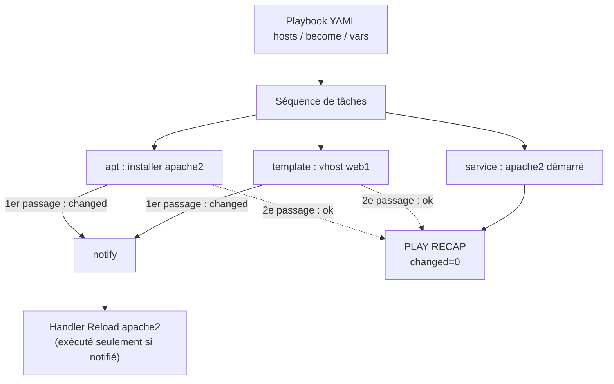
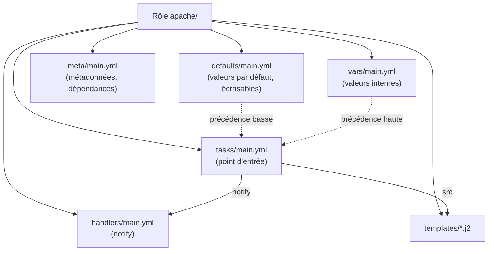
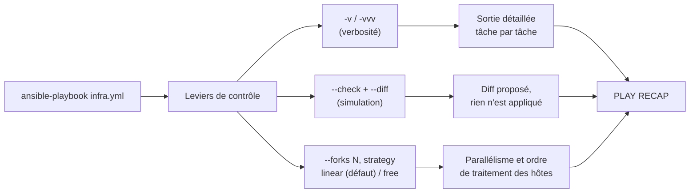
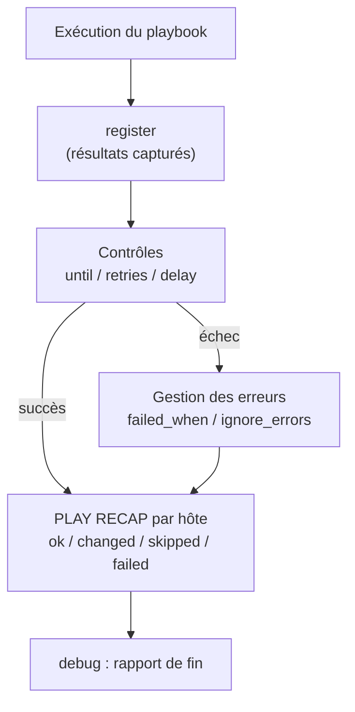

# Ansible — JOUR 2

## Playbooks, Rôles et Supervision (07/10/2026)

**Auteur : Youghourta Merabtène**

> **Fil conducteur** — Cette deuxième journée transforme les commandes ad hoc (J1) en automatisation structurée : écrire des playbooks avec variables et handlers (S4), organiser le projet en rôles avec une hiérarchie de variables (S5), puis déboguer, superviser et reporter l'infrastructure automatisée (S6). Le fil rouge reste l'idempotence : chaque playbook est exécuté deux fois, et la seconde exécution ne doit produire aucun changement (`changed=0`).

---

## Objectifs du Jour

- Écrire un playbook en YAML avec variables et conditions
- Déployer un service web basique à l'aide d'un playbook
- Organiser un projet Ansible avec des rôles
- Hiérarchiser les variables (group_vars, host_vars)
- Déboguer, superviser et reporter les tâches d'un playbook complexe

---

## Prérequis — Rappel des acquis J1

> **Bon à savoir** — La journée suppose l'état du lab laissé par le Jour 1 : le control node `cn-ansible` fourni déjà équipé (Ansible ≥ 2.20), le node `web1` préparé, le projet de référence `~/ansible-lab` pourvu d'un inventaire et d'un `ansible.cfg`. Aucun outil n'est réinstallé ce jour. Vérifier en trois commandes avant de commencer — les trois commandes partagent le même répertoire de travail, `~/ansible-lab`, sans lequel Ansible ne trouve ni la configuration ni l'inventaire du projet :

| Vérification | Commande | Résultat attendu |
|--------------|----------|------------------|
| Ansible installé | `cd ~/ansible-lab && ansible --version` | version affichée, avec la ligne « config file » pointant vers `~/ansible-lab/ansible.cfg` |
| Inventaire visible | `cd ~/ansible-lab && ansible-inventory --graph` | `@all` contient `webservers` (web1) et le groupe automatique `@ungrouped` est vide |
| Connectivité nodes | `cd ~/ansible-lab && ansible all -m ping` | `pong` pour web1, avec `changed: false` |

> **État attendu en fin de Jour 1** — Le tableau ci-dessous résume cet état ; les trois commandes du tableau précédent suffisent à le vérifier avant de commencer la journée.

| Élément | État en fin de Jour 1 |
|---------|-----------------------|
| Machines | `cn-ansible` (172.16.0.10, control node fourni) et `web1` (172.16.0.11, seul node managé), adresses statiques préparées au Lab 0 et résolues par `/etc/hosts` |
| Compte | `stagiaire` sur les deux machines, accès par clé ed25519 et élévation `sudo` sans mot de passe |
| Moteur | ansible-core ≥ 2.20 présent sur `cn-ansible` (fourni avec la machine), vérifié et remis à jour au Lab 2 |
| Projet de référence | `~/ansible-lab` : `inventory.yml`, `inventory.ini`, `ansible.cfg` ; le groupe `webservers` (web1) est opérationnel |
| Projet jetable | `~/ansible-demo` (Lab 1 du Jour 1) — sans effet sur les labs du Jour 2 |
| Journal de bord | Les fichiers déposés sur `web1` par le Lab 3 (`/tmp/hello.txt`, `/tmp/local.txt`, `/tmp/marqueur*`) sont présents et sans importance pour la suite |

> **Environnement de référence** — Control node `cn-ansible` (172.16.0.10) fourni équipé, node managé `web1` (172.16.0.11, groupe `webservers`) sur le réseau privé isolé 172.16.0.0/24. Toutes les commandes du jour s'exécutent dans la **session du compte `stagiaire`** ouverte sur `cn-ansible`, depuis le projet `~/ansible-lab` (inventaire `inventory.yml`, groupe `webservers`, `ansible.cfg` avec `remote_user = stagiaire` et `host_key_checking = False`).

---

## Planning du Jour

| Séquence | Horaires | Thème | Durée | Module |
|----------|----------|-------|-------|--------|
| S4 | 9h00-11h00 | Introduction aux playbooks Ansible | 2h | M4 |
| S5 | 11h00-12h00 | Gestion avancée des rôles et des variables (1/2) | 1h | M5 |
| — | 12h00-13h00 | Pause déjeuner | 1h | — |
| S5 | 13h00-14h00 | Gestion avancée des rôles et des variables (2/2) | 1h | M5 |
| S6 | 14h00-16h00 | Supervision et gestion d'une infrastructure | 2h | M6 |

---

## S4 — Introduction aux playbooks Ansible (9h00-11h00)

### Objectifs

- Écrire et valider un playbook en YAML (structure, tâches, mots-clés)
- Structurer un playbook : `hosts`, `become`, `tasks`, `handlers`, `vars`, `gather_facts`
- Déployer un service web basique avec des variables et des conditions
- Expliquer le mécanisme `notify` / handler : un handler n'est déclenché que sur changement
- Vérifier l'idempotence d'un playbook par double exécution (`changed=0`)

### Contenu Théorique (45min)

#### 1. Syntaxe YAML pour les playbooks

**YAML** (*YAML Ain't Markup Language*) est un format de sérialisation de données conçu pour être lisible par un humain. C'est le langage des playbooks, des inventaires (format YAML vu en S2) et des fichiers de variables [1].

Quelques règles : l'indentation se fait avec des **espaces** (2 espaces par niveau, jamais de tabulation), une association s'écrit `clé: valeur`, une liste se marque par des tirets `- élément`, les commentaires commencent par `#`, et un fichier peut commencer par `---` (début de document) et se terminer par `...` (fin de document).

| Type YAML | Exemple | Utilisation dans un playbook |
|-----------|---------|------------------------------|
| Scalaire (chaîne, nombre, booléen) | `name: Installer apache2` | Nom de la tâche, paramètres simples |
| Liste | `- ping`<br/>`- command` | Liste des tâches, liste des rôles |
| Dictionnaire (association clé/valeur) | `hosts: webservers` | Structure d'un play ou d'une tâche |
| Booléen | `become: true` | Élévation de privilèges, conditions |

Un playbook est une **liste de plays** ; chaque play est un dictionnaire qui définit sur quels hôtes agir et quelles tâches appliquer. Un play minimal :

```yaml
---
- name: Premier playbook
  hosts: webservers
  tasks:
    - name: Tester la connectivité
      ansible.builtin.ping:
```

La validation systématique se fait avec trois outils complémentaires : `yamllint` pour la syntaxe YAML (indentation, cohérence), `ansible-lint` pour les bonnes pratiques Ansible (noms de tâches, modules recommandés, FQCN) [14][15], et l'option `--syntax-check` d'ansible-playbook qui résout l'intégralité du fichier (playbooks, rôles, inventaires) sans rien exécuter [1].

> **Bon à savoir** — La commande ad hoc (J1) exécutait **une** tâche sur un motif d'hôtes. Un **playbook** exécute une **séquence de tâches** (ou de rôles, S5) sur des groupes d'hôtes, avec la possibilité de définir des variables, des conditions et des handlers : c'est la brique de réutilisation de toute l'automatisation Ansible.

#### 2. Structure d'un playbook : hôtes, tâches, handlers

Les mots-clés essentiels d'un play [2] :

| Mot-clé | Rôle | Exemple |
|---------|------|---------|
| `hosts` | Hôtes ou groupes ciblés (motif d'inventaire) | `hosts: webservers` |
| `become` | Élévation de privilèges pour le play (sudo) | `become: true` |
| `gather_facts` | Collecte des faits (courts-circuite la collecte si `false`) | `gather_facts: true` (défaut) |
| `vars` | Variables définies au niveau du play | `vars: web_root: /var/www/web1` |
| `tasks` | Liste ordonnée des tâches à exécuter | voir ci-dessous |
| `handlers` | Tâches spéciales exécutées uniquement si notifiées | voir ci-dessous |
| `roles` | Rôles à appliquer (S5) | `roles: - apache` |

Une **tâche** est l'appel d'un module avec ses paramètres, enrichi de mots-clés de contrôle (`when`, `notify`, `register`, `changed_when`…). Chaque tâche porte un nom explicite (affiché dans la sortie d'exécution) et utilise le nom complet du module (FQCN, ex. `ansible.builtin.template`) [13].

Un **handler** est une tâche enregistrée dans la section `handlers:` du play et exécutée **uniquement lorsqu'une tâche l'a notifiée** via le mot-clé `notify` — et uniquement si cette tâche a produit un **changement** (`changed: true`) [5]. C'est le mécanisme clé de l'idempotence : au premier passage, la modification d'un fichier de configuration notifie le handler (rechargement du service) ; au second passage, le fichier est identique, la tâche rapporte `ok` (aucun changement), aucune notification n'est émise et le handler ne s'exécute pas.

```yaml
---
- name: Exemple de playbook avec handler
  hosts: webservers
  become: true
  tasks:
    - name: Déployer la configuration du site
      ansible.builtin.template:
        src: vhost.conf.j2
        dest: /etc/apache2/sites-available/web1.conf
        mode: "0644"
      notify: Reload apache2          # notifie le handler en cas de changement
  handlers:
    - name: Reload apache2
      ansible.builtin.service:
        name: apache2
        state: reloaded
```

Points de fonctionnement des handlers [5] : ils s'exécutent **en fin de play** (après toutes les tâches du play), une seule fois même si plusieurs tâches les notifient, et dans l'ordre de déclaration de la section `handlers:`. La règle d'or : un handler **ne doit jamais** être appelé directement en tâche — il ne vit que par la notification.

> **Concept clé** — Un handler n'est déclenché que sur **notification**, et la notification n'est émise que par une tâche ayant produit un **changement** (`changed`). Si rien ne change (deuxième exécution), aucune notification n'est émise : le handler ne s'exécute pas. Ce mécanisme est la traduction concrète de l'idempotence dans les playbooks.

**Fig 2.1** — Workflow d'un playbook : les tâches s'exécutent, les handlers ne réagissent qu'aux changements.



#### 3. Gestion des variables et des conditions

**Variables** : définies dans la section `vars:` du play (ou dans des fichiers externes, cf. S5), interpolées avec la syntaxe `{{ variable }}` dans les paramètres des tâches et dans les modèles (templates) [3].

```yaml
---
- name: Playbook avec variables
  hosts: webservers
  vars:
    web_root: /var/www/web1
    server_name: "{{ inventory_hostname }}"
  tasks:
    - name: Créer la racine du site
      ansible.builtin.file:
        path: "{{ web_root }}"
        state: directory
        mode: "0755"
```

Quelques variables utiles déjà rencontrées : `inventory_hostname` (nom de l'hôte dans l'inventaire), `ansible_host` (adresse de connexion), et les faits `ansible_facts['os_family']` ou `ansible_facts['distribution']` (collectés par défaut via `gather_facts: true`, et disponibles pour les `when` et les templates) [3][13]. Si `gather_facts: false` est posé, ces faits ne sont pas disponibles : les conditions et templates qui y font référence échouent.

**Conditions** : le mot-clé `when` exécute la tâche uniquement si la condition est vraie. Les conditions portent sur des variables, des faits ou des valeurs comparées (`==`, `!=`, `>`, `<`), combinées avec `and` / `or`, ou testées avec les opérateurs `in` / `not in` [4].

```yaml
    - name: Installer apache2 sur les nodes Debian uniquement
      ansible.builtin.apt:
        name: apache2
        state: present
      when: ansible_facts['os_family'] == 'Debian'
```

Une tâche dont la condition est fausse est **ignorée** : la sortie affiche `skipping`, elle n'est comptée ni en `ok` ni en `changed`. Cette visibilité est précieuse pour les contrôles (S6).

> **Bon à savoir** — Bonnes pratiques d'écriture (Red Hat) : nommer chaque tâche de façon explicite et unique, utiliser les FQCN (`ansible.builtin.*`) plutôt que le nom court, préférer un module dédié (`template`, `copy`, `service`, `apt`) à `command`/`shell`, et ne jamais laisser de secret en clair dans un playbook (Ansible Vault est introduit au J2 S5 comme signalement, hors lab).

### Lab 4 — Déployer un service web basique (75min)

#### Environnement

| Élément | Valeur |
|---------|--------|
| Control node | `cn-ansible` (172.16.0.10), session du compte `stagiaire`, projet `~/ansible-lab` créé au Lab 2 du Jour 1 (ansible.cfg + inventory.yml), Ansible ≥ 2.20 |
| Nodes managés | `web1` (172.16.0.11, groupe `webservers`) — accès SSH par clé et Python déposés au Lab 0 du Jour 1 |
| Réseau | 172.16.0.0/24 (lab isolé) |
| Compte de connexion | `stagiaire` (sudo sans mot de passe sur le lab uniquement), élévation par `become` dans le playbook |
| Cible du lab | Groupe `webservers` uniquement (node `web1`) |

> **Sécurité** — Le playbook de ce lab installe Apache et modifie la configuration web de `web1`. Commandes et fichiers sont uniquement destinés au réseau isolé 172.16.0.0/24 ; ne jamais cibler un hôte hors de ce périmètre.

#### Exercices

**Exo 0 — Remettre le lab à l'état initial.**

**Contexte :** control node cn-ansible · répertoire `~/ansible-lab` · suppression des playbooks du projet et restauration de la configuration Apache d'origine sur web1 · le site du lab n'existe plus et le site par défaut est servi

> **Prérequis** — `apache2` est préinstallé sur l'image du lab (vérifier avec `dpkg -s apache2` sur web1) ; la dernière commande de cet exercice recharge le service.

Cette remise à zéro (5 min) est nécessaire : le playbook et ses modèles ont déjà été déposés, et la configuration Apache de `web1` a déjà été modifiée lors d'une session précédente ; sans cette restauration, la première exécution de l'Exo 4 ne produirait aucun changement et la vérification d'idempotence de l'Exo 6 serait faussée.

```bash
# Où : control node cn-ansible (172.16.0.10), répertoire ~/ansible-lab (cd ~/ansible-lab)
# Quoi : supprimer le répertoire playbooks du projet, entièrement recréé par l'Exo 2
# Attendu : aucune sortie ; le répertoire ~/ansible-lab/playbooks n'existe plus.
rm -rf ~/ansible-lab/playbooks
```

```bash
# Où : control node cn-ansible (172.16.0.10), répertoire ~/ansible-lab (cd ~/ansible-lab)
# Quoi : restaurer sur web1 la configuration Apache livrée par le paquet : suppression du site virtuel du lab et de sa racine, réactivation du site par défaut
# Attendu : les suppressions signalent changed (celle de 000-default.conf peut rester ok si le lien
# est déjà absent, le module ne modifie alors rien), le lien symbolique est recréé, le service apache2
# est rechargé ; web1 sert de nouveau la page d'accueil livrée avec le paquet.
# Note : le lien symbolique est recréé en deux étapes (suppression puis création) car state=link ne corrige pas une cible existante.
# Note : a2ensite et a2dissite sont volontairement évités ici : ces commandes sortent avec le code 1
# quand le site est déjà dans l'état demandé, ce qui ferait échouer une commande ad hoc.
ansible webservers -b -m file -a "path=/etc/apache2/sites-available/web1.conf state=absent"
ansible webservers -b -m file -a "path=/etc/apache2/sites-enabled/web1.conf state=absent"
ansible webservers -b -m file -a "path=/var/www/web1 state=absent"
ansible webservers -b -m file -a "path=/etc/apache2/sites-enabled/000-default.conf state=absent"
ansible webservers -b -m file -a "path=/etc/apache2/sites-enabled/000-default.conf state=link src=/etc/apache2/sites-available/000-default.conf"
ansible webservers -b -m service -a "name=apache2 state=reloaded"
```

**Exo 1 — Préparer la structure du projet et installer l'outillage de validation (7min).**

**Contexte :** control node cn-ansible · répertoire `~/ansible-lab` · création du répertoire des playbooks et de ses modèles, installation puis contrôle des validateurs · les répertoires existent et `yamllint` et `ansible-lint` répondent

```bash
# Où : control node cn-ansible (172.16.0.10), session du compte « stagiaire », répertoire ~/ansible-lab
# Quoi : créer les répertoires playbooks et playbooks/templates du projet de référence
# Attendu : aucune sortie ; les deux répertoires existent.
mkdir -p playbooks/templates
```

```bash
# Où : control node cn-ansible (172.16.0.10), session du compte « stagiaire », répertoire ~/ansible-lab
# Quoi : installer les deux validateurs utilisés dans ce lab (commande sans effet s'ils sont déjà là)
# Attendu : « yamllint est déjà la version la plus récente » ou « Setting up yamllint… », idem ansible-lint.
sudo apt update
sudo apt install -y yamllint ansible-lint
```

```bash
# Où : control node cn-ansible (172.16.0.10), session du compte « stagiaire », répertoire ~/ansible-lab
# Quoi : contrôler que les deux validateurs répondent
# Attendu : les versions de yamllint et de ansible-lint s'affichent, sans erreur.
yamllint --version
ansible-lint --version
```

> **Note** — Si le paquet `ansible-lint` n'existe pas dans les dépôts de la distribution, l'installer depuis l'environnement virtuel du Lab 2 du Jour 1 : `~/ansible-venv/bin/pip install ansible-lint`. Les deux outils ne sont utilisés qu'ici et dans le Lab 6 : aucun des deux n'est nécessaire pour exécuter les playbooks.

**Exo 2 — Écrire le playbook de déploiement du service web (20min).**

**Contexte :** control node cn-ansible · répertoire `~/ansible-lab` · dépôt du playbook, de son modèle de site virtuel et de sa page d'accueil · les trois fichiers du déploiement existent et sont cohérents entre eux

```bash
# Où : control node cn-ansible (172.16.0.10), répertoire ~/ansible-lab (cd ~/ansible-lab)
# Quoi : créer le fichier playbooks/web-deploy.yml
# Attendu : le playbook installe apache2, crée la racine du site, déploie les deux modèles et notifie le handler de rechargement.
cat > playbooks/web-deploy.yml <<'EOF'
---
- name: Déployer un service web basique
  hosts: webservers
  become: true
  vars:
    web_root: /var/www/web1
    server_name: "{{ inventory_hostname }}"
    welcome_message: "Bienvenue sur le site déployé par Ansible"
  tasks:
    - name: Installer le paquet apache2 (famille Debian uniquement)
      ansible.builtin.apt:
        name: apache2
        state: present
        update_cache: true
      when: ansible_facts['os_family'] == 'Debian'
    - name: Créer le répertoire racine du site
      ansible.builtin.file:
        path: "{{ web_root }}"
        state: directory
        mode: "0755"
    - name: Déployer la configuration du site virtuel
      ansible.builtin.template:
        src: vhost.conf.j2
        dest: /etc/apache2/sites-available/web1.conf
        mode: "0644"
      notify: Reload apache2
    - name: Activer le site virtuel web1
      ansible.builtin.command:
        cmd: a2ensite web1.conf
        creates: /etc/apache2/sites-enabled/web1.conf
    - name: Désactiver le site web par défaut
      ansible.builtin.command:
        cmd: a2dissite 000-default.conf
        removes: /etc/apache2/sites-enabled/000-default.conf
      notify: Reload apache2
    - name: Déployer la page d'accueil
      ansible.builtin.template:
        src: index.html.j2
        dest: "{{ web_root }}/index.html"
        mode: "0644"
    - name: Garantir le démarrage du service apache2
      ansible.builtin.service:
        name: apache2
        state: started
        enabled: true
  handlers:
    - name: Reload apache2
      ansible.builtin.service:
        name: apache2
        state: reloaded
EOF
```

```bash
# Où : control node cn-ansible (172.16.0.10), répertoire ~/ansible-lab (cd ~/ansible-lab)
# Quoi : créer le fichier playbooks/templates/vhost.conf.j2
# Attendu : le modèle décrit un site virtuel qui pointe sur web_root et autorise tous les accès.
cat > playbooks/templates/vhost.conf.j2 <<'EOF'
<VirtualHost *:80>
    ServerName {{ server_name }}
    DocumentRoot {{ web_root }}
    <Directory {{ web_root }}>
        AllowOverride All
        Require all granted
    </Directory>
</VirtualHost>
EOF
```

```bash
# Où : control node cn-ansible (172.16.0.10), répertoire ~/ansible-lab (cd ~/ansible-lab)
# Quoi : créer le fichier playbooks/templates/index.html.j2
# Attendu : le modèle produit une page HTML affichant le message de bienvenue et la distribution du node.
cat > playbooks/templates/index.html.j2 <<'EOF'
<!DOCTYPE html>
<html lang="fr">
  <head>
    <meta charset="utf-8">
    <title>{{ server_name }}</title>
  </head>
  <body>
    <h1>{{ welcome_message }}</h1>
    <p>Hébergé sur {{ server_name }} ({{ ansible_facts['distribution'] }} {{ ansible_facts['distribution_version'] }}).</p>
  </body>
</html>
EOF
```

> **Note** — Le playbook réutilise les acquis du J1 : la condition `when` sur `ansible_facts['os_family']` évite d'exécuter `apt` sur une éventuelle cible non Debian (tâche `skipping`), et les modules impératifs `a2ensite`/`a2dissite` restent idempotents grâce au **gating** `creates`/`removes` (le site est activé ou désactivé une seule fois).

**Exo 3 — Valider la syntaxe du playbook et des modèles (8min).**

**Contexte :** control node cn-ansible · répertoire `~/ansible-lab` · contrôle du playbook par les trois validateurs successifs, sans exécution · aucune erreur de syntaxe, aucune violation bloquante, résolution complète

```bash
# Où : control node cn-ansible (172.16.0.10), répertoire ~/ansible-lab (cd ~/ansible-lab)
# Quoi : valider la syntaxe YAML du playbook
# Attendu : aucune erreur : le fichier est conforme aux règles yamllint.
yamllint playbooks/web-deploy.yml
```

```bash
# Où : control node cn-ansible (172.16.0.10), répertoire ~/ansible-lab (cd ~/ansible-lab)
# Quoi : appliquer les règles de bonnes pratiques Ansible au playbook
# Attendu : aucune violation bloquante ; les éventuels avertissements sont listés pour correction.
ansible-lint playbooks/web-deploy.yml
```

```bash
# Où : control node cn-ansible (172.16.0.10), répertoire ~/ansible-lab (cd ~/ansible-lab)
# Quoi : vérifier que le playbook est résolvable, sans rien exécuter
# Attendu : la ligne « playbook: playbooks/web-deploy.yml » s'affiche, sans message d'erreur.
ansible-playbook playbooks/web-deploy.yml --syntax-check
```

**Exo 4 — Première exécution du playbook (10min).**

**Contexte :** control node cn-ansible · répertoire `~/ansible-lab` · déploiement du site sur web1 · les tâches modifient l'état, le handler de rechargement s'exécute une seule fois en fin de play

```bash
# Où : control node cn-ansible (172.16.0.10), répertoire ~/ansible-lab (cd ~/ansible-lab)
# Quoi : exécuter le playbook de déploiement sur le groupe webservers
# Attendu : tâches changed pour la racine du site, les deux modèles et les deux commandes
# d'activation/désactivation du site ; ok pour les faits collectés, le paquet déjà présent et
# le service déjà démarré ;
# le handler « Reload apache2 » s'exécute une seule fois en fin de play ;
# le PLAY RECAP affiche ok=9 et changed=6 : neuf résultats au total (faits + 7 tâches +
# handler), dont six avec changement — le compteur « ok » englobe les tâches changées.
ansible-playbook playbooks/web-deploy.yml
```

Au premier passage : la création du répertoire, les deux modèles et les deux commandes `a2ensite`/`a2dissite` produisent des changements (le paquet est déjà installé et le service déjà démarré : ces deux tâches restent en `ok`) ; les notifications déclenchées par les deux tâches notifiantes provoquent l'exécution **unique** du handler `Reload apache2` en fin de play.

**Exo 5 — Vérifier le déploiement cible (5min).**

**Contexte :** control node cn-ansible · répertoire `~/ansible-lab` · contrôle du site depuis le contrôleur, par HTTP · le code 200 est renvoyé et la page affichée contient le message interpolé

```bash
# Où : control node cn-ansible (172.16.0.10), répertoire ~/ansible-lab (cd ~/ansible-lab)
# Quoi : interroger le site déployé sur web1 et n'afficher que le code HTTP
# Attendu : 200. Si curl manque sur le contrôleur, l'installer avec sudo apt install -y curl.
curl -s -o /dev/null -w "%{http_code}\n" http://172.16.0.11/
```

```bash
# Où : control node cn-ansible (172.16.0.10), répertoire ~/ansible-lab (cd ~/ansible-lab)
# Quoi : afficher la page servie par Apache et en extraire le titre
# Attendu : le HTML contient « Bienvenue sur le site déployé par Ansible ».
curl -s http://172.16.0.11/
```

**Exo 6 — VÉRIFICATION DE L'IDEMPOTENCE : seconde exécution (7min).**

**Contexte :** control node cn-ansible · répertoire `~/ansible-lab` · rejeu du playbook sans aucune modification · `changed=0` et handler absent de la sortie

```bash
# Où : control node cn-ansible (172.16.0.10), répertoire ~/ansible-lab (cd ~/ansible-lab)
# Quoi : rejouer le playbook à l'identique, sans modification de contenu
# Attendu : PLAY RECAP avec changed=0 ; les tâches a2ensite et a2dissite passent en ok (le gating empêche l'exécution de la commande) ;
# le handler « Reload apache2 » est absent de la sortie, car aucune tâche n'a produit de changement.
ansible-playbook playbooks/web-deploy.yml
```

> **Vérification d'idempotence** — Deuxième exécution : `changed=0`. Les tâches `command` protégées par `creates`/`removes` passent en `ok` **sans exécuter la commande** (le module n'est pas lancé) et le handler n'apparaît pas : rien n'a changé, donc rien n'a été notifié, donc rien n'a été rejoué.

**Exo 7 — Observer le détail de l'exécution (verbosité et aperçu) (5min).**

**Contexte :** control node cn-ansible · répertoire `~/ansible-lab` · aperçu de la séquence et exécution détaillée · la liste des tâches et le détail des variables résolues sont visibles

```bash
# Où : control node cn-ansible (172.16.0.10), répertoire ~/ansible-lab (cd ~/ansible-lab)
# Quoi : lister les tâches et les hôtes ciblés sans exécuter
# Attendu : les sept tâches sont listées dans l'ordre ; un seul hôte est ciblé (web1).
ansible-playbook playbooks/web-deploy.yml --list-tasks
ansible-playbook playbooks/web-deploy.yml --list-hosts
```

```bash
# Où : control node cn-ansible (172.16.0.10), répertoire ~/ansible-lab (cd ~/ansible-lab)
# Quoi : exécuter le playbook avec la verbosité -v
# Attendu : la sortie détaille chaque tâche et affiche les variables interpolées (web_root, server_name).
ansible-playbook playbooks/web-deploy.yml -v
```

**Synthèse du lab — Ce qu'il faut retenir (8min).**

> - Un playbook est une liste de plays YAML : `hosts`, `become`, `vars`, `tasks`, `handlers`.
> - `notify` ne déclenche le handler que si la tâche notifiante a produit un changement.
> - `when` permet de conditionner une tâche (sur faits ou variables) : condition fausse = `skipping`.
> - Validation en trois coups avant exécution : `yamllint`, `ansible-lint`, `--syntax-check`.
> - Idempotence vérifiée par double exécution : `changed=0` au second passage, handler non rejoué.
>
> **Vérification finale** — (1) Le site répond en HTTP 200 avec le message interpolé ; (2) le handler `Reload apache2` n'est exécuté qu'au premier passage ; (3) la seconde exécution affiche `changed=0`. Le playbook est **idempotent** et réutilisable tel quel — il deviendra la base du rôle `apache` en S5.

---

## S5 — Gestion avancée des rôles et des variables (11h00-12h00 / 13h00-14h00)

### Objectifs

- Créer un rôle Ansible avec `ansible-galaxy role init` et comprendre son arborescence standard
- Distinguer `defaults/main.yml` (valeurs par défaut écrasables) et `vars/main.yml` (valeurs internes)
- Hiérarchiser les variables avec `group_vars` et `host_vars`
- Énoncer et vérifier concrètement l'ordre de précédence des variables
- Déployer un rôle et vérifier son idempotence

### Contenu Théorique (45min)

#### 1. Introduction aux rôles : organisation des tâches et des fichiers

Un **rôle** est un paquet réutilisable qui regroupe tâches, handlers, variables, templates et fichiers dans une arborescence normalisée [6]. Il encapsule une fonction (ex. « déployer un serveur web apache ») et peut être réutilisé d'un playbook à l'autre, d'un projet à l'autre.

Le squelette standard est généré par la commande `ansible-galaxy role init` (ou son alias `ansible-galaxy init`) [7] :

```bash
# Où : control node cn-ansible (172.16.0.10), répertoire ~/ansible-lab (cd ~/ansible-lab)
# Quoi : générer le squelette d'un rôle nommé « apache » dans le répertoire roles/
# Attendu : l'arborescence roles/apache est créée (tasks, templates, defaults, handlers, meta).
ansible-galaxy role init apache --init-path roles
```

| Répertoire / fichier | Contenu et rôle |
|----------------------|-----------------|
| `tasks/main.yml` | Les tâches du rôle, exécutées dans l'ordre (point d'entrée obligatoire) |
| `handlers/main.yml` | Les handlers propres au rôle (ex. reload du service) |
| `defaults/main.yml` | Variables par défaut du rôle — **facilement écrasables**, à surcharger |
| `vars/main.yml` | Variables internes du rôle — **non écrasables** par l'inventaire |
| `templates/` | Modèles Jinja2 utilisés par les tâches du rôle (`.j2`) |
| `files/` | Fichiers statiques copiés par le rôle sans interpolation |
| `meta/main.yml` | Métadonnées (auteur, description, dépendances, `min_ansible_version`) |
| `README.md`, `tests/` | Documentation et tests du rôle (squelette) |

Le rôle s'utilise dans un playbook avec le mot-clé `roles:` ; toutes les tâches du rôle sont alors exécutées dans l'ordre de déclaration, comme une séquence de tâches classique [6].

```yaml
---
- name: Appliquer le rôle apache
  hosts: webservers
  become: true
  roles:
    - apache
```

**Fig 2.2** — Arborescence standard d'un rôle Ansible et liens entre ses composants.



> **Bon à savoir** — Le chemin de recherche des rôles est piloté par la configuration `roles_path` (section `[defaults]` d'ansible.cfg) : on y référence le répertoire `roles/` du projet (`roles_path = ./roles`, chemins relatifs résolus par rapport à ansible.cfg). Sans cela, un rôle local au projet n'est pas trouvé.

#### 2. Définir des variables globales et locales

Les variables d'un projet se répartissent en familles de portée croissante [3] :

| Famille | Emplacement | Caractéristique |
|---------|-------------|-----------------|
| Playbook | `vars:`, `vars_files:`, `vars_prompt:` | Portée du play, écrasent les variables d'inventaire |
| Inventaire | lignes `var=value` ou `group_vars/`, `host_vars/` | Portée groupe ou hôte |
| Rôle | `defaults/main.yml`, `vars/main.yml` | Portée de l'appel du rôle |
| Ligne de commande | `-e "var=value"` (`--extra-vars`) | Portée globale de l'exécution |

La distinction essentielle à l'intérieur d'un rôle : **`defaults/`** contient des valeurs par défaut pensées pour être surchargées (port, message, chemins configurables) ; **`vars/`** contient des valeurs internes de fonctionnement que l'inventaire ne doit pas modifier (nom du paquet, nom du service) [3][6]. Les deux se combinent : un rôle bien conçu définit ses valeurs internes dans `vars/` et expose ses paramètres dans `defaults/`.

Bonne pratique de nommage Red Hat : **préfixer les variables d'un rôle par le nom du rôle** (`apache_port`, `apache_service`, `apache_welcome_message`), ce qui évite les collisions entre rôles.

#### 3. Hiérarchisation group_vars / host_vars et ordre de précédence

Les répertoires `group_vars/` et `host_vars/` centralisent les variables par groupe ou par hôte : placés **à côté de l'inventaire**, ils fournissent des variables d'inventaire ; placés à côté du playbook, des variables de playbook — les deux jeux coexistent, avec des priorités différentes (voir tableau ci-dessous) [9].

```text
~/ansible-lab/
├── inventory.yml            # groupe webservers (web1)
├── group_vars/
│   ├── all.yml              # variables communes à tous les hôtes
│   └── webservers.yml       # variables du groupe webservers
└── host_vars/
    └── web1.yml             # variables propres à l'hôte web1
```

Les noms de fichiers suivent les noms de groupes et d'hôtes de l'inventaire (`all` = groupe racine, `webservers` = groupe, `web1` = hôte). Les groupes enfants priment sur les groupes parents, et une variable d'hôte prime sur celle de son groupe [9].

**Ordre de précédence des variables (du plus bas au plus haut)** [8] :

| Niveau | Source de variable |
|--------|--------------------|
| 1 | Valeurs passées en ligne de commande (options non-variables, ex. `-u`) |
| 2 | **Role defaults** (`roles/x/defaults/main.yml`) |
| 3 | Group vars définis dans le fichier/script d'inventaire |
| 4 | Inventory `group_vars/all` |
| 5 | Playbook `group_vars/all` |
| 6 | Inventory `group_vars/*` (groupe) |
| 7 | Playbook `group_vars/*` (groupe) |
| 8 | Host vars définis dans le fichier/script d'inventaire |
| 9 | Inventory `host_vars/*` |
| 10 | Playbook `host_vars/*` |
| 11 | Faits hôte (facts) et `set_facts` mis en cache |
| 12 | **Play `vars:`** |
| 13 | Play `vars_prompt` |
| 14 | Play `vars_files` |
| 15 | **Role vars** (`roles/x/vars/main.yml`) |
| 16 | Block vars (tâches d'un block) |
| 17 | Task vars (tâche seule) |
| 18 | `include_vars` |
| 19 | Variables enregistrées (`register`) et `set_facts` |
| 20 | Paramètres du rôle (et `include_role`) |
| 21 | Paramètres d'`include` |
| 22 | **Extra vars** (`-e "var=value"`) — gagnent toujours |

> **Concept clé** — L'ordre de précédence des variables (du plus bas au plus haut) détermine la valeur effective utilisée par les tâches. Deux pièges classiques : les `role defaults` (niv. 2) sont presque tout en bas — c'est leur but, être écrasés facilement ; le `vars:` du playbook (niv. 12) écrase `host_vars` (niv. 9-10). Seules les **extra vars** (`-e`) passent au-dessus de tout (niv. 22). Le Lab 5 vérifie chacun de ces niveaux par affichage `debug`.

**Fig 2.3** — Précédence des variables : du bas (facilement écrasé) vers le haut (incontournable).


> **Bon à savoir** — Pour choisir où placer une variable, raisonner en termes de facilité d'écrasement : une valeur que tout le monde doit pouvoir adapter → `defaults/` du rôle ; un réglage par site → `group_vars/*` ; un cas particulier → `host_vars/*` ; une urgence ponctuelle → `-e`. Ne jamais hésiter : en cas de doute, `-e` écrase tout (mais à réserver aux cas ponctuels, car elle échappe au versionnement) [3][8].

### Lab 5 — Organiser un projet Ansible en rôles (75min)

#### Environnement

| Élément | Valeur |
|---------|--------|
| Control node | `cn-ansible` (172.16.0.10), projet `~/ansible-lab` (J1) enrichi au Lab 4 (répertoire `playbooks/`) |
| Nodes managés | `web1` (172.16.0.11, groupe `webservers`) |
| Réseau | 172.16.0.0/24 (lab isolé) |
| Compte de connexion | `stagiaire` (sudo sans mot de passe sur le lab uniquement) |
| Variable de démonstration | `apache_welcome_message` — suivie étape par étape (debug + page servie) |

> **Sécurité** — Ce lab modifie la configuration Apache déployée au Lab 4 (contenu du site) et ajoute des fichiers de variables au projet ; tout se joue sur le réseau isolé 172.16.0.0/24.

#### Exercices

**Exo 0 — Remettre le lab à l'état initial.**

**Contexte :** control node cn-ansible · répertoire `~/ansible-lab` · suppression du rôle `apache` et des fichiers de variables recréés par ce lab, playbooks conservés · `roles/apache/`, `group_vars/` et `host_vars/` n'existent plus

Cette remise à zéro (3 min) est nécessaire : la démonstration de la précédence des variables n'a de sens que si la valeur part du niveau le plus bas, les valeurs par défaut du rôle, et la vérification d'idempotence doit être observée depuis un état neuf. Les playbooks du Lab 4 sont conservés : ce lab s'appuie dessus.

```bash
# Où : control node cn-ansible (172.16.0.10), répertoire ~/ansible-lab (cd ~/ansible-lab)
# Quoi : supprimer le rôle apache et les répertoires de variables du projet
# Attendu : aucune sortie ; roles/apache, group_vars/ et host_vars/ ont disparu, le répertoire playbooks/ est intact.
rm -rf roles/apache group_vars host_vars
```

**Exo 1 — Enrichir ansible.cfg avec le chemin des rôles (5min).**

**Contexte :** control node cn-ansible · répertoire `~/ansible-lab` · réécriture complète de la configuration du projet, section `[defaults]` complétée du chemin des rôles · la valeur effective de `roles_path` pointe sur le répertoire `roles/` du projet

```bash
# Où : control node cn-ansible (172.16.0.10), répertoire ~/ansible-lab (cd ~/ansible-lab)
# Quoi : réécrire le fichier ansible.cfg avec le chemin de recherche des rôles
# Attendu : le fichier contient les huit paramètres par défaut du Lab 2, plus roles_path = ./roles.
# Note : inject_facts_as_vars = False est conservé : les faits restent accessibles par ansible_facts['…'].
# Avertissement : host_key_checking = False n'est acceptable que sur le réseau de lab isolé.
cat > ansible.cfg <<'EOF'
[defaults]
inventory = ./inventory.yml
remote_user = stagiaire
forks = 5
host_key_checking = False
interpreter_python = auto
inject_facts_as_vars = False
timeout = 10
roles_path = ./roles
EOF
```

```bash
# Où : control node cn-ansible (172.16.0.10), répertoire ~/ansible-lab (cd ~/ansible-lab)
# Quoi : afficher la valeur effective du chemin de recherche des rôles
# Attendu : DEFAULT_ROLES_PATH(/…/ansible.cfg) = ['/…/ansible-lab/roles'].
# Note : la valeur redefine le chemin de recherche des rôles : elle ne contient QUE le répertoire roles/ du
# projet. Pour conserver les chemins par défaut du système, il faut les énumérer à la main, par exemple
# « roles_path = ./roles:~/.ansible/roles:/usr/share/ansible/roles:/etc/ansible/roles ».
ansible-config dump | grep DEFAULT_ROLES_PATH
```

**Exo 2 — Créer le rôle apache et explorer son squelette (8min).**

**Contexte :** control node cn-ansible · répertoire `~/ansible-lab` · génération du squelette du rôle `apache` dans `roles/` puis nettoyage de ses fichiers de test · l'arborescence standard du rôle est visible et exploitable

```bash
# Où : control node cn-ansible (172.16.0.10), répertoire ~/ansible-lab (cd ~/ansible-lab)
# Quoi : générer le squelette du rôle apache dans le répertoire roles/ du projet
# Attendu : l'arborescence roles/apache est créée avec README.md, defaults/, files/, handlers/, meta/, tasks/, templates/, tests/ et vars/.
ansible-galaxy role init apache --init-path roles
```

```bash
# Où : control node cn-ansible (172.16.0.10), répertoire ~/ansible-lab (cd ~/ansible-lab)
# Quoi : retirer les deux fichiers de test générés par ansible-galaxy, puis supprimer le répertoire devenu vide
# Attendu : aucune sortie ; le répertoire roles/apache/tests n'existe plus, le reste du squelette est conservé.
# Note : tests/test.yml est un play de test sans nom et tests/inventory un inventaire factice.
# Ils ne font pas partie d'un rôle publié et ne satisfont pas la règle name[play] d'ansible-lint.
rm -f roles/apache/tests/test.yml roles/apache/tests/inventory
rmdir roles/apache/tests
```

```bash
# Où : control node cn-ansible (172.16.0.10), répertoire ~/ansible-lab (cd ~/ansible-lab)
# Quoi : visualiser l'arborescence du squelette généré
# Attendu : la liste des répertoires et fichiers du rôle, tests/ absent.
ls -R roles/apache
```

**Exo 3 — Compléter le rôle apache (transposition du playbook du Lab 4) (20min).**

**Contexte :** control node cn-ansible · répertoire `~/ansible-lab/roles/apache` · dépôt des sept fichiers du rôle (tâches, handler, valeurs par défaut, variables internes, deux modèles, métadonnées) · le rôle reproduit exactement le déploiement du Lab 4, paramétré par variables

```bash
# Où : control node cn-ansible (172.16.0.10), répertoire ~/ansible-lab (cd ~/ansible-lab)
# Quoi : créer le fichier roles/apache/tasks/main.yml
# Attendu : sept tâches paramétrées par apache_package, apache_docroot, apache_site_name et apache_service.
cat > roles/apache/tasks/main.yml <<'EOF'
---
- name: Installer le paquet {{ apache_package }}
  ansible.builtin.apt:
    name: "{{ apache_package }}"
    state: present
    update_cache: true
  when: ansible_facts['os_family'] == 'Debian'
- name: Créer le répertoire racine du site
  ansible.builtin.file:
    path: "{{ apache_docroot }}"
    state: directory
    mode: "0755"
- name: Déployer la configuration du site virtuel
  ansible.builtin.template:
    src: vhost.conf.j2
    dest: "/etc/apache2/sites-available/{{ apache_site_name }}"
    mode: "0644"
  notify: Reload apache2
- name: Activer le site virtuel
  ansible.builtin.command:
    cmd: "a2ensite {{ apache_site_name }}"
    creates: "/etc/apache2/sites-enabled/{{ apache_site_name }}"
- name: Désactiver le site web par défaut
  ansible.builtin.command:
    cmd: a2dissite 000-default.conf
    removes: /etc/apache2/sites-enabled/000-default.conf
  notify: Reload apache2
- name: Déployer la page d'accueil
  ansible.builtin.template:
    src: index.html.j2
    dest: "{{ apache_docroot }}/index.html"
    mode: "0644"
- name: Garantir le démarrage du service {{ apache_service }}
  ansible.builtin.service:
    name: "{{ apache_service }}"
    state: started
    enabled: true
EOF
```

```bash
# Où : control node cn-ansible (172.16.0.10), répertoire ~/ansible-lab (cd ~/ansible-lab)
# Quoi : créer le fichier roles/apache/handlers/main.yml
# Attendu : un handler unique, Reload apache2, qui recharge le service apache2 du rôle.
cat > roles/apache/handlers/main.yml <<'EOF'
---
- name: Reload apache2
  ansible.builtin.service:
    name: "{{ apache_service }}"
    state: reloaded
EOF
```

```bash
# Où : control node cn-ansible (172.16.0.10), répertoire ~/ansible-lab (cd ~/ansible-lab)
# Quoi : créer le fichier roles/apache/defaults/main.yml
# Attendu : cinq paramètres par défaut, dont apache_welcome_message, facile à surcharger par l'appelant.
cat > roles/apache/defaults/main.yml <<'EOF'
---
apache_port: 80
apache_server_name: "{{ inventory_hostname }}"
apache_site_name: web1.conf
apache_docroot: /var/www/web1
apache_welcome_message: "Site géré par le rôle apache (valeur par défaut)"
EOF
```

```bash
# Où : control node cn-ansible (172.16.0.10), répertoire ~/ansible-lab (cd ~/ansible-lab)
# Quoi : créer le fichier roles/apache/vars/main.yml
# Attendu : les deux variables internes du rôle, apache_package et apache_service.
cat > roles/apache/vars/main.yml <<'EOF'
---
apache_package: apache2
apache_service: apache2
EOF
```

```bash
# Où : control node cn-ansible (172.16.0.10), répertoire ~/ansible-lab (cd ~/ansible-lab)
# Quoi : créer le fichier roles/apache/templates/vhost.conf.j2
# Attendu : le modèle décrit un site virtuel sur le port apache_port, avec apache_server_name et apache_docroot.
mkdir -p roles/apache/templates
cat > roles/apache/templates/vhost.conf.j2 <<'EOF'
<VirtualHost *:{{ apache_port }}>
    ServerName {{ apache_server_name }}
    DocumentRoot {{ apache_docroot }}
    <Directory {{ apache_docroot }}>
        AllowOverride All
        Require all granted
    </Directory>
</VirtualHost>
EOF
```

```bash
# Où : control node cn-ansible (172.16.0.10), répertoire ~/ansible-lab (cd ~/ansible-lab)
# Quoi : créer le fichier roles/apache/templates/index.html.j2
# Attendu : le modèle produit une page HTML affichant apache_welcome_message.
cat > roles/apache/templates/index.html.j2 <<'EOF'
<!DOCTYPE html>
<html lang="fr">
  <head>
    <meta charset="utf-8">
    <title>{{ apache_server_name }}</title>
  </head>
  <body>
    <h1>{{ apache_welcome_message }}</h1>
    <p>Hébergé sur {{ apache_server_name }} ({{ ansible_facts['distribution'] }} {{ ansible_facts['distribution_version'] }}).</p>
  </body>
</html>
EOF
```

```bash
# Où : control node cn-ansible (172.16.0.10), répertoire ~/ansible-lab (cd ~/ansible-lab)
# Quoi : réécrire le fichier roles/apache/meta/main.yml
# Attendu : les métadonnées du rôle sont complètes : auteur, description, licence, version minimale et dépendances.
cat > roles/apache/meta/main.yml <<'EOF'
---
galaxy_info:
  author: stagiaire
  role_name: apache
  description: Déploiement d'un serveur web Apache2 (lab 172.16.0.0/24)
  license: MIT
  min_ansible_version: "2.20"
dependencies: []
EOF
```

> **Note** — L'exécution du Lab 4 a déjà installé Apache et déployé le site sur `web1` : le rôle appliqué sur le même hôte doit être **strictement idempotent** (aucun changement au second passage) — c'est la vérification finale de l'Exo 7.

**Exo 4 — Écrire et exécuter le playbook du rôle (8min).**

**Contexte :** control node cn-ansible · répertoire `~/ansible-lab` · dépôt de `playbooks/site.yml`, qui appelle le rôle sans surcharger aucune variable · la valeur par défaut du rôle est affichée par `debug` et servie par le site

```bash
# Où : control node cn-ansible (172.16.0.10), répertoire ~/ansible-lab (cd ~/ansible-lab)
# Quoi : créer le fichier playbooks/site.yml
# Attendu : le playbook appelle le rôle apache puis affiche la valeur effective de apache_welcome_message.
cat > playbooks/site.yml <<'EOF'
---
- name: Déployer le serveur web via le rôle apache
  hosts: webservers
  become: true
  roles:
    - apache
  tasks:
    - name: Afficher la valeur de apache_welcome_message
      ansible.builtin.debug:
        var: apache_welcome_message
EOF
```

```bash
# Où : control node cn-ansible (172.16.0.10), répertoire ~/ansible-lab (cd ~/ansible-lab)
# Quoi : exécuter le playbook du rôle
# Attendu : le debug affiche « Site géré par le rôle apache (valeur par défaut) » ;
# la seule tâche modifiée est le déploiement de la page d'accueil, dont le message change.
ansible-playbook playbooks/site.yml
```

```bash
# Où : control node cn-ansible (172.16.0.10), répertoire ~/ansible-lab (cd ~/ansible-lab)
# Quoi : relire le titre de la page servie par web1
# Attendu : la page contient <h1>Site géré par le rôle apache (valeur par défaut)</h1>.
curl -s http://172.16.0.11/ | grep "<h1>"
```

**Exo 5 — Vérifier la précédence étape par étape : `group_vars` puis `host_vars` (11min).**

**Contexte :** control node cn-ansible · répertoire `~/ansible-lab` · dépôt successif de `group_vars/all.yml`, `group_vars/webservers.yml` puis `host_vars/web1.yml`, avec observation après chaque étape · à chaque étape, le message servi vient du niveau de précédence le plus élevé ayant défini la variable

```bash
# Où : control node cn-ansible (172.16.0.10), répertoire ~/ansible-lab (cd ~/ansible-lab)
# Quoi : créer le fichier group_vars/all.yml, puis rejouer le playbook et relire le titre servi
# Attendu : le debug affiche « Message défini dans group_vars/all.yml », et la page servie affiche ce message.
mkdir -p group_vars
cat > group_vars/all.yml <<'EOF'
---
apache_welcome_message: "Message défini dans group_vars/all.yml"
EOF
ansible-playbook playbooks/site.yml
curl -s http://172.16.0.11/ | grep "<h1>"
```

```bash
# Où : control node cn-ansible (172.16.0.10), répertoire ~/ansible-lab (cd ~/ansible-lab)
# Quoi : créer le fichier group_vars/webservers.yml, puis rejouer le playbook et relire le titre servi
# Attendu : le message devient « Message défini dans group_vars/webservers.yml » : le groupe enfant prime sur le groupe racine.
cat > group_vars/webservers.yml <<'EOF'
---
apache_welcome_message: "Message défini dans group_vars/webservers.yml"
EOF
ansible-playbook playbooks/site.yml
curl -s http://172.16.0.11/ | grep "<h1>"
```

```bash
# Où : control node cn-ansible (172.16.0.10), répertoire ~/ansible-lab (cd ~/ansible-lab)
# Quoi : créer le fichier host_vars/web1.yml, puis rejouer le playbook et relire le titre servi
# Attendu : le message devient « Message défini dans host_vars/web1.yml » : la variable d'hôte prime sur celles des groupes.
mkdir -p host_vars
cat > host_vars/web1.yml <<'EOF'
---
apache_welcome_message: "Message défini dans host_vars/web1.yml"
EOF
ansible-playbook playbooks/site.yml
curl -s http://172.16.0.11/ | grep "<h1>"
```

> **Vérification de la précédence (1/2)** — En partant des valeurs par défaut du rôle (niveau 2), le message effectif passe successivement à `group_vars/all` (niveau 4), puis à `group_vars/webservers` (niveau 6), puis à `host_vars/web1` (niveau 9) : à chaque étape, la valeur affichée par `debug` et servie par le site est celle du niveau le plus haut ayant défini la variable.

**Exo 6 — Continuer la vérification : variables du playbook puis extra vars (6min).**

**Contexte :** control node cn-ansible · répertoire `~/ansible-lab` · ajout d'une section `vars:` au play, puis exécution avec une variable passée en ligne de commande · le `vars:` du play écrase `host_vars`, et l'option `-e` écrase tout

```bash
# Où : control node cn-ansible (172.16.0.10), répertoire ~/ansible-lab (cd ~/ansible-lab)
# Quoi : réécrire le fichier playbooks/site.yml en lui ajoutant une section vars:
# Attendu : le fichier contient vars: apache_welcome_message avant la section roles:.
cat > playbooks/site.yml <<'EOF'
---
- name: Déployer le serveur web via le rôle apache
  hosts: webservers
  become: true
  vars:
    apache_welcome_message: "Message défini par le playbook (vars: du play)"
  roles:
    - apache
  tasks:
    - name: Afficher la valeur de apache_welcome_message
      ansible.builtin.debug:
        var: apache_welcome_message
EOF
```

```bash
# Où : control node cn-ansible (172.16.0.10), répertoire ~/ansible-lab (cd ~/ansible-lab)
# Quoi : exécuter le playbook après l'ajout de la section vars:
# Attendu : le debug affiche « Message défini par le playbook (vars: du play) » : le niveau 12 écrase host_vars (niveau 9).
ansible-playbook playbooks/site.yml
curl -s http://172.16.0.11/ | grep "<h1>"
```

```bash
# Où : control node cn-ansible (172.16.0.10), répertoire ~/ansible-lab (cd ~/ansible-lab)
# Quoi : exécuter le même playbook en surchargeant la variable en ligne de commande
# Attendu : le message servi devient « Message défini par extra vars » : le niveau 22 gagne toujours.
# Note : une valeur contenant des espaces se cite entre guillemets À L'INTÉRIEUR de l'argument -e,
# sinon elle est tronquée au premier mot.
ansible-playbook playbooks/site.yml -e 'apache_welcome_message="Message défini par extra vars"'
curl -s http://172.16.0.11/ | grep "<h1>"
```

> **Vérification de la précédence (2/2)** — Le `vars:` du playbook (niveau 12) écrase bien `host_vars` (niveaux 9-10) — résultat contre-intuitif mais conforme à la table [8]. Les extra vars (`-e`, niveau 22) priment sur tout, y compris sur le `vars:` du play.

**Exo 7 — VÉRIFICATION DE L'IDEMPOTENCE du rôle (6min).**

**Contexte :** control node cn-ansible · répertoire `~/ansible-lab` · retrait de la surcharge ponctuelle du playbook puis double exécution dans un état stable · la valeur effective revient à `host_vars` et la seconde exécution affiche `changed=0`

```bash
# Où : control node cn-ansible (172.16.0.10), répertoire ~/ansible-lab (cd ~/ansible-lab)
# Quoi : réécrire playbooks/site.yml sans la section vars:, puis exécuter le playbook
# Attendu : le message redevient « Message défini dans host_vars/web1.yml » : la surcharge ponctuelle est retirée.
# Note : cette première exécution modifie la page d'accueil, qui contient encore le message des extra vars.
cat > playbooks/site.yml <<'EOF'
---
- name: Déployer le serveur web via le rôle apache
  hosts: webservers
  become: true
  roles:
    - apache
  tasks:
    - name: Afficher la valeur de apache_welcome_message
      ansible.builtin.debug:
        var: apache_welcome_message
EOF
ansible-playbook playbooks/site.yml
```

```bash
# Où : control node cn-ansible (172.16.0.10), répertoire ~/ansible-lab (cd ~/ansible-lab)
# Quoi : rejouer le playbook du rôle à l'identique, dans un état stable
# Attendu : PLAY RECAP avec changed=0 ; le handler « Reload apache2 » est absent de la sortie, aucune notification émise.
ansible-playbook playbooks/site.yml
```

**Synthèse du lab — Ce qu'il faut retenir (8min).**

> - `ansible-galaxy role init <nom> --init-path roles` génère le squelette standard d'un rôle.
> - `defaults/main.yml` = valeurs par défaut écrasables ; `vars/main.yml` = variables internes du rôle.
> - `group_vars/` et `host_vars/` hiérarchisent les variables par groupe et par hôte.
> - Ordre de précédence : valeurs par défaut du rôle < `group_vars` < `host_vars` < `vars:` du play < extra vars.
> - L'idempotence d'un rôle se vérifie comme celle d'un playbook : rejeu dans un état stable → `changed=0`.

> **Vérification finale** — Le rôle `apache` applique le déploiement complet (paquet, vhost, site, service) de manière idempotente : `changed=0` au second passage. La valeur effective de `apache_welcome_message` est démontrée niveau par niveau (valeurs par défaut du rôle → `group_vars/all` → `group_vars/webservers` → `host_vars/web1` → `vars:` du play → extra vars), conformément à la table de précédence [8].

---

## S6 — Supervision et gestion d'une infrastructure (14h00-16h00)

### Objectifs

- Diagnostiquer une exécution avec les niveaux de verbosité (`-v`, `-vvv`) et le module `debug`
- Contrôler les erreurs avec `ignore_errors`, `failed_when`, `changed_when`
- Adapter le parallélisme avec les forks et choisir une stratégie (`linear`, `free`)
- Surveiller sans risque avec `--check` et `--diff`, et exploiter les registres (`register`, `until`, `retries`)
- Produire un retour d'exécution clair (PLAY RECAP, rapport de fin via `debug`)

### Contenu Théorique (45min)

#### 1. Débogage et gestion des erreurs dans Ansible

**Verbosité** : ansible-playbook affiche par défaut uniquement le déroulé des tâches ; les niveaux `-v` à `-vvvv` ajoutent des détails croissants [10].

| Niveau | Informations ajoutées |
|--------|------------------------|
| `-v` | Résultat détaillé des tâches, variables interpolées, sorties |
| `-vv` | Déroulé fin de l'exécution, configuration résolue |
| `-vvv` | Détails de connexion SSH, payload du module envoyé au node |
| `-vvvv` | Payload complet (débogage avancé du protocole) |

Le module `ansible.builtin.debug` affiche une valeur ou une variable en cours de playbook (avec `msg:` pour un texte interpolé, `var:` pour une variable brute) : c'est l'outil de traçage privilégié, déjà utilisé au Lab 5 [13].

**Contrôle des erreurs et des changements** [10] :

| Mot-clé | Effet | Bon usage |
|---------|-------|-----------|
| `ignore_errors: true` | L'échec de la tâche n'arrête pas le play (compté `failed=0` au récap après traitement) | Avec parcimonie : mieux vaut tester explicitement l'état |
| `failed_when: <condition>` | Re-déclare **quand** une tâche est un échec (au lieu du code de retour seul) | Transformer une commande en vérification (`rc != 0`) |
| `changed_when: <condition>` | Re-déclare **quand** une tâche est un changement | Rendre idempotente une tâche impérative qui ne modifie rien |
| `register:` | Capture le résultat d'un module dans une variable (`.rc`, `.stdout`, `.status`…) | Exploiter la sortie dans `when`, `debug`, `until` |

Le pattern `register` + `until` + `retries` + `delay` attend qu'une condition soit vraie avant de continuer : l'attente de disponibilité d'un service est l'exemple canonique (le module `ansible.builtin.uri` interroge une URL ; `until: result.status == 200`, `retries: 5`, `delay: 2`) [2][13].

```yaml
    - name: Attendre la disponibilité du service web
      ansible.builtin.uri:
        url: "http://localhost/"
        status_code: 200
      register: http_check
      until: http_check.status == 200
      retries: 5
      delay: 2
```

#### 2. Stratégies d'exécution et forks

**Forks** : nombre de nodes traités en parallèle (défini dans ansible.cfg, `forks = 5`, ou en ligne de commande avec `--forks N`) [13]. Dans ce lab, `webservers` ne compte qu'un node (`web1`) : l'option ne change rien à l'observable. En parc réel, `--forks 1` sérialise le traitement (ordre d'hôtes déterministe), tandis que des forks élevés accélèrent l'exécution de grands groupes tout en chargeant davantage le contrôleur.

**Stratégies** : le mot-clé `strategy` (niveau play) choisit le plugin d'orchestration [12] :

| Stratégie | Comportement | Usage recommandé |
|-----------|--------------|------------------|
| `linear` (défaut) | Chaque tâche s'exécute sur **tous** les hôtes avant de passer à la suivante | Défaut : cohérence et prévisibilité |
| `free` | Chaque hôte avance à **son rythme** dans les tâches | Tâches longues et hétérogènes, dernier recours (chargement, synchronisation) |

**Fig 2.4** — Débogage et stratégies : les leviers de contrôle d'une exécution.



#### 3. Surveillance et reporting des tâches exécutées

**PLAY RECAP** : à la fin de chaque exécution, le bilan par hôte — `ok`, `changed`, `unreachable`, `failed`, `skipped`, `rescued`, `ignored`. C'est le premier indicateur de supervision : un playbook sain rejoué sur un état conforme affiche `changed=0`, `failed=0` [1].

**Mode simulation** : `--check` exécute le playbook sans rien modifier (les tâches déclaratives annoncent ce qu'elles feraient ; les modules impératifs `command`/`shell` sont simplement ignorés) ; `--diff` affiche les différences de contenu qui seraient appliquées (templates, fichiers). `--check --diff` constitue une revue d'impact sans risque [11].

**Aperçus avant exécution** : `--list-tasks` (séquence des tâches, rôles inclus) et `--list-hosts` (hôtes ciblés) permettent de vérifier ce qui va être exécuté.

**Registres et rapport de fin** : les résultats capturés (`register`) alimentent des vérifications (`until`) et des affichages (`debug`) ; un play final sur `localhost` peut produire un rapport de fin lisible. Sur des infrastructures plus vastes, la supervision centralisée passe par Ansible Automation Platform (AWX/AAP), qui archive exécutions, résultats et rapports [16].

**Fig 2.5** — Supervision et reporting : de l'exécution au bilan exploitable.



> **Concept clé** — Un playbook supervisé **rend compte** : chaque hôte est qualifié au bilan (`ok` / `changed` / `failed` / `skipped`), les registres permettent d'attendre et de vérifier la disponibilité réelle des services (`until`/`retries`), les erreurs sont maîtrisées explicitement (`failed_when`, `changed_when`, `ignore_errors` avec parcimonie) et un rapport de fin résume le déploiement. Le mode `--check --diff` permet de valider l'impact **avant** toute modification.

### Lab 6 — Exécuter et superviser un playbook complexe (75min)

#### Environnement

| Élément | Valeur |
|---------|--------|
| Control node | `cn-ansible` (172.16.0.10), projet `~/ansible-lab` (J1) — rôle `apache` du Lab 5 en place |
| Nodes managés | `web1` (172.16.0.11, groupe `webservers`) |
| Réseau | 172.16.0.0/24 (lab isolé) |
| Compte de connexion | `stagiaire` (sudo sans mot de passe sur le lab uniquement) |
| Rôles du lab | `apache` (Lab 5) et `motd` (créé à l'Exo 1) |

> **Sécurité** — Le playbook `infra.yml` modifie la configuration web et le fichier `/etc/motd` de `web1` ; les simulations `--check` ne modifient rien. Aucune commande ne doit cibler un système hors du réseau isolé 172.16.0.0/24.

#### Exercices

**Exo 0 — Remettre le lab à l'état initial.**

**Contexte :** control node cn-ansible · répertoire `~/ansible-lab` · suppression du rôle `motd` et des playbooks de supervision, puis remise à zéro de `/etc/motd` sur `web1` · le message du jour n'est plus produit par Ansible avant l'Exo 2

Cette remise à zéro (3 min) est nécessaire : le rôle `motd` et les deux playbooks de ce lab ont déjà été déposés lors d'une session précédente, et `/etc/motd` a déjà été personnalisé sur `web1` ; sans cette purge, la première exécution de l'Exo 2 ne signalerait aucun changement et les vérifications d'idempotence seraient fausses. Le rôle `apache` et ses fichiers de variables sont conservés : ce lab s'appuie dessus.

```bash
# Où : control node cn-ansible (172.16.0.10), répertoire ~/ansible-lab (cd ~/ansible-lab)
# Quoi : supprimer le rôle motd et les deux playbooks recréés par ce lab
# Attendu : aucune sortie ; roles/motd, playbooks/infra.yml et playbooks/erreurs.yml ont disparu.
rm -rf roles/motd playbooks/infra.yml playbooks/erreurs.yml
```

```bash
# Où : control node cn-ansible (172.16.0.10), répertoire ~/ansible-lab (cd ~/ansible-lab)
# Quoi : vider le fichier /etc/motd de web1 pour que son contenu soit produit par Ansible
# Attendu : CHANGED avec changed: true sur web1 ; le fichier /etc/motd est vide.
ansible all -b -m copy -a "content='' dest=/etc/motd mode=0644"
```

**Exo 1 — Créer le rôle motd (message du jour) (12min).**

**Contexte :** control node cn-ansible · répertoire `~/ansible-lab/roles/motd` · dépôt d'un second rôle, appliqué au groupe `webservers`, qui dérive ses modèles des faits collectés · `/etc/motd` est régénéré sur `web1`

```bash
# Où : control node cn-ansible (172.16.0.10), répertoire ~/ansible-lab (cd ~/ansible-lab)
# Quoi : générer le squelette du rôle motd, puis retirer les fichiers qu'il ne sert pas
# Attendu : l'arborescence roles/motd est créée ; tests/, handlers/, defaults/ et vars/ ont disparu.
#           Il reste tasks/, templates/, meta/, le répertoire files/ (vide, non utilisé) et README.md.
# Note : ce rôle ne déclare ni handler, ni valeur par défaut, ni variable interne : ces trois fichiers
#        ne contiendraient qu'un commentaire généré par ansible-galaxy, que la règle yaml[comments]
#        rejette, et les métadonnées laissées par défaut seraient refusées par meta-incorrect.
#        Même démarche qu'à l'Exo 2 du Lab 5 : le rôle apache, qui utilise handlers/, defaults/ et
#        vars/, les réécrit à l'Exo 3 avec un contenu conforme ; le rôle motd n'en a pas besoin.
ansible-galaxy role init motd --init-path roles
rm -f roles/motd/tests/test.yml roles/motd/tests/inventory
rmdir roles/motd/tests
rm -f roles/motd/handlers/main.yml
rmdir roles/motd/handlers
rm -f roles/motd/defaults/main.yml
rmdir roles/motd/defaults
rm -f roles/motd/vars/main.yml
rmdir roles/motd/vars
```

```bash
# Où : control node cn-ansible (172.16.0.10), répertoire ~/ansible-lab (cd ~/ansible-lab)
# Quoi : réécrire le fichier roles/motd/meta/main.yml
# Attendu : les métadonnées sont complètes : auteur, nom du rôle, description, licence et version
#           minimale d'Ansible. min_ansible_version est entre guillemets : ansible-lint l'exige, un
#           nombre y serait rejeté par le schéma.
cat > roles/motd/meta/main.yml <<'EOF'
---
galaxy_info:
  author: stagiaire
  role_name: motd
  description: Déploiement du message du jour sur les hôtes du lab (172.16.0.0/24)
  license: MIT
  min_ansible_version: "2.20"
dependencies: []
EOF
```

```bash
# Où : control node cn-ansible (172.16.0.10), répertoire ~/ansible-lab (cd ~/ansible-lab)
# Quoi : créer le fichier roles/motd/tasks/main.yml
# Attendu : une unique tâche déploie le modèle motd.j2 vers /etc/motd avec les permissions 0644.
cat > roles/motd/tasks/main.yml <<'EOF'
---
- name: Déployer le message du jour (motd)
  ansible.builtin.template:
    src: motd.j2
    dest: /etc/motd
    mode: "0644"
EOF
```

```bash
# Où : control node cn-ansible (172.16.0.10), répertoire ~/ansible-lab (cd ~/ansible-lab)
# Quoi : créer le fichier roles/motd/templates/motd.j2
# Attendu : le modèle produit trois lignes : nom d'hôte, distribution et date de déploiement.
mkdir -p roles/motd/templates
cat > roles/motd/templates/motd.j2 <<'EOF'
Machine {{ ansible_facts['hostname'] }} — gérée par Ansible
Système : {{ ansible_facts['distribution'] }} {{ ansible_facts['distribution_version'] }}
Déployé le {{ ansible_facts['date_time']['date'] }}
EOF
```

> **Bon à savoir** — Le template n'affiche que la **date**, pas l'heure : une valeur volatile (heure, minute) changerait le fichier à chaque exécution et casserait l'idempotence du rôle. C'est une illustration typique du piège des templates.

> **Bon à savoir** — Un squelette de rôle laissé intact n'est pas conforme aux règles de bonnes pratiques : c'est pourquoi le rôle `motd` est nettoyé puis doté de métadonnées complètes. Une fois `playbooks/infra.yml` déposé à l'Exo 2, un `ansible-lint playbooks/infra.yml` lancé depuis `~/ansible-lab` ne signale plus aucune violation imputable aux squelettes de rôles (`meta-incorrect`, `name[play]`, commentaires résiduels laissés par `ansible-galaxy`) : les fichiers déposés dans ce lab sont conformes aux règles de bonnes pratiques [14].

**Exo 2 — Écrire le playbook complexe multi-rôles (8min).**

**Contexte :** control node cn-ansible · répertoire `~/ansible-lab` · dépôt de `playbooks/infra.yml` : un play de déploiement web et un play de rapport, puis première exécution · le site reste servi, le message du jour est régénéré et le rapport de fin s'affiche

```bash
# Où : control node cn-ansible (172.16.0.10), répertoire ~/ansible-lab (cd ~/ansible-lab)
# Quoi : créer le fichier playbooks/infra.yml
# Attendu : le playbook contient deux plays : rôles apache et motd sur webservers, rapport sur localhost.
cat > playbooks/infra.yml <<'EOF'
---
- name: Déployer l'infrastructure web
  hosts: webservers
  become: true
  roles:
    - apache
    - motd
  tasks:
    - name: Attendre la disponibilité du service web
      ansible.builtin.uri:
        url: "http://localhost/"
        status_code: 200
      register: http_check
      until: http_check.status == 200
      retries: 5
      delay: 2
    - name: Confirmer la disponibilité du service
      ansible.builtin.debug:
        msg: "Service web opérationnel (HTTP {{ http_check.status }})"
      when: http_check is defined and http_check.status is defined
- name: Rapport de fin de déploiement
  hosts: localhost
  gather_facts: true
  tasks:
    - name: Afficher le rapport
      ansible.builtin.debug:
        msg: "Déploiement terminé le {{ ansible_facts['date_time']['date'] }}"
EOF
```

```bash
# Où : control node cn-ansible (172.16.0.10), répertoire ~/ansible-lab (cd ~/ansible-lab)
# Quoi : exécuter le playbook complexe pour la première fois
# Attendu : les deux plays se déroulent ; les tâches apache sont ok (déploiement déjà fait au Lab 5),
# le déploiement du message du jour est changed ; la tâche uri renvoie le statut 200 et le rapport de fin s'affiche.
ansible-playbook playbooks/infra.yml
```

**Exo 3 — Superviser par les aperçus et la verbosité (12min).**

**Contexte :** control node cn-ansible · répertoire `~/ansible-lab` · aperçu de la séquence et des hôtes ciblés, puis exécution très détaillée · la séquence des tâches des deux rôles est visible et la connexion SSH est tracée

```bash
# Où : control node cn-ansible (172.16.0.10), répertoire ~/ansible-lab (cd ~/ansible-lab)
# Quoi : lister la séquence complète des tâches, rôles inclus
# Attendu : les tâches des rôles apache puis motd, suivies des tâches des plays (uri, debug, rapport).
# Note : --list-tasks n'instancie pas les variables : les noms de tâches contenant du Jinja restent
# « {{ apache_package }} ». À l'exécution, Ansible les résout (par exemple « Installer le paquet apache2 »).
ansible-playbook playbooks/infra.yml --list-tasks
```

```bash
# Où : control node cn-ansible (172.16.0.10), répertoire ~/ansible-lab (cd ~/ansible-lab)
# Quoi : lister les hôtes ciblés par l'ensemble des plays
# Attendu : web1 (play de déploiement), puis localhost (play de rapport).
ansible-playbook playbooks/infra.yml --list-hosts
```

```bash
# Où : control node cn-ansible (172.16.0.10), répertoire ~/ansible-lab (cd ~/ansible-lab)
# Quoi : exécuter le playbook avec la verbosité -vvv
# Attendu : les informations de connexion SSH (utilisateur, hôte), les arguments des modules et les résultats détaillés s'affichent.
ansible-playbook playbooks/infra.yml -vvv
```

**Exo 4 — Simuler sans risque : modes check et diff (14min).**

**Contexte :** control node cn-ansible · répertoire `~/ansible-lab` · modification du message servi, puis simulation du déploiement complet · le contenu proposé est affiché, la page servie reste inchangée, puis l'état est restauré

```bash
# Où : control node cn-ansible (172.16.0.10), répertoire ~/ansible-lab (cd ~/ansible-lab)
# Quoi : modifier le message de web1 dans host_vars/web1.yml
# Attendu : le fichier contient « Message défini dans host_vars (simulation check) ».
# Note : web1 n'a plus de surcharge dans site.yml (retirée à l'Exo 7 du Lab 5) : la valeur effective
# de apache_welcome_message vient bien de host_vars/web1.yml, niveau 9 de la précédence.
# Le délimiteur « # » évite d'échapper les « / » du chemin ; la commande est réversible.
sed -i 's#Message défini dans host_vars/web1.yml#Message défini dans host_vars (simulation check)#' host_vars/web1.yml
```

```bash
# Où : control node cn-ansible (172.16.0.10), répertoire ~/ansible-lab (cd ~/ansible-lab)
# Quoi : simuler le déploiement complet en affichant les différences de contenu
# Attendu : la tâche « Déployer la page d'accueil » signale le changement et --diff affiche le contenu
# avant/après (signes - et +) : l'ancien message de host_vars devient le message « simulation check » ;
# la tâche uri, sans support du mode check, passe en skipping, de même que le debug associé ; aucune modification réelle.
ansible-playbook playbooks/infra.yml --check --diff
```

```bash
# Où : control node cn-ansible (172.16.0.10), répertoire ~/ansible-lab (cd ~/ansible-lab)
# Quoi : relire le titre de la page servie, puis annuler la modification de démonstration
# Attendu : le HTML contient <h1>Message défini dans host_vars/web1.yml</h1>, preuve que la simulation n'a rien appliqué.
curl -s http://172.16.0.11/ | grep '<h1>'
# Attendu : aucune sortie ; le fichier host_vars/web1.yml retrouve son message d'origine.
sed -i 's#Message défini dans host_vars (simulation check)#Message défini dans host_vars/web1.yml#' host_vars/web1.yml
```

> **Bon à savoir** — Le mode `--check` est un **contrat de confiance** du point de vue déclaratif (modèles, fichiers, services) ; les modules sans support du mode check (`command`, `shell`, `uri`) sont simplement ignorés en simulation : toujours rejouer un `--check` suivi d'une exécution réelle pour valider.

**Exo 5 — Jouer avec les forks et la stratégie (8min).**

**Contexte :** control node cn-ansible · répertoire `~/ansible-lab` · exécution du playbook avec un seul fork pour observer le déroulé séquentiel des tâches · le détail de chaque tâche s'affiche dans l'ordre du playbook

```bash
# Où : control node cn-ansible (172.16.0.10), répertoire ~/ansible-lab (cd ~/ansible-lab)
# Quoi : exécuter le playbook en série, avec un seul fork et une verbosité détaillée
# Attendu : chaque tâche s'exécute l'une après l'autre, dans l'ordre du playbook.
# Note : avec un seul node dans webservers, le réglage des forks ne modifie rien à l'observable ;
# en parc réel, --forks 1 sérialise le traitement des hôtes (ordre d'hôtes déterministe).
ansible-playbook playbooks/infra.yml --forks 1 -v
```

> **Note** — Ce lab ne déploie que la stratégie par défaut `linear` : avec un seul node managé, les effets du parallélisme — et donc la différence entre `linear` et `free` — ne seraient pas visibles. Rappel des principes : en `linear`, chaque tâche termine sur **tous** les hôtes du play avant de passer à la suivante ; en `free`, chaque hôte avance à son rythme — une démonstration concrète de cette différence exigerait plusieurs hôtes dans le jeu, comme dans un parc réel. Le mot-clé ne se choisit pas par goût : la stratégie par défaut `linear` est la bonne réponse dans la très grande majorité des cas [12]. À connaître au passage : ansible-lint rapproche les deux notions dans sa règle `run-once` — `run-once[play]` signale tout play déclarant `strategy: free`, et `run-once[task]` signale toute tâche portant `run_once: true`, même sous `linear`, car la stratégie effective au runtime (option `--strategy` en ligne de commande) peut différer de celle du fichier [14].

**Exo 6 — Gérer une erreur et en faire une vérification (8min).**

**Contexte :** control node cn-ansible · répertoire `~/ansible-lab` · dépôt de `playbooks/erreurs.yml` puis exécution sur web1 · l'échec est neutralisé une fois, la vérification du paquet réussit, le bilan reste sans échec

```bash
# Où : control node cn-ansible (172.16.0.10), répertoire ~/ansible-lab (cd ~/ansible-lab)
# Quoi : créer le fichier playbooks/erreurs.yml
# Attendu : le playbook ignore l'échec de la première tâche et transforme la seconde en vérification explicite.
cat > playbooks/erreurs.yml <<'EOF'
---
- name: Démontrer la gestion des erreurs
  hosts: webservers
  gather_facts: false
  tasks:
    - name: Commande en échec, erreur ignorée
      ansible.builtin.command: /bin/false
      ignore_errors: true  # noqa: ignore-errors (démonstration)
      changed_when: false
    - name: Vérifier la présence du paquet apache2
      ansible.builtin.command: dpkg -s apache2
      register: pkg_check
      failed_when: pkg_check.rc != 0
      changed_when: false
EOF
```

```bash
# Où : control node cn-ansible (172.16.0.10), répertoire ~/ansible-lab (cd ~/ansible-lab)
# Quoi : exécuter le playbook de démonstration des erreurs
# Attendu : la première tâche affiche FAILED puis « ignoring » (le play continue) ; la seconde passe en ok ;
# le PLAY RECAP affiche failed=0, changed=0 et ignored=1 ;
# note : ansible-core 2.20 fait précéder le message fatal: d'un bloc « [ERROR]: Task failed …
# Origin: …/erreurs.yml:6:7 » avec un extrait des lignes du fichier — ce bloc est normal, seul le
# comportement « ignoring » compte.
ansible-playbook playbooks/erreurs.yml
```

> **Bon à savoir** — `ignore_errors` est toléré pour les contrôles ponctuels mais reste une exception : dans un playbook robuste, on lui préfère `failed_when`/`changed_when` qui rendent l'échec **explicite et attendu**. Un `ignore_errors` systématique masquerait de vraies pannes.

**Exo 7 — VÉRIFICATION FINALE : idempotence et rapport (5min).**

**Contexte :** control node cn-ansible · répertoire `~/ansible-lab` · rejeu du playbook complexe sans aucune modification de contenu · `changed=0`, `failed=0` et rapport de fin affiché

```bash
# Où : control node cn-ansible (172.16.0.10), répertoire ~/ansible-lab (cd ~/ansible-lab)
# Quoi : rejouer le playbook complexe sans aucune modification de contenu
# Attendu : PLAY RECAP avec changed=0 et failed=0 ; le play « Rapport de fin de déploiement » s'affiche ;
# la tâche uri est ok, le service étant déjà disponible.
ansible-playbook playbooks/infra.yml
```

**Synthèse du lab — Ce qu'il faut retenir (5min).**

> - Verbosité et aperçus : `-v` / `-vvv`, `--list-tasks`, `--list-hosts` pour diagnostiquer et contrôler.
> - `--check --diff` simule l'impact sans rien modifier (limité pour les modules impératifs).
> - `register` + `until`/`retries`/`delay` attendent la disponibilité réelle d'un service.
> - `failed_when`/`changed_when` rendent l'échec et le changement explicites ; `ignore_errors` reste l'exception.
> - `forks` parallélise, `strategy: free` désynchronise : à n'utiliser que lorsque le besoin existe.
> - Un playbook supervisé rend compte : `ok`/`changed`/`failed`/`skipped` par hôte et rapport de fin.

> **Vérification finale** — Le playbook `infra.yml` (2 plays, 2 rôles, contrôles `until`/`retries`) est idempotent : `changed=0` au second passage. Le bilan par hôte (PLAY RECAP) et le rapport de fin `debug` constituent la sortie de supervision de l'infrastructure.

---

## Synthèse

### Couverture Jour 2

| Séquence | Thème | Module |
|----------|-------|--------|
| S4 | Introduction aux playbooks Ansible | M4 |
| S5 | Gestion avancée des rôles et des variables | M5 |
| S6 | Supervision et gestion d'une infrastructure | M6 |

### Mémo — Commandes Essentielles

```bash
# Jour 2 — playbooks, rôles et supervision (à exécuter depuis ~/ansible-lab)

# S4 — Valider et exécuter un playbook
yamllint playbooks/web-deploy.yml                       # syntaxe YAML
ansible-lint playbooks/web-deploy.yml                   # bonnes pratiques Ansible
ansible-playbook playbooks/web-deploy.yml --syntax-check  # résolution complète sans exécuter
ansible-playbook playbooks/web-deploy.yml -v            # exécution détaillée
ansible-playbook playbooks/web-deploy.yml               # rejouer : changed=0 (idempotence)

# S5 — Rôles et variables
ansible-galaxy role init apache --init-path roles       # squelette du rôle apache
ansible-config dump | grep DEFAULT_ROLES_PATH              # chemin des rôles configuré
ansible-playbook playbooks/site.yml                      # appliquer le rôle + debug de la variable
ansible-playbook playbooks/site.yml -e 'apache_welcome_message="Message extra vars"'  # -e gagne

# S6 — Supervision et reporting
ansible-playbook playbooks/infra.yml --list-tasks       # séquence des tâches (rôles inclus)
ansible-playbook playbooks/infra.yml --list-hosts       # hôtes ciblés
ansible-playbook playbooks/infra.yml -vvv               # verbosité connexion + payload
ansible-playbook playbooks/infra.yml --check --diff     # simulation avec diff (rien appliqué)
ansible-playbook playbooks/infra.yml --forks 1          # parallélisme maîtrisé
ansible-playbook playbooks/erreurs.yml                  # ignore_errors / failed_when / changed_when
ansible-playbook playbooks/infra.yml                    # rejouer : changed=0 + rapport de fin
```

### Concepts Clés

| Concept | Définition |
|---------|------------|
| Playbook | Fichier YAML décrivant une liste de plays : cibles (`hosts`), variables, tâches, handlers |
| Handler / notify | Tâche spéciale exécutée uniquement si une tâche notifiante a produit un changement ; fondement de l'idempotence |
| Idempotence (playbook) | Un playbook rejoué sur un état conforme ne produit aucun changement : `changed=0` au second passage |
| Variables | Paramètres du play (`vars:`), interpolés avec `{{ }}`, surchargés selon la précédence |
| Conditions (`when`) | Mot-clé qui n'exécute la tâche que si la condition est vraie ; condition fausse = `skipping` |
| Rôle | Paquet réutilisable (tasks/, handlers/, defaults/, vars/, templates/, meta/) généré par `ansible-galaxy role init` |
| defaults vs vars | `defaults/main.yml` = valeurs par défaut écrasables ; `vars/main.yml` = valeurs internes du rôle |
| group_vars / host_vars | Répertoires de variables par groupe et par hôte, à côté de l'inventaire ou du playbook |
| Précédence des variables | Ordre (bas → haut) de résolution d'une variable : role defaults < group_vars < host_vars < play vars < extra vars |
| Verbosité / debug | Niveaux `-v` à `-vvvv` et module `debug` pour tracer et diagnostiquer une exécution |
| Check mode / diff | `--check` simule sans appliquer ; `--diff` affiche les différences de contenu (revue d'impact) |
| Forks, stratégies, retries | `--forks N` parallélise ; `strategy: linear` (défaut) / `free` orchestre ; `until`/`retries`/`delay` attendent une condition |

---

## Glossaire

| Terme | Définition |
|-------|------------|
| Check mode | Mode de simulation d'ansible-playbook (`--check`) : les tâches déclaratives annoncent leurs changements sans les appliquer |
| changed_when | Mot-clé de tâche qui re-déclare la condition de changement (par défaut : `changed` du module) |
| debug | Module `ansible.builtin.debug` affichant un message interpolé (`msg:`) ou une variable (`var:`) |
| Defaults (de rôle) | Variables par défaut d'un rôle (`defaults/main.yml`), conçues pour être écrasées |
| Diff | Option `--diff` d'ansible-playbook : affiche les différences de contenu (fichiers, templates) |
| Extra vars | Variables passées en ligne de commande (`-e`/`--extra-vars`) : niveau de précédence le plus haut |
| failed_when | Mot-clé de tâche qui re-déclare la condition d'échec |
| Forks | Nombre de nodes traités en parallèle (`--forks N`, `forks` dans ansible.cfg) |
| group_vars | Répertoire de variables communes à un groupe d'hôtes, à côté de l'inventaire ou du playbook |
| Handler | Tâche du play ou du rôle exécutée uniquement sur notification (`notify`) d'un changement |
| host_vars | Répertoire de variables propres à un hôte, à côté de l'inventaire ou du playbook |
| ignore_errors | Mot-clé de tâche qui neutralise un échec (à utiliser avec parcimonie) |
| Jinja2 | Langage de templating utilisé par Ansible (templates `.j2`, interpolation `{{ }}`) |
| notify | Mot-clé de tâche qui déclenche un handler en cas de changement |
| Play | Unité d'exécution d'un playbook : cibles + tâches (un playbook contient un ou plusieurs plays) |
| Play recap | Bilan d'exécution par hôte affiché en fin de playbook : ok, changed, unreachable, failed, skipped |
| Précédence des variables | Ordre de résolution de la valeur effective d'une variable parmi ses sources |
| register | Mot-clé de tâche qui capture le résultat du module dans une variable (`rc`, `stdout`, `status`…) |
| retries / until / delay | Mots-clés d'attente : réessayer jusqu'à une condition (`until`), nombre d'essais (`retries`), intervalle (`delay`) |
| Rôle (role) | Paquet structuré de tâches, handlers, variables, templates et fichiers, réutilisable |
| strategy | Mot-clé du play : plugin d'orchestration (`linear` par défaut, `free`) |
| Template | Fichier modèle traité par le module `ansible.builtin.template` avec interpolation Jinja2 |
| Verbosité | Niveaux de détail de sortie d'ansible-playbook : `-v`, `-vv`, `-vvv`, `-vvvv` |
| Vars (de rôle) | Variables internes d'un rôle (`vars/main.yml`), non écrasables par l'inventaire |
| when | Mot-clé de tâche : condition d'exécution (fausse = tâche ignorée, `skipping`) |
| YAML | YAML Ain't Markup Language — format de sérialisation lisible, langage des playbooks |
| yamllint / ansible-lint | Validateurs de syntaxe YAML et de bonnes pratiques Ansible |

---

## Ressources Supplémentaires

### Outils Utilisés

| Outil | Version | Usage |
|-------|---------|-------|
| ansible / ansible-core | ≥ 2.20 (série 2.20/2.21 en 2026) | Moteur d'automatisation : ansible-playbook, ansible-galaxy, ansible-config |
| ansible-playbook | fourni avec ansible | Exécution, validation (`--syntax-check`), supervision (`-v`, `--check`, `--diff`, `--forks`) |
| ansible-galaxy | fourni avec ansible | Création des rôles (`role init`) |
| ansible-config | fourni avec ansible | Lecture de la configuration effective (`ansible-config dump \| grep DEFAULT_ROLES_PATH`) |
| ansible-doc | fourni avec ansible | Documentation locale des modules |
| ansible-lint | paquet du control node (série stable 2026) | Bonnes pratiques Ansible sur playbooks et rôles |
| yamllint | 1.35+ | Validation de la syntaxe YAML (playbooks, templates, group_vars, host_vars) |
| Jinja2 | fourni avec ansible-core | Interpolation des templates (`.j2`) |
| Python 3 | 3.12–3.14 sur le contrôleur ; 3.9–3.14 sur les nodes | Interpréteur des modules côté node |
| OpenSSH | 9.x ou 10.x (10.2 sur Ubuntu 26.04) | Transport vers les nodes, clés ed25519, ssh-copy-id |
| git | 2.4x | Versionnement du projet ~/ansible-lab |
| Ubuntu 24.04 / 26.04 | — | Contrôleur et node du lab de référence (lab : Ubuntu 26.04) |

### Références

| Doc | Référence | Lien |
|-----|-----------|------|
| Ansible Community Documentation — Intro to playbooks | [1] | https://docs.ansible.com/ansible/latest/playbook_guide/playbooks_intro.html |
| Ansible Community Documentation — Playbook keywords | [2] | https://docs.ansible.com/ansible/latest/reference_appendices/playbooks_keywords.html |
| Ansible Community Documentation — Using variables | [3] | https://docs.ansible.com/ansible/latest/playbook_guide/playbooks_variables.html |
| Ansible Community Documentation — Conditionals (when) | [4] | https://docs.ansible.com/ansible/latest/playbook_guide/playbooks_conditionals.html |
| Ansible Community Documentation — Handlers | [5] | https://docs.ansible.com/ansible/latest/playbook_guide/playbooks_handlers.html |
| Ansible Community Documentation — Roles | [6] | https://docs.ansible.com/ansible/latest/playbook_guide/playbooks_reuse_roles.html |
| Ansible Community Documentation — ansible-galaxy CLI | [7] | https://docs.ansible.com/ansible/latest/cli/ansible-galaxy.html |
| Ansible Community Documentation — Precedence rules (variables) | [8] | https://docs.ansible.com/ansible/latest/reference_appendices/general_precedence.html |
| Ansible Community Documentation — Inventory guide (group_vars, host_vars) | [9] | https://docs.ansible.com/ansible/latest/inventory_guide/intro_inventory.html |
| Ansible Community Documentation — Error handling in playbooks | [10] | https://docs.ansible.com/ansible/latest/playbook_guide/playbooks_error_handling.html |
| Ansible Community Documentation — Check mode and diff mode | [11] | https://docs.ansible.com/ansible/latest/playbook_guide/playbooks_checkmode.html |
| Ansible Community Documentation — Strategies | [12] | https://docs.ansible.com/ansible/latest/playbook_guide/playbooks_strategies.html |
| Ansible Community Documentation — Collection index ansible.builtin | [13] | https://docs.ansible.com/ansible/latest/collections/ansible/builtin/index.html |
| ansible-lint — documentation officielle | [14] | https://ansible.readthedocs.io/projects/lint/ |
| yamllint — documentation officielle | [15] | https://yamllint.readthedocs.io/ |
| Red Hat — Red Hat Ansible Automation Platform, product documentation | [16] | https://access.redhat.com/documentation/en-us/red_hat_ansible_automation_platform |