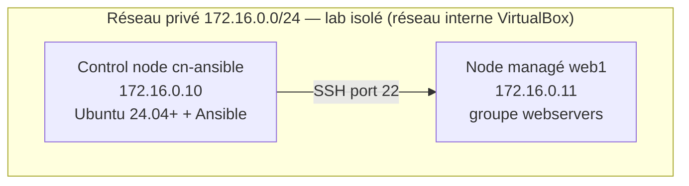
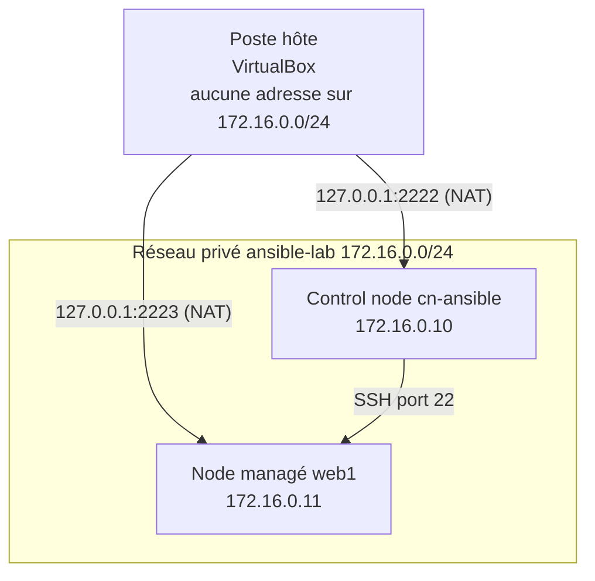

# Laboratoire Ansible — Guide de mise en place

**Auteur : Youghourta Merabtène**

> Ce dépôt contient les supports de cours du module « Ansible — Automatiser la gestion de serveurs » (`jour-1.md`, `jour-2.md`) et le laboratoire sur lequel tous les labs s'exécutent. Le laboratoire est constitué de **deux machines virtuelles** : le control node `cn-ansible`, fourni **déjà équipé** (Ubuntu Server, Ansible, compte `stagiaire`, clé SSH, adressage statique), et le node managé `web1`, livré vierge. Ce guide explique comment vérifier le control node fourni, préparer le node `web1` (étapes reprises une par une dans le Lab 0 de `jour-1.md`), puis, pour le formateur ou en cas de panne, comment reconstruire intégralement le laboratoire depuis zéro : deux machines, un réseau privé isolé et un contrat d'adressage fixe repris tel quel dans tous les supports.

---

## 1. Objet du laboratoire

Le laboratoire reproduit l'architecture Ansible décrite dans les supports : un **control node** (machine de contrôle) qui pilote un **node managé** unique au moyen du module `ping`, de commandes *ad hoc* et de playbooks. Il fournit l'environnement dans lequel les six labs du cours s'exécutent :

| Lab | Support | Cible Ansible | Ce que le laboratoire doit fournir |
|-----|---------|---------------|-----------------------------------|
| Lab 1 | `jour-1.md` | `webservers` (`web1`) | Control node avec Ansible, projet de démonstration `/opt/ansible-demo`, node joignable |
| Lab 2 | `jour-1.md` | `webservers` (`web1`) | Control node prêt à recevoir Ansible, accès SSH sans mot de passe vers le node, dépôt `~/ansible-lab` |
| Lab 3 | `jour-1.md` | `webservers` (`web1`) | Node joignable par les modules et les commandes *ad hoc* |
| Lab 4 | `jour-2.md` | `webservers` (`web1`) | Cible `web1` pour le déploiement d'un service web |
| Lab 5 | `jour-2.md` | `webservers` (`web1`) | Grille d'arborescence du rôle, variables de groupe et d'hôte |
| Lab 6 | `jour-2.md` | `webservers` (`web1`) | Node unique pour l'exécution, le `--check`, le `--diff` et la supervision |

Le laboratoire sert aussi de support à la démonstration de l'idempotence, principe fondateur du cours : une tâche exécutée deux fois ne doit produire aucun changement au second passage. Cette propriété n'est démontrable que si l'état des machines est stable d'un passage à l'autre, ce qui suppose un adressage fixe.

> **Pourquoi un laboratoire plutôt qu'un poste nu ?** Les supports du cours citent en toutes lettres les adresses `172.16.0.10` et `172.16.0.11`, la commande `curl http://172.16.0.11/` et les tests d'idempotence qui en dépendent. Un environnement reproductible garantit que chaque poste de la salle obtient exactement le même état, et qu'un résultat obtenu par un stagiaire est reproductible par un autre.

---

## 2. Avertissement de sécurité

Toutes les manipulations décrites dans ce guide s'appliquent **au laboratoire de formation uniquement**.

- **Aucune commande ne vise un système de production.** Les deux machines sont des machines virtuelles jetables, créées et détruites par ce guide.
- **Le compte `stagiaire` dispose d'un `sudo` sans mot de passe.** Cette règle (`/etc/sudoers.d/99-stagiaire`) existe pour que les playbooks qui utilisent `become` s'exécutent sans saisie interactive. Sur une machine exposée, un `sudo` sans mot de passe est une faille : ne jamais reproduire cette méthode ailleurs.
- **Le réseau privé est isolé.** Les deux machines sont reliées par un réseau interne VirtualBox, invisible du réseau du poste hôte [9]. Le poste ne les atteint que par deux ports de redirection, liés à la boucle locale (`127.0.0.1`).
- **L'option `--forcer` de `00-creer-vms.sh` supprime une VM existante** et tous ses disques. Ne l'utiliser que dans le cadre du laboratoire.
- **Aucune donnée d'identification réelle n'est utilisée.** Le compte du laboratoire est `stagiaire`, son identifiant interne est fixé à 1001, et la clé SSH privée reste sur la machine qui l'a créée.

> **Rappel de méthode** — Les bonnes pratiques Ansible du cours (organisation par rôles, précédence des variables, idempotence) sont décrites dans les supports [5][6]. Les scripts du laboratoire appliquent la même exigence : ils sont idempotents, un second passage n'écrit que ce qui a réellement changé.

---

## 3. Topologie du laboratoire

### 3.1 Contrat d'adressage

| Machine | Rôle | Adresse sur le réseau privé | Port NAT administrateur (poste hôte) |
|---------|------|------------------------------|-------------------------------------|
| `cn-ansible` | Control node — Ansible installé, projets Ansible | `172.16.0.10` | `2222` → 22 |
| `web1` | Node managé, groupe `webservers` | `172.16.0.11` | `2223` → 22 |

Réseau privé du laboratoire : `172.16.0.0/24`, avec le préfixe `/24` appliqué sur les deux machines. Chaque machine possède **deux interfaces réseau** :

| Interface | Mode VirtualBox | Adresse | Rôle |
|-----------|-----------------|---------|------|
| Adaptateur 1 | NAT | `10.0.2.x/24` (attribuée par DHCP) | Accès à Internet et redirection des ports SSH vers le poste hôte |
| Adaptateur 2 | Réseau interne `ansible-lab` | `172.16.0.x/24` (fixe) | Trafic Ansible entre le control node et le node |

**Fig L.1** — Topologie du laboratoire : le control node et le node managé sur le réseau privé isolé `172.16.0.0/24`.



**Fig L.2** — Deux chemins d'accès vers les mêmes machines : le control node utilise les adresses privées, le poste hôte utilise les ports de redirection NAT.



### 3.2 Pourquoi des adresses statiques et pas DHCP

L'adressage statique est un **contrat du cours**, pas un choix de confort. Le DHCP est volontairement exclu **sur l'interface du réseau privé**, pour trois raisons :

1. **Les adresses sont citées dans les supports.** Les playbooks, les inventaires et les commandes des labs visent `172.16.0.11`. Une adresse attribuée par DHCP pourrait être différente, et toutes ces commandes échoueraient sans que l'erreur soit évidente.
2. **Les entrées `/etc/hosts` du laboratoire supposent ces adresses.** Sans elles, la résolution des noms `cn-ansible` et `web1` pointerait vers une adresse périmée.
3. **Les tests d'idempotence exigent un état stable.** Si une machine obtenait une nouvelle adresse après un renouvellement de bail, le second passage d'un playbook ne serait plus comparable au premier : la tâche de déploiement serait signalée comme modifiée alors qu'elle ne l'a pas été.

L'adresse fixe garantit en outre que le laboratoire se comporte à l'identique quel que soit le poste hôte, quel que soit l'ordre de démarrage des machines et quelle que soit la machine depuis laquelle on se connecte.

> **Nuance importante** — Le DHCP n'est pas absent du laboratoire : l'interface NAT, elle, conserve (ou reçoit) une configuration DHCP. C'est elle qui porte la route par défaut et l'accès à Internet. Le laboratoire a donc un adressage fixe côté réseau privé et un adressage dynamique côté accès extérieur.

La configuration est écrite dans `/etc/netplan/99-lab.yaml` avec `dhcp4: false`, et la configuration réseau gérée par `cloud-init` est désactivée par un fichier déposé dans `/etc/cloud/cloud.cfg.d/` [7][8] : sans cette désactivation, `cloud-init` peut réécrire la configuration réseau au démarrage et remplacer l'adresse fixe.

### 3.3 Environnement de référence

| Élément | Valeur de référence | Alternatives acceptées |
|---------|---------------------|--------------------------|
| Control node | Ubuntu Server 24.04 ou plus récent | Distribution Debian ou Ubuntu récente |
| Python du control node | 3.12 à 3.14 (minimum 3.12 exigé par `ansible-core` 2.20) [2] | — |
| Node managé | Ubuntu Server 26.04 | Debian 12, Rocky 9 |
| Python du node | 3.9 à 3.14 (minimum 3.9 exigé par `ansible-core` 2.20) [2] | — |
| RAM par VM | 2 Go (2048 Mo, valeur par défaut de `00-creer-vms.sh`) | 4 Go confortable |
| Disque par VM | 16 Go (16384 Mo, valeur par défaut de `00-creer-vms.sh`) | 20 Go confortable |
| Cœurs par VM | 2 | 2 ou 4 |
| Accès au poste hôte | Serveur SSH (`openssh-server`) | — |

Les deux machines fonctionnant simultanément, prévoir **environ 4 Go de RAM** et **environ 32 Go de disque** sur le poste hôte (16 Go par VM).

---

## 4. Prérequis

| Outil ou ressource | Vérification | Installation ou fourniture |
|--------------------|--------------|----------------------------|
| VirtualBox 7.x (Oracle VM VirtualBox) | `VBoxManage --version` | Paquet de la distribution, ou paquet `.deb` officiel du projet VirtualBox [9] |
| Image ISO Ubuntu Server (amd64) | `ls -l /srv/iso/ubuntu-*server-amd64.iso` | Téléchargement depuis le site de Canonical ; à conserver, elle sert à l'installation des machines du lab |
| Client SSH (`ssh`, `ssh-keygen`, `ssh-copy-id`) | `ssh -V` | `sudo apt install openssh-client` [10][11] |
| `python3` | `python3 --version` | `sudo apt install python3` |
| `openssl` | `openssl version` | `sudo apt install openssl` (bibliothèque utilisée par la génération des clés SSH) |
| Dépôt du cours (scripts et gabarits) | `ls labs/scripts labs/templates` | Copie locale du dépôt ; c'est la source des commandes décrites ci-dessous |
| Clé SSH du poste | `ls -l ~/.ssh/id_ed25519*` | Générée automatiquement par `20-cle-ssh.sh` si elle est absente [10] |
| Ressources du poste hôte | 4 Go de RAM, 32 Go de disque, 4 cœurs | — |
| Virtualisation matérielle activée dans le BIOS/UEFI (Intel VT-x ou AMD-V) | — | Paramètre du firmware, à activer si VirtualBox refuse de démarrer une VM 64 bits |

> **Deux répertoires indissociables** — `10-preparer-vm.sh` cherche les gabarits dans le répertoire `../templates` situé à côté de lui. `labs/scripts/` et `labs/templates/` doivent donc toujours être copiés ensemble dans les machines, en conservant leur arborescence.

---

## 5. Mise en place du laboratoire

Deux usages sont possibles. Dans le **usage normal** (laboratoire livré avec le cours), le control node `cn-ansible` est déjà équipé et le node `web1` est préparé par le Lab 0 de `jour-1.md` : la section 5.1 décrit alors comment **vérifier** le lab livré. Dans l'usage **reconstruction intégrale** (formateur, machine endommagée), on repart de zéro : les deux procédures ci-dessous reproduisent exactement ce qui a servi à construire le laboratoire de référence. La procédure automatisée est la référence ; la procédure manuelle décrit les mêmes manipulations sans passer par les scripts, pour comprendre ce que font les scripts et dépanner lorsqu'un d'eux échoue.

### 5.1 Procédure automatisée (recommandée)

#### Rôle de chaque script

| Script | Où l'exécuter | Droits | Rôle |
|--------|---------------|--------|------|
| `00-creer-vms.sh` | Poste hôte | — | Crée les deux VM et leurs interfaces réseau ; configure la redirection des ports SSH |
| `10-preparer-vm.sh` | Dans une VM | `sudo` | Nom d'hôte, adressage statique, `cloud-init`, serveur SSH, Python, compte `stagiaire`, résolution de noms. Sur `web1` en usage normal ; sur `cn-ansible` uniquement après une reconstruction intégrale, avec `--control-node` |
| `20-cle-ssh.sh` | Control node ou poste hôte | — | Déploie la clé SSH publique vers les deux VM et teste la connexion sans mot de passe |
| `30-projet-demo.sh` | Control node | `sudo` | Crée `/opt/ansible-demo` et le squelette `~/ansible-lab` |
| `90-verifier-lab.sh` | Control node | — | Contrôle complet du laboratoire ; code de sortie non nul en cas d'échec |

Tous les scripts acceptent `--help` (ou `--aide`) pour afficher leurs options, et `--simulation` pour afficher les actions sans les exécuter.

#### Étape 1 — Créer les deux machines virtuelles (poste hôte)

Durée indicative : 1 à 2 minutes, hors installation du système.

```bash
# Objectif : créer les deux VM du lab avec leurs interfaces réseau et leurs ports NAT.
# Environnement : poste hôte, VirtualBox installé, dépôt du cours copié dans le répertoire courant.
# Sortie attendue : récapitulatif du lab (machines, adresses, ports), puis la question
# « Confirmer la préparation des VM du lab ? (oui/non) ». Répondre oui.
# Note : l'image ISO est recherchée automatiquement dans /srv/iso ; --iso permet de la désigner.
labs/scripts/00-creer-vms.sh --iso /srv/iso/ubuntu-26.04-live-server-amd64.iso
```

Ce que produit le script, dans l'ordre : vérification de `VBoxManage`, de l'image ISO et du réseau interne ; création de la VM de base `cn-ansible` depuis l'image ISO ; clonage de `web1` à partir de cette VM de base ; configuration de deux interfaces par VM (NAT puis réseau interne `ansible-lab`) et d'une règle de redirection du port 22 vers le poste hôte.

Options utiles :

| Option | Effet |
|--------|-------|
| `--iso <chemin>` | Image ISO Ubuntu Server à installer (par défaut, recherche dans `/srv/iso` puis dans le dossier personnel) |
| `--memoire <Mo>` | Mémoire par VM (2048 par défaut) |
| `--cpu <nombre>` | Cœurs par VM (2 par défaut) |
| `--disque <Mo>` | Taille de disque par VM (16384 par défaut) |
| `--dossier-vm <chemin>` | Dossier parent des VM du lab (`~/VirtualBox VMs/lab-ansible` par défaut) |
| `--simulation` | Affiche les commandes `VBoxManage` sans les exécuter |
| `--oui` | Ne demande pas de confirmation |
| `--forcer` | Supprime puis recrée une VM déjà enregistrée |

> **Bon à savoir** — Le réseau interne `ansible-lab` n'est pas créé comme un objet distinct : VirtualBox le crée automatiquement au rattachement de la première machine [9]. Le script se contente de constater sa présence ou d'annoncer sa création.

#### Étape 2 — Démarrer les deux machines et installer le système

Durée indicative : 10 à 15 minutes par machine.

```bash
# Objectif : démarrer les deux VM créées à l'étape 1.
# Environnement : poste hôte.
# Sortie attendue : les deux fenêtres de console VirtualBox s'ouvrent.
VBoxManage startvm cn-ansible web1

# Objectif : contrôler l'état du démarrage.
# Sortie attendue : état « running » pour les deux VM.
VBoxManage list runningvms
```

L'image ISO étant attachée aux deux VM, l'installateur Ubuntu Server doit être exécuté **dans chacune des deux machines** : `00-creer-vms.sh` clone la VM de base avant toute installation, et le clone reçoit une copie du disque encore vide.

Points de vigilance lors de l'installation :

| Choix dans l'installateur | Recommandation | Raison |
|---------------------------|----------------|--------|
| Profil | Installation minimale | Aucun bureau n'est nécessaire : tout se passe en SSH et en console |
| Case « Installer le serveur OpenSSH » | À conserver activée | Elle permet de rejoindre la machine par le port NAT dès la fin de l'installation |
| Nom d'utilisateur et mot de passe du compte initial | Choisir un compte d'administration et son mot de passe | Ce compte sert uniquement à préparer la machine ; `10-preparer-vm.sh` crée ensuite le compte `stagiaire` utilisé par le cours |
| Nom de la machine | Sans importance | Le nom d'hôte est fixé par `10-preparer-vm.sh` |

#### Étape 3 — Transmettre le dépôt dans chaque machine

Durée indicative : 1 minute.

```bash
# Objectif : copier le dépôt (scripts et gabarits) dans la VM avant toute préparation.
# Environnement : poste hôte, à exécuter depuis la racine du dépôt ; VM allumée et
# serveur SSH actif sur son port NAT. Le mot de passe du compte d'installation est demandé.
# Sortie attendue : le répertoire /tmp/labs est créé dans la VM.
scp -P 2222 -r labs <compte-installation>@127.0.0.1:/tmp/
scp -P 2223 -r labs <compte-installation>@127.0.0.1:/tmp/
```

> **Alternative** — Un dossier partagé VirtualBox, monté dans la machine invitée, évite cette étape. Dans ce cas, le dépôt reste accessible sous `/media/sf_<nom-partage>/labs` et les commandes suivantes sont identiques, le chemin de départ changeant seulement.

#### Étape 4 — Préparer chaque machine (dans chaque VM)

En usage normal (laboratoire livré), seule `web1` doit être préparée par ce script : `cn-ansible` est fourni déjà équipé, et le script **refuse par défaut** de s'exécuter sur lui. Après une reconstruction intégrale, `cn-ansible` se rapproche avec l'option `--control-node` : le script rejoué est idempotent et ne supprime aucun équipement existant.

Durée indicative : 3 minutes par machine.

```bash
# Objectif : préparer le node web1 du groupe webservers (usage normal).
# Environnement : dans web1, depuis le dépôt copié à l'étape 3.
# Sortie attendue : « [OK] Préparation de web1 terminée. »
cd /tmp/labs
sudo scripts/10-preparer-vm.sh --nom web1 --ip 172.16.0.11
```

```bash
# Objectif : rapprocher le control node reconstruit de zéro (reconstruction intégrale).
# Environnement : dans cn-ansible, depuis le dépôt copié à l'étape 3.
# Sortie attendue : « [INFO] control node cn-ansible : rapprochement idempotent autorisé
# (option --control-node). » puis « [OK] Préparation de cn-ansible terminée. »
cd /tmp/labs
sudo scripts/10-preparer-vm.sh --nom cn-ansible --ip 172.16.0.10 --control-node
```

Le script affiche un récapitulatif (machine, adresse, interface retenue, gabarits, compte créé) puis exécute les neuf étapes décrites dans son en-tête, toutes idempotentes : nom d'hôte ; écriture de `/etc/netplan/99-lab.yaml` à partir du gabarit `labs/templates/99-lab.yaml` ; maintien d'une configuration DHCP sur l'interface NAT si l'installateur n'en fournit pas ; désactivation de la configuration réseau de `cloud-init` ; installation de `openssh-server` et `python3` ; création du compte `stagiaire` (identifiant 1001, groupe `sudo`, fichier `/etc/sudoers.d/99-stagiaire`) ; écriture des entrées `/etc/hosts` (les deux machines) entre les marqueurs `# LAB-ANSIBLE-DEBUT` et `# LAB-ANSIBLE-FIN` ; activation du serveur SSH ; application de la configuration réseau par `netplan`, suivie d'un contrôle de l'adresse pendant quinze secondes.

> **Le script peut être relancé sans risque.** Chaque fichier n'est écrit que si son contenu change ; un second passage affiche `inchangé : /etc/netplan/99-lab.yaml` et ne touche à rien. C'est le même principe d'idempotence que celui enseigné dans les supports.

Options utiles de `10-preparer-vm.sh` :

| Option | Effet |
|--------|-------|
| `--interface <nom>` | Impose le nom de l'interface du réseau privé (par exemple `enp0s8`), lorsque la détection automatique échoue |
| `--masque <longueur>` | Longueur du préfixe du réseau privé (24 par défaut, valeur du contrat) |
| `--gabarits <dossier>` | Dossier des gabarits (`labs/templates` par défaut) |
| `--control-node` | Autorise le rapprochement du control node `cn-ansible` (reconstruction intégrale uniquement) |
| `--sans-paquets` | N'installe pas `openssh-server` ni `python3` |
| `--simulation` | Affiche les actions sans les exécuter |

La détection de l'interface du réseau privé suit quatre critères, dans l'ordre : interface portant déjà une adresse `172.16.0.x`, puis interface déjà déclarée dans `/etc/netplan/99-lab.yaml`, puis deuxième interface physique, puis unique interface disponible (avec un avertissement, la machine étant alors hors de la topologie de référence).

> **Avertissement** — `netplan apply` coupe brièvement la connexion réseau. Exécutez cette commande depuis la console de la machine plutôt que depuis une session SSH distante, ou utilisez `netplan try` (voir le chapitre « Dépannage »).

#### Étape 5 — Installer Ansible sur le control node

Le control node livré avec le cours est déjà équipé (cette installation en fait partie). L'installation fait l'objet du Lab 2 de `jour-1.md` (séquence S2) ; elle est rappelée ici pour que le laboratoire reconstruit soit complet avant la vérification.

```bash
# Objectif : installer ansible-core dans un environnement virtuel Python dédié.
# Environnement : control node cn-ansible.
# Sortie attendue : la ligne « ansible [core 2.20.x] » (ou une version supérieure).
sudo apt update
sudo apt install -y python3-venv
python3 -m venv ~/ansible-venv
~/ansible-venv/bin/pip install --upgrade ansible
~/ansible-venv/bin/ansible --version

# Objectif : rendre les commandes Ansible disponibles dans la session courante.
# Sortie attendue : l'invite de commande affiche (ansible-venv).
source ~/ansible-venv/bin/activate
```

#### Étape 6 — Déployer la clé SSH (control node)

Durée indicative : 3 minutes.

```bash
# Objectif : déposer la clé publique du control node sur les deux machines du lab.
# Environnement : control node cn-ansible, à l'intérieur du dépôt copié à l'étape 3.
# Option retenue : --reseau-prive, car le control node atteint les deux machines
# par leurs adresses du réseau privé (172.16.0.10 et 172.16.0.11).
# Sortie attendue : « [OK] Les deux machines du lab sont accessibles en SSH sans mot de passe. »
# Note : sur cn-ansible, la clé est déjà présente et aucune saisie n'a lieu ; sur web1,
# le mot de passe du compte stagiaire est demandé une fois. Il est fourni par le formateur.
# S'il est inconnu, voir la procédure manuelle (chapitre 5.2.3).
cd /tmp/labs
scripts/20-cle-ssh.sh --reseau-prive
```

Ce que fait le script : vérifie la présence de `ssh`, `ssh-keygen` et `ssh-copy-id` ; génère `~/.ssh/id_ed25519` (type `ed25519`, sans phrase de passe, commentaire `lab-ansible`) **uniquement si elle est absente**, afin de ne jamais écraser une clé existante ; copie la clé publique vers `cn-ansible` et `web1` (`ssh-copy-id` reconnaît la clé déjà présente sur `cn-ansible` et la laisse en place) ; puis teste la connexion sans mot de passe et compare le nom d'hôte renvoyé au nom attendu. Le code de sortie vaut 0 si les deux machines répondent, 1 sinon.

Options utiles de `20-cle-ssh.sh` :

| Option | Effet |
|--------|-------|
| `--identite <fichier>` | Chemin de la clé privée (`~/.ssh/id_ed25519` par défaut) |
| `--reseau-prive` | Atteint les machines par `172.16.0.x` au lieu des ports NAT du poste |
| `--sans-generation` | Ne génère pas de clé si elle est absente |
| `--simulation` | Affiche les commandes sans les exécuter |

> **Où exécuter ce script ?** Sur le **control node**, avec l'option `--reseau-prive` : c'est cette clé privée qu'Ansible utilisera pour joindre les nodes. Sur le poste hôte, le script fonctionne aussi (ports NAT par défaut), mais la clé privée reste sur le poste et Ansible ne pourra pas s'en servir depuis le control node.

#### Étape 7 — Créer les projets Ansible (control node)

Durée indicative : 1 minute.

```bash
# Objectif : créer le projet de démonstration /opt/ansible-demo et le squelette ~/ansible-lab.
# Environnement : control node cn-ansible, à l'intérieur du dépôt copié à l'étape 3.
# Sortie attendue : « [OK] Projets Ansible créés. » puis « [OK] inventaire lisible par Ansible. »
sudo scripts/30-projet-demo.sh
```

Le script crée, avec les droits root :

| Chemin | Contenu |
|--------|---------|
| `/opt/ansible-demo/inventory.yml` | Inventaire statique : groupe `webservers` (`web1`), compte `ansible_user: stagiaire` |
| `/opt/ansible-demo/ansible.cfg` | Configuration du control node, section `[defaults]` |
| `/opt/ansible-demo/group_vars/all.yml` | Variables communes (`repertoire_accueil`, `fichier_accueil`) |
| `/opt/ansible-demo/group_vars/webservers.yml` | Variable du groupe `webservers` (`paquet_web: nginx`) |
| `/opt/ansible-demo/playbooks/` | Quatre playbooks de démonstration (`verifier-connexion.yml`, `verifier-os.yml`, `installer-paquet.yml`, `deployer-accueil.yml`) |
| `/opt/ansible-demo/playbooks/templates/index.html.j2` | Gabarit Jinja2 de la page d'accueil |
| `/opt/ansible-demo/README.md` | Présentation du projet |

et, avec les droits du compte `stagiaire`, le squelette du projet du cours :

```text
/home/stagiaire/ansible-lab/
├── playbooks/
│   └── templates/
├── roles/
├── group_vars/
└── host_vars/
```

Si Ansible est installé, le script contrôle ensuite la syntaxe de chaque playbook (`ansible-playbook --syntax-check`) et la lisibilité de l'inventaire (`ansible-inventory --list`). Options utiles : `--racine-demo <chemin>`, `--projet <chemin>`, `--sans-projet`, `--sans-controle`, `--simulation`.

#### Étape 8 — Vérifier le laboratoire (control node)

```bash
# Objectif : contrôler l'intégralité du laboratoire avant de commencer les labs.
# Environnement : control node cn-ansible, à l'intérieur du dépôt copié à l'étape 3.
# Sortie attendue : « [OK] Lab conforme : tous les contrôles passent. » et le code de sortie 0.
scripts/90-verifier-lab.sh
```

Le détail des contrôles figure au chapitre 6.

#### Récapitulatif de la procédure

| Étape | Où | Commande | Résultat attendu |
|-------|-----|----------|------------------|
| 1 | Poste hôte | `labs/scripts/00-creer-vms.sh --iso <image>` | Deux VM créées |
| 2 | Poste hôte | `VBoxManage startvm cn-ansible web1` | Deux VM démarrées |
| 2 | Dans chaque VM | Installateur Ubuntu Server | Système installé dans les deux VM |
| 3 | Poste hôte | `scp -P 222x -r labs …:/tmp/` | Dépôt présent dans les deux VM |
| 4 | Dans web1 | `sudo scripts/10-preparer-vm.sh --nom web1 --ip 172.16.0.11` | Machine préparée |
| 4 | Dans cn-ansible | `sudo scripts/10-preparer-vm.sh --nom cn-ansible --ip 172.16.0.10 --control-node` | Machine rapprochée (reconstruction intégrale) |
| 5 | Control node | Installation d'Ansible (Lab 2 de `jour-1.md`) | `ansible --version` opérationnel |
| 6 | Control node | `scripts/20-cle-ssh.sh --reseau-prive` | Accès SSH sans mot de passe |
| 7 | Control node | `sudo scripts/30-projet-demo.sh` | `/opt/ansible-demo` et `~/ansible-lab` créés |
| 8 | Control node | `scripts/90-verifier-lab.sh` | `Lab conforme`, code de sortie 0 |

### 5.2 Procédure manuelle (sans scripts)

Cette procédure décrit les manipulations sous-jacentes. Elle sert deux besoins : comprendre précisément ce que fait chaque script, et reprendre une machine lorsque le script échoue. Les commandes ci-dessous préparent `web1` ; il suffit de remplacer le nom d'hôte et l'adresse pour traiter `cn-ansible` (avec le même jeu d'étapes, `--control-node` en moins puisque le control node livré est déjà équipé).

#### 5.2.1 Créer les machines virtuelles (poste hôte)

```bash
# Objectif : créer le dossier parent des VM du lab et le dossier de la VM de base.
# Environnement : poste hôte.
RACINE="$HOME/VirtualBox VMs/lab-ansible"
ISO="/srv/iso/ubuntu-26.04-live-server-amd64.iso"
mkdir -p "$RACINE/cn-ansible"

# Objectif : créer le disque de la VM de base (16 Go, format VDI).
# Sortie attendue : UUID du disque renvoyé par VirtualBox.
VBoxManage createmedium disk --filename="$RACINE/cn-ansible/cn-ansible.vdi" --size=16384 --format=VDI

# Objectif : créer et enregistrer la VM de base cn-ansible, contrôleur SATA Intel AHCI.
# Sortie attendue : aucun message d'erreur ; la VM apparaît ensuite dans
# « VBoxManage list vms » avec son identifiant (UUID).
VBoxManage createvm --name cn-ansible --ostype Ubuntu_64 --basefolder "$RACINE" --register
VBoxManage storagectl cn-ansible --name=SATA --add=sata --controller=IntelAhci

# Objectif : brancher le disque sur le port 0 et l'image ISO sur le port 1.
# Sortie attendue : aucune erreur signalée ; « VBoxManage list hdds » liste les deux médias.
VBoxManage storageattach cn-ansible --storagectl=SATA --port=0 --device=0 --type=hdd \
  --medium="$RACINE/cn-ansible/cn-ansible.vdi"
VBoxManage storageattach cn-ansible --storagectl=SATA --port=1 --device=0 --type=dvddrive \
  --medium="$ISO"

# Objectif : dimensionner la VM et configurer les deux interfaces réseau.
# --nic1 nat : accès Internet et redirection des ports ; --nic2 intnet : réseau privé du lab.
# --boot1 dvd : l'image ISO reste le premier média de démarrage, indispensable à l'installation.
VBoxManage modifyvm cn-ansible --memory=2048 --cpus=2 --vram=32 \
  --boot1=dvd --boot2=disk --boot3=none --nic1=nat --nic2=intnet --intnet2=ansible-lab

# Objectif : ouvrir le port SSH de la VM sur la boucle locale du poste.
# Format de la règle : nom, protocole, adresse du poste, port du poste, adresse de la VM
# (vide : premier adaptateur), port dans la VM.
# Sortie attendue : aucune erreur signalée ; la règle est vérifiable avec
# « VBoxManage showvminfo cn-ansible | grep -i natpf ».
VBoxManage modifyvm cn-ansible --nat-pf1="lab-ssh,tcp,127.0.0.1,2222,,22"

# Objectif : cloner la VM de base pour obtenir web1.
# Prérequis : cn-ansible doit être éteinte, le clonage échoue sur une machine démarrée.
# Le clonage recopie aussi la règle de redirection NAT : elle sera remplacée juste après.
VBoxManage clonevm cn-ansible --name web1 --basefolder "$RACINE" --register

# Objectif : réattacher l'ISO et reprendre le même dimensionnement sur le clone.
VBoxManage storageattach web1 --storagectl=SATA --port=1 --device=0 --type=dvddrive --medium="$ISO"
VBoxManage modifyvm web1 --memory=2048 --cpus=2 --vram=32 \
  --boot1=dvd --boot2=disk --boot3=none --nic1=nat --nic2=intnet --intnet2=ansible-lab

# Objectif : supprimer la règle de redirection héritée du clonage (port 2222, déjà occupé
# par cn-ansible), puis créer la règle propre à web1.
# Sans cette suppression, deux machines écoutent sur le même port du poste : la seconde
# refuse de démarrer son service SSH en redirection.
VBoxManage modifyvm web1 --nat-pf1=delete lab-ssh
VBoxManage modifyvm web1 --nat-pf1="lab-ssh,tcp,127.0.0.1,2223,,22"

# Objectif : contrôler la configuration obtenue.
# Sortie attendue : « NIC 1 » en mode NAT avec une règle de redirection vers le port 22,
# « NIC 2 » rattaché au réseau interne ansible-lab.
VBoxManage showvminfo web1 | grep -Ei 'Name:|nic1|nic2|natpf'
```

> **Pourquoi un réseau interne et pas un réseau « ponté » (bridged) ?** Un réseau interne n'est visible que des machines qui y sont rattachées : le poste hôte n'y accède pas et aucun trafic ne sort vers le réseau du poste [9]. C'est l'isolement recherché. Le poste rejoint les machines par les ports de redirection NAT, et le control node — qui est lui-même une machine du réseau privé — parle au node par `172.16.0.10` et `172.16.0.11`.

#### 5.2.2 Préparer une machine (dans la VM)

```bash
# Objectif : identifier l'interface reliée au réseau privé.
# Environnement : dans web1, console ou session SSH.
# Sortie attendue : l'interface NAT porte une adresse 10.0.2.x/24 (réseau NAT par défaut
# de VirtualBox) ; l'interface du réseau privé n'a pas encore d'adresse. Noter son nom.
ip -br -4 addr

# Objectif : fixer le nom d'hôte.
# Sortie attendue : « [INFO] nom d'hôte : … devient web1 ».
sudo hostnamectl set-hostname web1

# Objectif : produire le fichier netplan à partir du gabarit du dépôt.
# Les trois marqueurs du gabarit (__INTERFACE_LAB__, __ADRESSE_LAB__, __MASQUE_LAB__)
# sont remplacés par les valeurs réelles de la machine : aucune adresse n'est figée
# dans le gabarit.
IFACE=enp0s8
sed -e "s/__INTERFACE_LAB__/$IFACE/" \
    -e "s/__ADRESSE_LAB__/172.16.0.11/" \
    -e "s/__MASQUE_LAB__/24/" \
    labs/templates/99-lab.yaml > /tmp/99-lab.yaml

# Objectif : installer le fichier avec les droits 600, exigés par netplan.
# Un fichier lisible par tous déclencherait un avertissement de netplan.
sudo install -D -m 600 /tmp/99-lab.yaml /etc/netplan/99-lab.yaml

# Objectif : contrôler le rendu puis générer la configuration réseau.
# Sortie attendue : l'interface privée apparaît en dhcp4: false avec l'adresse 172.16.0.11/24.
cat /etc/netplan/99-lab.yaml
sudo netplan generate
```

```yaml
# Fichier : /etc/netplan/99-lab.yaml — résultat attendu sur web1 après rendu du gabarit.
network:
  version: 2
  renderer: networkd
  ethernets:
    enp0s8:
      dhcp4: false
      dhcp6: false
      addresses:
        - 172.16.0.11/24
```

```bash
# Objectif : désactiver la configuration réseau gérée par cloud-init.
# Sans ce fichier, cloud-init peut réécrire /etc/netplan au démarrage et supprimer
# l'adresse fixe. Le préfixe 00- garantit que le réglage est appliqué avant les autres
# fichiers de /etc/cloud/cloud.cfg.d/.
sudo install -D -m 644 labs/templates/00-subiquity-disable-cloudinit-networking.cfg \
  /etc/cloud/cloud.cfg.d/00-subiquity-disable-cloudinit-networking.cfg

# Objectif : installer le serveur SSH et l'interpréteur Python, prérequis des nodes Ansible [1].
# Sortie attendue : « Setting up openssh-server … » puis « Setting up python3 ».
sudo apt-get update
sudo apt-get install -y --no-install-recommends openssh-server python3

# Objectif : créer le compte stagiaire, avec l'identifiant 1001 sur les deux machines,
# et l'ajouter au groupe d'administration.
sudo useradd --uid 1001 --create-home --shell /bin/bash stagiaire
sudo usermod --append --groups sudo stagiaire

# Objectif : autoriser l'élévation de privilèges sans mot de passe (usage lab uniquement).
# Sortie attendue : « parsed OK » ; droits 440 obligatoires pour sudo.
printf '%s\n' 'stagiaire ALL=(ALL) NOPASSWD:ALL' | sudo tee /etc/sudoers.d/99-stagiaire >/dev/null
sudo chmod 440 /etc/sudoers.d/99-stagiaire
sudo visudo --check --file=/etc/sudoers.d/99-stagiaire

# Objectif : écrire les entrées de résolution de noms du lab.
# Le bloc est délimité par les mêmes marqueurs que ceux utilisés par le script, afin que
# les deux approches restent compatibles et que le script puisse reprendre la main.
sudo tee -a /etc/hosts >/dev/null <<'FIN'

# LAB-ANSIBLE-DEBUT
# Entrées du lab Ansible, réseau privé 172.16.0.0/24.
172.16.0.10	cn-ansible
172.16.0.11	web1
# LAB-ANSIBLE-FIN
FIN

# Objectif : activer le serveur SSH au démarrage et le démarrer immédiatement (option --now).
sudo systemctl enable --now ssh.service

# Objectif : appliquer l'adressage.
# Avertissement : la connexion réseau est coupée brièvement ; depuis la console, préférer
# « sudo netplan try » qui revient automatiquement à la configuration précédente au bout
# de quelques dizaines de secondes si la session n'est pas validée.
sudo netplan apply

# Objectif : contrôler l'adresse obtenue.
# Sortie attendue : 172.16.0.11/24 sur l'interface privée, 10.0.2.x/24 sur l'interface NAT.
ip -br -4 addr

# Objectif : contrôler la configuration persistée après un redémarrage.
# Les adresses du lab ne doivent pas changer : c'est le contrat du cours.
sudo reboot
# après redémarrage, dans la VM :
ip -br -4 addr
```

#### 5.2.3 Déployer la clé SSH

```bash
# Objectif : générer la clé du control node si elle n'existe pas.
# Environnement : control node cn-ansible.
# Sortie attendue : « Your identification has been saved in /home/stagiaire/.ssh/id_ed25519 ».
# Note : ne jamais régénérer une clé existante, la suppression du fichier .pub ferait
# perdre l'accès aux deux machines.
ssh-keygen -t ed25519 -N "" -C lab-ansible -f ~/.ssh/id_ed25519

# Objectif : déposer la clé publique sur les deux machines.
# Sortie attendue : « Number of key(s) added: 1 » pour web1. Sur cn-ansible, la clé est
# déjà présente : ssh-copy-id la détecte, la laisse en place et ne demande pas de mot de passe.
ssh-copy-id -i ~/.ssh/id_ed25519.pub -p 22 -o StrictHostKeyChecking=accept-new stagiaire@172.16.0.10
ssh-copy-id -i ~/.ssh/id_ed25519.pub -p 22 -o StrictHostKeyChecking=accept-new stagiaire@172.16.0.11

# Objectif : vérifier l'accès sans mot de passe.
# Sortie attendue : « cn-ansible », « web1 ».
for HOTE in cn-ansible web1; do
  ssh -o BatchMode=yes "stagiaire@$HOTE" hostname
done
```

`10-preparer-vm.sh` crée le compte `stagiaire` sans définir de mot de passe : selon la configuration d'authentification du serveur SSH, `ssh-copy-id` peut alors être refusé. Dans ce cas, deux solutions :

- définir un mot de passe temporaire depuis la console de chaque machine (`sudo passwd stagiaire`), puis relancer `ssh-copy-id` ;
- déposer la clé publique sans mot de passe depuis la console de chaque machine :

```bash
# Objectif : installer la clé publique du control node sans recourir à un mot de passe.
# Environnement : console d'une machine du lab.
# Sortie attendue : le fichier /home/stagiaire/.ssh/authorized_keys contient la clé publique.
sudo install -d -m 700 -o stagiaire -g stagiaire /home/stagiaire/.ssh
echo "ssh-ed25519 AAAA... lab-ansible" | sudo tee -a /home/stagiaire/.ssh/authorized_keys >/dev/null
sudo chown stagiaire:stagiaire /home/stagiaire/.ssh/authorized_keys
sudo chmod 600 /home/stagiaire/.ssh/authorized_keys
```

#### 5.2.4 Créer le projet de démonstration et le projet du cours (control node)

```bash
# Objectif : créer l'arborescence du projet de démonstration et celle du projet du cours.
# Environnement : control node cn-ansible.
# Sortie attendue : les répertoires existent ; le projet du cours appartient au compte
# stagiaire, qui doit pouvoir y écrire ses playbooks et ses variables sans élévation.
sudo mkdir -p /opt/ansible-demo/group_vars /opt/ansible-demo/playbooks/templates
sudo install -d -o stagiaire -g stagiaire -m 755 \
  /home/stagiaire/ansible-lab/playbooks/templates \
  /home/stagiaire/ansible-lab/roles \
  /home/stagiaire/ansible-lab/group_vars \
  /home/stagiaire/ansible-lab/host_vars
```

```yaml
# Fichier : /opt/ansible-demo/inventory.yml — à créer avec l'éditeur (droits 644, root).
# Syntaxe YAML de l'inventaire : all > children > groupes > hosts.
# ansible_user désigne le compte SSH, ansible_python_interpreter l'interpréteur utilisé.
all:
  vars:
    ansible_user: stagiaire
    ansible_python_interpreter: /usr/bin/python3
  children:
    webservers:
      hosts:
        web1:
          ansible_host: 172.16.0.11
```

```ini
# Fichier : /opt/ansible-demo/ansible.cfg — section [defaults].
# Ansible lit le premier fichier trouvé : ANSIBLE_CONFIG, puis ansible.cfg du répertoire
# courant, puis ~/.ansible.cfg, puis /etc/ansible/ansible.cfg.
# host_key_checking = False est une commodité propre au lab (les clés d'hôtes changent à
# chaque création de VM) ; en production, la vérification des clés reste active.
[defaults]
inventory = ./inventory.yml
remote_user = stagiaire
forks = 5
host_key_checking = False
interpreter_python = auto
inject_facts_as_vars = False
timeout = 10
```

Les variables placées à côté de l'inventaire sont lues automatiquement par Ansible, sans
déclaration préalable :

```yaml
# Fichier : /opt/ansible-demo/group_vars/all.yml — variables communes à tous les nodes.
repertoire_accueil: /var/www/html
fichier_accueil: /var/www/html/index.html
```

```yaml
# Fichier : /opt/ansible-demo/group_vars/webservers.yml — variables du groupe webservers.
# Elles priment sur celles de group_vars/all.yml.
paquet_web: nginx
```

> **Vérification** — `ansible-inventory --graph` et `ansible all -m ping` (procédure suivante) valident immédiatement ces fichiers : une erreur d'indentation ou de nom de groupe se voit au premier affichage. La syntaxe d'un inventaire statique et la portée des variables d'hôte et de groupe sont décrites dans la documentation dédiée [3].

#### 5.2.5 Contrôler le résultat

```bash
# Objectif : contrôler la résolution de noms du lab sur le control node.
# Sortie attendue : deux lignes, chacune associant un nom à son adresse.
getent hosts cn-ansible web1

# Objectif : contrôler l'accès SSH sans mot de passe vers le node.
# Sortie attendue : « web1 ».
ssh -o BatchMode=yes stagiaire@172.16.0.11 hostname

# Objectif : afficher la vue graphique de l'inventaire.
# Sortie attendue : une arborescence @all contenant le groupe webservers (web1).
cd /opt/ansible-demo
ansible-inventory --graph

# Objectif : vérifier la connectivité Ansible vers le node (commande *ad hoc* :
# ansible <motif> -m <module> [4]).
# Sortie attendue : SUCCESS … pong pour web1, puis PLAY RECAP avec 1 réussite.
ansible all -m ping

# Objectif : contrôler la présence de Python sur le node, prérequis des modules.
# Sortie attendue : « Python 3.x.y ».
ansible all -m command -a "python3 --version"
```

---

## 6. Vérification du laboratoire

Le contrôle complet est assuré par `90-verifier-lab.sh`, à exécuter **sur le control node** :

```bash
# Objectif : contrôler l'état du laboratoire avant de commencer les labs.
# Environnement : control node cn-ansible, à l'intérieur du dépôt copié dans la VM.
# Sortie attendue : récapitulatif des contrôles, vue graphique de l'inventaire,
# puis « [OK] Lab conforme : tous les contrôles passent. » et le code de sortie 0.
cd /tmp/labs
scripts/90-verifier-lab.sh

# Objectif : contrôler le code de retour, exploitable dans une chaîne de préparation.
echo $?    # sortie attendue : 0
```

### 6.1 Contrôles effectués

| Contrôle | Par machine | Attendu |
|----------|-------------|----------|
| Accès SSH sans mot de passe, en mode non interactif (`BatchMode`) | `cn-ansible`, `web1` | Connexion acceptée |
| Identité | `cn-ansible`, `web1` | Le nom d'hôte renvoyé par SSH est bien celui attendu |
| Adressage | `cn-ansible`, `web1` | L'adresse fixe du contrat est présente avec le préfixe `/24` |
| Résolution de noms | `cn-ansible`, `web1` | `getent hosts <nom>` renvoie l'adresse attendue |
| Vue graphique de l'inventaire | Inventaire du projet | Groupe `webservers` affiché sous `@all`, aucun autre groupe, un seul hôte |
| Module `ping` | Inventaire du projet | Un `pong` pour le node de l'inventaire |

Le script mémorise chaque résultat et affiche un récapitulatif final, puis renvoie le code de sortie 0 si tous les contrôles passent, 1 sinon.

Options utiles :

| Option | Effet |
|--------|-------|
| `--projet <chemin>` | Projet Ansible contrôlé (`/opt/ansible-demo` par défaut) |
| `--identite <fichier>` | Clé privée utilisée pour les tests SSH (`~/.ssh/id_ed25519` par défaut) |
| `--sans-ansible` | N'exécute pas les commandes Ansible ; utile avant l'installation d'Ansible |
| `--simulation` | Affiche les commandes sans les exécuter |

> **Prérequis de la clé** — Les contrôles SSH utilisent `~/.ssh/id_ed25519` du **control node**. Si le laboratoire a été préparé depuis le poste hôte avec `20-cle-ssh.sh` (ports NAT), cette clé n'existe pas sur le control node : il faut y déployer la clé, ou indiquer le bon chemin avec `--identite`.

### 6.2 Résultat attendu

Sur un laboratoire conforme, chaque contrôle affiche `[OK]` et le script se termine par `Lab conforme`. Sortie attendue, reconstituée à partir des libellés du script et de l'ordre de ses contrôles (aucune exécution réelle n'est reproduite ici) :

```text
[OK] cn-ansible — accès SSH sans mot de passe
[OK] cn-ansible — identité (cn-ansible)
[OK] cn-ansible — adresse 172.16.0.10/24
[OK] cn-ansible — résolution de cn-ansible vers 172.16.0.10
[OK] web1 — accès SSH sans mot de passe
[OK] web1 — identité (web1)
[OK] web1 — adresse 172.16.0.11/24
[OK] web1 — résolution de web1 vers 172.16.0.11
[OK] inventaire — ansible-inventory --graph (@all, webservers, 1 hôte)
[OK] inventaire — ansible all -m ping (1 réponse(s) pong)

== Récapitulatif des contrôles ==
machine     contrôle                                    état
cn-ansible  accès SSH sans mot de passe                  OK
…

Contrôles effectués : 10, échecs : 0

[OK] Lab conforme : tous les contrôles passent.
```

Le compte de contrôles est de 10 : quatre contrôles système pour chacune des deux machines, plus deux contrôles Ansible portant sur l'inventaire.

---

## 7. Raccourcis d'accès

Le poste hôte ne possède aucune adresse sur le réseau `172.16.0.0/24` : le réseau interne VirtualBox lui est invisible [9]. L'accès au laboratoire depuis le poste passe donc par la **redirection de ports NAT**, qui publie le port 22 de chaque machine sur un port de la boucle locale du poste.

| Machine | Connexion depuis le poste hôte | Connexion depuis le control node |
|---------|-------------------------------|-----------------------------------|
| `cn-ansible` | `ssh -p 2222 stagiaire@127.0.0.1` | `ssh stagiaire@172.16.0.10` |
| `web1` | `ssh -p 2223 stagiaire@127.0.0.1` | `ssh stagiaire@172.16.0.11` |

```bash
# Objectif : ouvrir une session sur le control node depuis le poste hôte.
# Sortie attendue : l'invite de commande de la VM cn-ansible.
ssh -p 2222 stagiaire@127.0.0.1

# Objectif : ouvrir une session sur le node depuis le poste hôte.
ssh -p 2223 stagiaire@127.0.0.1   # web1

# Objectif : vérifier une commande sur un node sans ouvrir de session interactive.
# Sortie attendue : « web1 ».
ssh -p 2223 stagiaire@127.0.0.1 hostname -s

# Objectif : transférer un fichier vers un node (l'option de port de scp est -P, majuscule).
scp -P 2223 mon-fichier stagiaire@127.0.0.1:/tmp/

# Objectif : vérifier le service web déployé par le Lab 4 depuis le control node.
# Sortie attendue : page d'accueil contenant « Lab Ansible ».
curl http://172.16.0.11/
```

> **Pourquoi ce mécanisme ?** Trois raisons convergent. L'isolement : le trafic du laboratoire ne sort pas vers le réseau du poste. La souplesse : plusieurs postes peuvent être branchés en parallèle, chacun par ses propres ports. La sécurité : les règles de redirection sont liées à `127.0.0.1`, donc les machines du laboratoire ne sont pas joignables depuis les autres machines du réseau du poste.

---

## 8. Dépannage

| Symptôme | Cause probable | Correction |
|----------|----------------|------------|
| `ansible all -m ping` échoue avec `UNREACHABLE` ou `Permission denied (publickey)` | Clé publique absente ou illisible sur le node | Depuis le control node : `ssh -o BatchMode=yes stagiaire@172.16.0.11 true` pour isoler le canal SSH ; si la commande échoue, relancer `scripts/20-cle-ssh.sh --reseau-prive`, ou déposer la clé dans `/home/stagiaire/.ssh/authorized_keys` (droits 600, propriétaire `stagiaire`) |
| `ansible all -m ping` échoue alors que `ssh` fonctionne | Ansible utilise un autre utilisateur ou un autre interpréteur | Vérifier `ansible_user` et `ansible_python_interpreter` dans l'inventaire ; contrôler la présence de Python : `ssh stagiaire@172.16.0.11 python3 --version` |
| Les noms ne se résolvent pas (`getent hosts web1` ne renvoie rien) | Bloc `/etc/hosts` absent ou non rechargé | Sur la machine concernée : `getent hosts web1` ; corriger avec le bloc délimité par `# LAB-ANSIBLE-DEBUT` / `# LAB-ANSIBLE-FIN`, ou relancer `sudo scripts/10-preparer-vm.sh --nom web1 --ip 172.16.0.11` |
| Un nom se résout vers une mauvaise adresse | Entrée héritée d'un ancien laboratoire, ou DHCP encore actif sur l'interface privée | `getent hosts web1` pour observer la résolution ; `ip -br -4 addr` pour vérifier l'adresse réelle ; vérifier `dhcp4: false` dans `/etc/netplan/99-lab.yaml`, puis `sudo netplan apply` |
| `netplan apply` n'applique pas la configuration, ou `netplan generate` signale une erreur | Interface inexistante dans le fichier, ou fichier lisible par tous | `netplan generate` pour obtenir le message d'erreur exact ; contrôler le nom de l'interface avec `ip -br -4 addr` ; corriger avec `sudo install -m 600 /tmp/99-lab.yaml /etc/netplan/99-lab.yaml` |
| La connexion réseau est coupée après `netplan apply` | Commande exécutée à distance, session SSH interrompue | Depuis la console : `sudo netplan try` (retour arrière automatique si la session n'est pas confirmée), puis `sudo netplan apply` une fois la configuration validée ; pour revenir en arrière : `sudo netplan revert` |
| Le fichier netplan écrit par le script n'est pas celui de la bonne interface | Détection automatique de l'interface erronée (ordre des adaptateurs différent, carte bridge) | `ip -br -4 addr` pour repérer l'interface privée (celle qui n'a pas d'adresse `10.0.2.x`), puis relancer avec `--interface <nom>` : `sudo scripts/10-preparer-vm.sh --nom web1 --ip 172.16.0.11 --interface enp0s8` |
| `Permission denied (publickey)` alors que la clé a été copiée | Droits trop permissifs sur `authorized_keys`, ou clé déplacée par la réinstallation | `chmod 700 ~/.ssh`, `chmod 600 ~/.ssh/authorized_keys`, `chown -R stagiaire:stagiaire ~/.ssh` ; contrôler la clé réellement utilisée avec `ssh -v -i ~/.ssh/id_ed25519 -p 2223 stagiaire@127.0.0.1` |
| `ssh: connect to host 127.0.0.1 port 222x: Connection refused` | VM arrêtée, serveur SSH inactif, ou port non redirigé | `VBoxManage list runningvms` ; `VBoxManage showvminfo web1 \| grep -i natpf` pour contrôler la règle ; dans la VM : `systemctl status ssh` |
| `Failed to bind to port` au démarrage d'une VM, ou port 2222/2223 déjà utilisé | Un clone a conservé la règle de redirection de la VM de base ; un autre service occupe le port du poste | Contrôler les ports occupés : `ss -ltn \| grep -E '2222\|2223'` ; corriger la règle : `VBoxManage modifyvm web1 --nat-pf1=delete lab-ssh` puis `VBoxManage modifyvm web1 --nat-pf1="lab-ssh,tcp,127.0.0.1,2223,,22"` |
| `sudo` demande un mot de passe dans un playbook qui utilise `become` | Règle `sudo` absente ou illisible sur le node | `sudo -l -U stagiaire` sur la machine ; recréer la règle : `printf '%s\n' 'stagiaire ALL=(ALL) NOPASSWD:ALL' \| sudo tee /etc/sudoers.d/99-stagiaire >/dev/null` puis `sudo chmod 440 /etc/sudoers.d/99-stagiaire` |
| Ansible signale `/usr/bin/python3: not found` ou un interpréteur introuvable | `python3` absent sur le node | Dans la VM : `sudo apt-get install -y --no-install-recommends python3`, puis relancer `sudo scripts/10-preparer-vm.sh --nom web1 --ip 172.16.0.11` |
| `netplan: command not found` | Distribution sans `netplan` (par exemple une machine pilotée uniquement par NetworkManager) | Vérifier la distribution et la présence de `netplan` : `command -v netplan` ; appliquer l'adressage statique par la méthode de la distribution, puis reprendre la vérification : `scripts/90-verifier-lab.sh --sans-ansible` |
| La VM refuse de démarrer (`VERR_NEM_*, VT-x disabled`) | Virtualisation non activée dans le firmware | Activer Intel VT-x ou AMD-V dans le BIOS/UEFI, puis réessayer `VBoxManage startvm web1` |
| `ssh-copy-id` échoue ou redemande un mot de passe | Compte `stagiaire` créé sans mot de passe, ou clé publique absente | Définir un mot de passe temporaire (`sudo passwd stagiaire`), ou déposer la clé publique depuis la console du node (procédure décrite au chapitre 5.2.3) |
| Les deux machines portent la même adresse, ou le node est `UNREACHABLE` | Adresse statique en double, ou configuration de la machine oubliée | Contrôler les adresses : `for h in 172.16.0.10 172.16.0.11; do ping -c1 $h >/dev/null && echo "$h répond"; done` ; reprécifier l'adresse de la machine concernée avec `10-preparer-vm.sh --nom <nom> --ip <adresse>` |
| L'adresse du lab disparaît après un redémarrage | Configuration réseau de `cloud-init` réactivée, ou fichier netplan supprimé | Contrôler la présence du fichier de désactivation : `ls /etc/cloud/cloud.cfg.d/00-subiquity-disable-cloudinit-networking.cfg` ; relancer `10-preparer-vm.sh`, puis `sudo reboot` et recontrôler `ip -br -4 addr` |

### Commandes de diagnostic les plus utiles

```bash
# Objectif : identifier l'interface du réseau privé (celle sans adresse 10.0.2.x).
ip -br -4 addr

# Objectif : contrôler la résolution de noms du lab.
getent hosts cn-ansible web1

# Objectif : contrôler l'accès SSH sans mot de passe depuis le control node.
ssh -o BatchMode=yes stagiaire@172.16.0.11 hostname -s

# Objectif : contrôler la connectivité Ansible et la version d'ansible-core utilisée.
cd /opt/ansible-demo && ansible all -m ping
ansible --version

# Objectif : contrôler l'affichage complet de l'inventaire.
ansible-inventory --graph

# Objectif : contrôler les règles de redirection NAT et l'état des VM (poste hôte).
VBoxManage showvminfo web1 | grep -Ei 'Name:|nic|natpf'
VBoxManage list runningvms
```

---

## 9. Désinstallation du laboratoire

Le laboratoire se supprime entièrement : les deux machines sont détruites, aucun résidu n'est laissé sur le poste hôte.

```bash
# Objectif : demander l'arrêt propre des deux machines virtuelles (bouton d'alimentation virtuel).
# Environnement : poste hôte.
# Sortie attendue : aucun message d'erreur ; après quelques secondes, la commande de contrôle
# ci-dessous ne liste plus les deux machines.
for VM in cn-ansible web1; do
  VBoxManage controlvm "$VM" acpipowerbutton
done
sleep 30

# Objectif : contrôler l'arrêt des deux machines.
# Sortie attendue : aucune ligne en sortie.
VBoxManage list runningvms

# Objectif : forcer l'arrêt des machines qui seraient encore démarrées.
for VM in cn-ansible web1; do
  VBoxManage stopvm "$VM" poweroff || true
done

# Objectif : désenregistrer les VM et supprimer leurs disques.
# Avertissement : cette commande est destructive ; le dossier du lab disparaît.
VBoxManage unregistervm cn-ansible --delete
VBoxManage unregistervm web1 --delete

# Objectif : supprimer le dossier parent des VM, s'il subsiste.
# Avertissement : vérifier le chemin avant de valider ; rm -rf est irréversible.
rm -rf "$HOME/VirtualBox VMs/lab-ansible"

# Objectif : vérifier qu'aucune VM du lab ne subsiste.
VBoxManage list vms
```

Nettoyage complémentaire, uniquement si les machines sont conservées :

```bash
# Objectif : oublier les clés d'hôtes SSH du poste (elles ne correspondent plus).
# Sortie attendue : une ligne « # Host [127.0.0.1]:2222 found: 1 line(s) … », puis une ligne
# indiquant que le fichier known_hosts a été mis à jour ; l'ancien contenu est conservé
# dans le fichier known_hosts.old.
ssh-keygen -R '[127.0.0.1]:2222'
ssh-keygen -R '[127.0.0.1]:2223'
```

Sur une machine du laboratoire conservée, les fichiers gérés par les scripts sont les suivants ; les retirer ramène la machine à son état d'installation :

| Fichier ou élément | Retrait |
|--------------------|---------|
| `/etc/netplan/99-lab.yaml` | `sudo rm /etc/netplan/99-lab.yaml` puis `sudo netplan apply` |
| `/etc/netplan/98-nat-dhcp.yaml` | `sudo rm /etc/netplan/98-nat-dhcp.yaml` (uniquement s'il a été ajouté par le script) |
| `/etc/cloud/cloud.cfg.d/00-subiquity-disable-cloudinit-networking.cfg` | `sudo rm /etc/cloud/cloud.cfg.d/00-subiquity-disable-cloudinit-networking.cfg` |
| `/etc/sudoers.d/99-stagiaire` | `sudo rm /etc/sudoers.d/99-stagiaire` |
| Bloc `/etc/hosts` du lab | Supprimer les lignes comprises entre `# LAB-ANSIBLE-DEBUT` et `# LAB-ANSIBLE-FIN` |
| Compte `stagiaire` | `sudo userdel -r stagiaire` |
| Projets Ansible | `sudo rm -rf /opt/ansible-demo /home/stagiaire/ansible-lab` |

> **Clé privée** — La clé `~/.ssh/id_ed25519` du poste ou du control node n'est pas supprimée : elle peut servir à d'autres environnements. Sa suppression (`rm ~/.ssh/id_ed25519*`) n'est nécessaire que si elle n'a servi qu'au laboratoire.

---

## 10. Ce que le laboratoire fournit aux cours

| Ressource | Chemin ou valeur | Utilisée par |
|-----------|------------------|--------------|
| Control node | `cn-ansible`, `172.16.0.10`, SSH port NAT 2222, fourni déjà équipé (Ansible, compte `stagiaire`, clé SSH, adressage statique) | Toutes les séquences du cours |
| Node managé | `web1`, `172.16.0.11`, groupe `webservers` | Labs 1 à 3 de `jour-1.md` ; Labs 4 à 6 de `jour-2.md` |
| Compte de travail | `stagiaire`, identifiant 1001, `sudo` sans mot de passe | Toutes les commandes des labs |
| Clé SSH | `~/.ssh/id_ed25519` du control node, clé publique déposée sur les deux machines | Accès SSH et Ansible sans mot de passe |
| Résolution de noms | Entrées `/etc/hosts` pour `cn-ansible`, `web1` | `getent hosts`, inventaire par nom d'hôte |
| Projet de démonstration | `/opt/ansible-demo` (inventaire, `ansible.cfg`, `group_vars/`, quatre playbooks, gabarit Jinja2) | Lab 1 de `jour-1.md` |
| Projet du cours | `~/ansible-lab` (`playbooks/`, `playbooks/templates/`, `roles/`, `group_vars/`, `host_vars/`) | Labs 2 et 3 de `jour-1.md`, Labs 4 à 6 de `jour-2.md` |
| Serveur SSH et Python | `openssh-server` et `python3` installés sur les deux machines | Prérequis des modules Ansible [1][2] |
| Scripts de contrôle | `labs/scripts/90-verifier-lab.sh` | Vérification avant chaque séance |

Le laboratoire ne comporte volontairement qu'un seul node managé : les six labs du cours se déroulent tous sur le groupe `webservers` et l'hôte `web1`. Le control node fourni est déjà équipé — le Lab 0 de `jour-1.md` le vérifie ; ce guide explique comment reconstruire intégralement le laboratoire si nécessaire.

Le squelette `~/ansible-lab` est volontairement minimal : les labs le complètent eux-mêmes, et chaque exercice produit un livrable que le suivant consomme (inventaire, puis `ansible.cfg`, puis playbooks, puis rôle). Les supports décrivent le contenu attendu à chaque étape ; le laboratoire ne fournit que l'arborescence de départ.

---

## 11. Glossaire

| Terme | Définition |
|-------|------------|
| Control node | Machine de contrôle sur laquelle Ansible est installé et depuis laquelle les exécutions sont lancées |
| Node managé | Machine cible pilotée par Ansible ; dans ce laboratoire, `web1` |
| NAT (traduction d'adresses réseau) | Mode réseau VirtualBox donnant à la machine un accès sortant via l'adresse du poste hôte |
| Port forwarding (redirection de ports) | Mécanisme NAT qui publie un port de la machine virtuelle sur un port du poste hôte |
| Réseau interne VirtualBox | Réseau logiciel visible uniquement des machines qui y sont rattachées, invisible du poste hôte |
| Netplan | Outil de configuration réseau déclaratif de Debian et Ubuntu, lisant les fichiers YAML de `/etc/netplan/` [7] |
| `cloud-init` | Outil qui applique la configuration d'une machine provisionnée, notamment le réseau, au premier démarrage [8] |
| Idempotence | Propriété d'une opération qui ne produit aucun changement lorsqu'elle est appliquée une seconde fois |
| `authorized_keys` | Fichier contenant les clés publiques autorisées à se connecter à un compte, dans `~/.ssh/` |
| `ssh-copy-id` | Commande qui installe une clé publique sur une machine distante en l'ajoutant à `authorized_keys` [10] |
| Gabarit (template) | Fichier contenant des marqueurs remplacés par des valeurs réelles lors de la génération d'un fichier de configuration |

---

## Références

Les appels cités dans le texte renvoient à cette table, numérotée dans l'ordre d'apparition.

| N° | Organisation | Document | Version ou édition | URL |
|----|--------------|----------|--------------------|-----|
| [1] | Ansible Project | Ansible Documentation — Getting Started (architecture control node / nodes, fonctionnement sans agent) | Série `latest` (ansible-core 2.20 et ultérieur) | https://docs.ansible.com/ansible/latest/getting_started/index.html |
| [2] | Ansible Project | Ansible Documentation — Installation Guide (prérequis Python des control nodes et des nodes) | Série `latest` | https://docs.ansible.com/ansible/latest/installation_guide/index.html |
| [3] | Ansible Project | Ansible Documentation — Inventory Guide (inventaire statique, groupes, variables d'hôte et de groupe) | Série `latest` | https://docs.ansible.com/ansible/latest/inventory_guide/intro_inventory.html |
| [4] | Ansible Project | Ansible Documentation — Using ad hoc commands (commandes `ansible <motif> -m <module>`) | Série `latest` | https://docs.ansible.com/ansible/latest/command_guide/intro_adhoc.html |
| [5] | Ansible Project | Ansible Documentation — Best practices (organisation d'un projet, rôles, variables) | Série `latest` | https://docs.ansible.com/ansible/latest/user_guide/playbooks_best_practices.html |
| [6] | Red Hat | Red Hat Ansible Automation Platform — Best practices for automation execution | Édition 2.7 | https://docs.redhat.com/en/documentation/red_hat_ansible_automation_platform/2.7/develop-assembly_controller_best_practices |
| [7] | Canonical | Netplan — documentation (fichiers YAML de `/etc/netplan/`, `netplan generate`, `netplan apply`, `netplan try`) | Édition `stable` | https://netplan.readthedocs.io/en/stable/ |
| [8] | Canonical | cloud-init — How to configure network (désactivation de la gestion réseau, fichier dans `cloud.cfg.d/`) | Édition `stable` | https://docs.cloud-init.io/en/stable/howto/network_config.html |
| [9] | Oracle | Oracle VM VirtualBox — User Manual, chapitre 6 « Virtual Networking » (mode NAT, redirection de ports, réseau interne) | Édition 7.x | https://www.virtualbox.org/manual/ch06.html |
| [10] | OpenSSH Project | ssh-copy-id(1) — page de manuel (options `-i`, `-p`, `-o` ; ajout de la clé à `authorized_keys`) | — | https://www.man7.org/linux/man-pages/man1/ssh-copy-id.1.html |
| [11] | OpenSSH Project | OpenSSH — manuels (`ssh`, `ssh-keygen`, `sshd`) | — | https://www.openssh.com/manual.html |